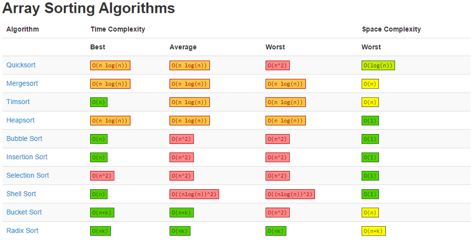
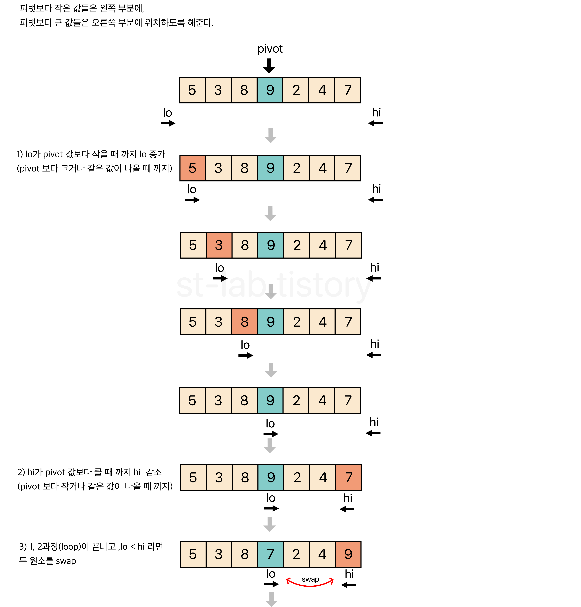
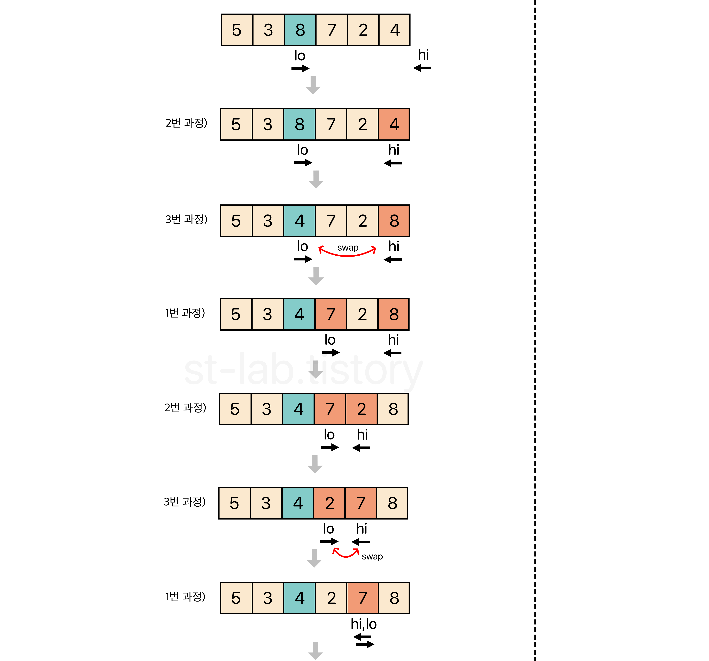
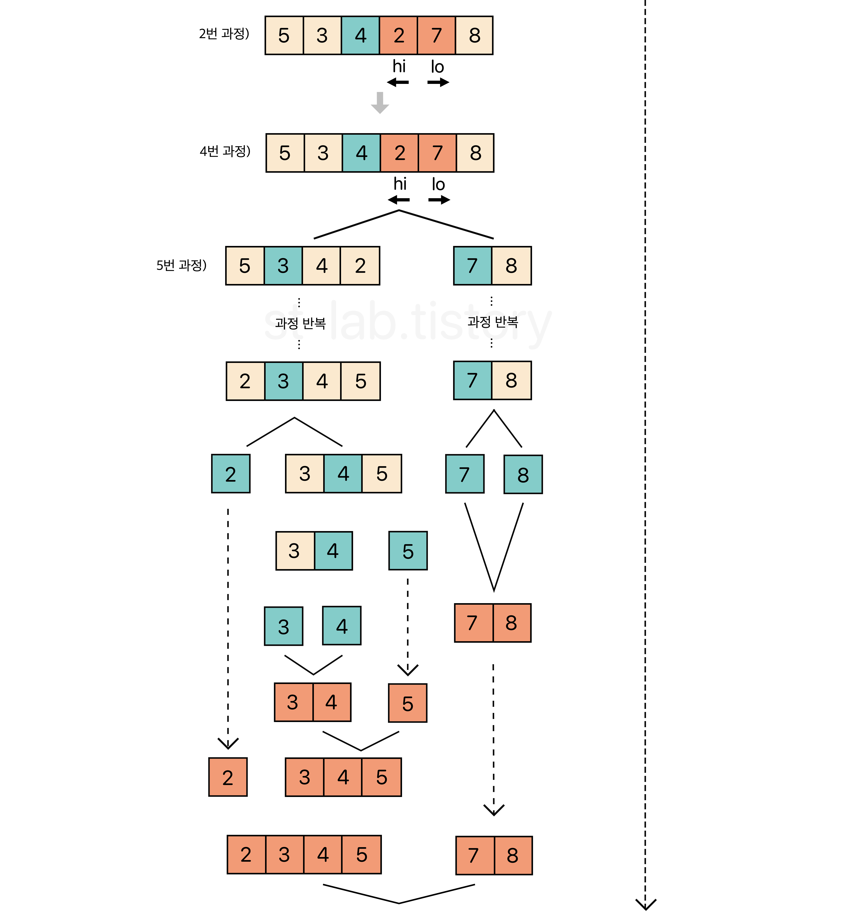
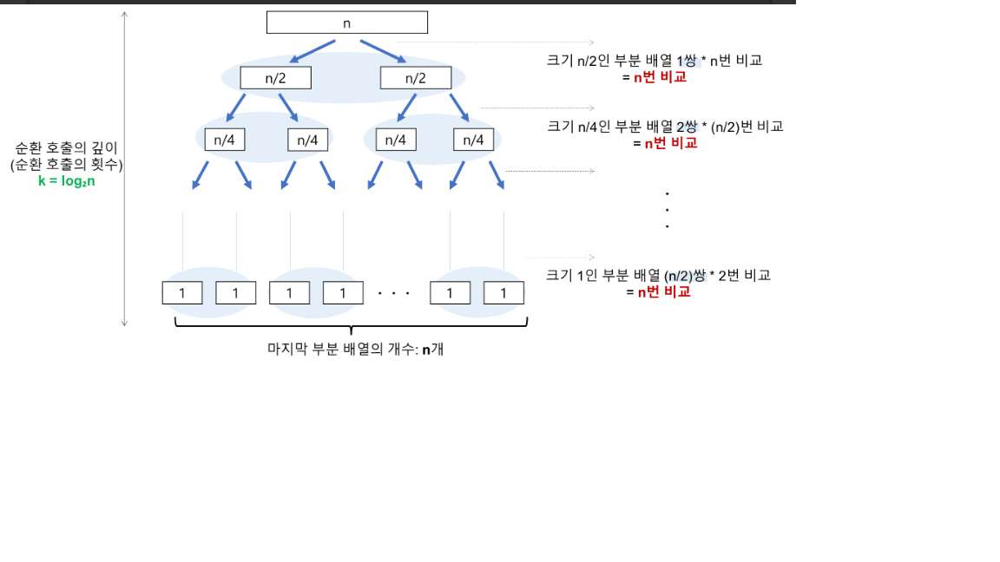
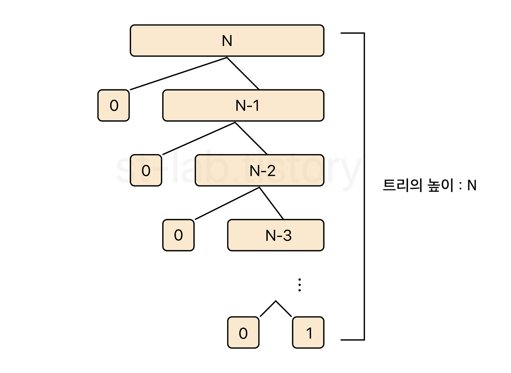

# Quick Sort - 퀵정렬

## 목차
1. 개념
2. 정렬 방법
3. 구현 & 성능분석
4. 장단점
5. 면접질문
6. 참고자료


## 1. 개념

`**퀵 정렬(Quick Sort)**` 
: 평균적으로 매우 빠른 수행 속도를 자랑하는 정렬 방법

<div align='center'>   
    
</div>


하나의 List를 피벗(pivot)을 기준으로 2개의 부분 리스트로 나눈다. 파티셔닝 후, 배치된 피벗의 위치를 기준으로 좌우 부분리스트로 나누어 각각의 List에 대해 재귀호출을 한다

- `피벗(pivot)` : 퀵 정렬에서 데이터 그룹을 나누는 임의의 기준값

- `파티셔닝(partitioning)` : 피벗보다 작은 값들은 왼쪽에, 큰 값들은 오른쪽에 치중하도록 하는 과정

- `재귀호출` : 메소드 내부에서 해당 메소드가 또다시 호출되는 것을 의미

**합병(병합)정렬과 비슷하게 `분할 정복기법`과 `재귀 알고리즘`을 이용한 정렬 알고리즘**
병합정렬(Merge Sort) : 문제를 분할하고, 분할한 문제를 정복하여 합치는 과정. 알고리즘을 기반으로 정렬됨


### 특징

- `분할 정복(Divide and Conquer)` : 정렬해야 할 리스트가 주어지면, 해당 리스트를 분할을 반복하여 최대한 작게 쪼개진 시점에 부분리스트에서 인접한 원소들끼리 비교하여 정렬

- `비교정렬` : 데이터를 '비교'하면서 찾는다

- `제자리정렬(in-place sort)` : 정렬의 대상이 되는 데이터 외에 추가적인 공간을 필요로 하지 않는다

- `불안정 정렬(Unstable Sort)` : 하나의 피벗을 두고 두개의 부분리스트를 만들 때, 서로 떨어진 원소끼리 교환이 일어나는 알고리즘


### 병합정렬 vs 퀵정렬

`병합정렬(Merge Sort)` : 하나의 리스트를 '절반'으로 나누어 분할 정복

- **안정 정렬**
- **제자리 정렬 X**

`퀵정렬` : 피벗(pivot)의 값에 따라 부분리스트의 크기가 달라지기에, 하나의 List에 대해 비균등하게 나뉜다

- **불안정 정렬**
- **제자리 정렬**


## 2. 정렬 방법

> 퀵 정렬에서 가장 중요한 부분
> **: pivot을 무엇으로 잡느냐**


### pivot 값을 선택하는 여러가지 방법

- `오른쪽 피벗 선택 방식`
: 가장 오른쪽 원소를 pivot으로 지정. pivot보다 작은 값들은 왼쪽 부분에, pivot보다 큰 값들은 오른쪽 부분에 위치하도록 한다

- `중간 피벗 선택 방식`
: 중간 원소를 pivot으로 지정. 

<div align='center'>   
    
</div>
<div align='center'>   
    
</div>
<div align='center'>   
    
</div>
<div align='center'>   
    
</div>
<div align='center'>   
    
</div>


- `왼쪽 피벗 선택 방식`
: 가장 왼쪽 원소를 pivot으로 지정. pivot보다 작은 값들은 왼쪽 부분에, pivot보다 큰 값들은 오른쪽 부분에 위치하도록 한다

## 정렬 방법
(위 그림과 함께 봐주세요)

1. 피벗을 하나 선택한다.

2. 피벗을 기준으로 양쪽에서 피벗보다 큰 값, 혹은 작은 값을 찾는다. 왼쪽에서부터는 피벗보다 큰 값을 찾고, 오른쪽에서부터는 피벗보다 작은 값을 찾는다.

3. 양 방향에서 찾은 두 원소를 교환한다.

4. 왼쪽에서 탐색하는 위치와 오른쪽에서 탐색하는 위치가 엇갈리지 않을 때 까지 2번으로 돌아가 위 과정을 반복한다.

5. 엇갈린 기점을 기준으로 두 개의 부분리스트로 나누어 1번으로 돌아가 해당 부분리스트의 길이가 1이 아닐 때 까지 1번 과정을 반복한다. (Divide : 분할)

6. 인접한 부분리스트끼리 합친다. (Conqure : 정복)


## 3. 구현 & 성능비교

``` 
// java
public class QuickSort {
	
	public static void sort(int[] a) {
		m_pivot_sort(a, 0, a.length - 1);
	}
	
	/**
	 *  중간 피벗 선택 방식
	 * @param a		정렬할 배열
	 * @param lo	현재 부분배열의 왼쪽
	 * @param hi	현재 부분배열의 오른쪽
	 */
	private static void m_pivot_sort(int[] a, int lo, int hi) {
		
		/*
		 *  lo가 hi보다 크거나 같다면 정렬 할 원소가 
		 *  1개 이하이므로 정렬하지 않고 return한다.
		 */
		if(lo >= hi) {
			return;
		}
		
		/*
		 * 피벗을 기준으로 요소들이 왼쪽과 오른쪽으로 약하게 정렬 된 상태로
		 * 만들어 준 뒤, 최종적으로 pivot의 위치를 얻는다.
		 * 
		 * 그리고나서 해당 피벗을 기준으로 왼쪽 부분리스트와 오른쪽 부분리스트로 나누어
		 * 분할 정복을 해준다.
		 * 
		 * [과정]
		 * 
		 * Partitioning:
		 *
		 *      left part      a[(right + left)/2]      right part      
		 * +---------------------------------------------------------+
		 * |    element < pivot    |  pivot  |    element >= pivot   |
		 * +---------------------------------------------------------+
		 *    
		 *    
		 *  result After Partitioning:
		 *  
		 *         left part         a[hi]          right part
		 * +---------------------------------------------------------+
		 * |   element < pivot    |  pivot  |    element >= pivot    |
		 * +---------------------------------------------------------+
		 *       
		 *       
		 *  result : pivot = hi     
		 *       
		 *
		 *  Recursion:
		 *  
		 * m_pivot_sort(a, lo, pivot)         m_pivot_sort(a, pivot + 1, hi)
		 *  
		 *         left part                           right part
		 * +-----------------------+             +-----------------------+
		 * |   element <= pivot    |             |    element > pivot    |
		 * +-----------------------+             +-----------------------+
		 * lo                pivot          pivot + 1                   hi
		 * 
		 */
		int pivot = partition(a, lo, hi);	
		
		m_pivot_sort(a, lo, pivot);
		m_pivot_sort(a, pivot + 1, hi);
	}
	
	
	
	/**
	 * pivot을 기준으로 파티션을 나누기 위한 약한 정렬 메소드
	 * 
	 * @param a		정렬 할 배열 
	 * @param left	현재 배열의 가장 왼쪽 부분
	 * @param right	현재 배열의 가장 오른쪽 부분
	 * @return		최종적으로 위치한 피벗의 위치(hi)를 반환
	 */
	private static int partition(int[] a, int left, int right) {
		
		// lo와 hi는 각각 배열의 끝에서 1 벗어난 위치부터 시작한다.
		int lo = left - 1;
		int hi = right + 1;
		int pivot = a[(left + right) / 2];		// 부분리스트의 중간 요소를 피벗으로 설정
		
 
		while(true) {
			
			/*
			 * 1 증가시키고 난 뒤의 lo 위치의 요소가 pivot보다 큰 요소를
			 * 찾을 떄 까지 반복한다.
			 */
			do { 
				lo++; 
			} while(a[lo] < pivot);
 
			
			/*
			 * 1 감소시키고 난 뒤의 hi 위치가 lo보다 크거나 같은 위치이면서
			 * hi위치의 요소가 pivot보다 작은 요소를 찾을 떄 까지 반복한다.
			 */
			do {
				hi--;
			} while(a[hi] > pivot && lo <= hi);
			
			
			/*
			 * 만약 hi가 lo보다 크지 않다면(엇갈린다면) swap하지 않고 hi를 리턴한다.
			 */
			if(lo >= hi) {
				return hi;
			}
			
			
			// 교환 될 두 요소를 찾았으면 두 요소를 바꾼다.
			swap(a, lo, hi);
		}
		
	}
	
	
	
	private static void swap(int[] a, int i, int j) {
		int temp = a[i];
		a[i] = a[j];
		a[j] = temp;
	}
	
}

``` 


### 성능

시간복잡도 분석

- Best : `nlogn`


<div align='center'>   
    
</div>


- Worst : `n^2`

<div align='center'>   
    
</div>

`정렬 된 상태의 배열을 정렬할 때` 최악의 시간복잡도 발생


## 4. 장단점

**장점**

1. 속도가 빠르다
2. 추가 메모리 공간을 필요로 하지 않는다

**단점**

1. 정렬된 리스트에 대해서는 퀵 정렬의 불균형 분할에 오히려 수행시간이 더 많이 걸린다.<br>
-> 이러한 불균형 분할을 방지하기 위해, pivot 선택 시 리스트를 균등하게 분할할 수 있는 중간 값 데이터를 이용하는 편


## 5. 면접질문

Q1. 퀵 정렬(Quick Sort)에 대해 설명해주세요.

A1 : 퀵 정렬은 빠른 정렬 속도를 자랑하는 분할 정복 알고리즘 중 하나로 피봇을 설정하고 피봇보다 큰 값과 작은 값으로 분할하여 정렬 합니다.
병합정렬과 달리 리스트를 비균등하게 분할합니다.
시간 복잡도는 O(nlogn)이며 worst case 경우 O(n^2)까지 나빠질 수 있습니다.


## 참고자료

- [퀵 정렬 전반적인 개념1](https://st-lab.tistory.com/250)
- [퀵 정렬 전반적인 개념2]((https://www.daleseo.com/sort-quick/))
- [정렬 시간복잡도 표 이미지](http://bangu4.tistory.com/202)
- [합병 정렬 정리](https://st-lab.tistory.com/233)

- [정렬 방법](https://code-lab1.tistory.com/23)

- [퀵 정렬 성능분석](https://nox1004.tistory.com/entry/%ED%80%B5%EC%A0%95%EB%A0%AC#:~:text=%E2%91%A0%20%EB%A6%AC%EC%8A%A4%ED%8A%B8%20%EC%95%88%EC%97%90%20%EC%9E%88%EB%8A%94%20%ED%95%9C%20%EC%9A%94%EC%86%8C%EB%A5%BC%20%ED%94%BC%EB%B4%87%20%28pivot%29%EC%9C%BC%EB%A1%9C,%EB%A6%AC%EC%8A%A4%ED%8A%B8%EB%93%A4%EC%9D%84%20%EB%8C%80%EC%83%81%EC%9C%BC%EB%A1%9C%201~2%EC%9D%98%20%EA%B3%BC%EC%A0%95%EC%9D%84%20%EB%B0%98%EB%B3%B5%ED%95%B4%20%ED%80%B5%20%EC%A0%95%EB%A0%AC%EC%9D%84%20%EC%99%84%EB%A3%8C%ED%95%9C%EB%8B%A4.)


- [면접질문](https://dev-coco.tistory.com/160)
