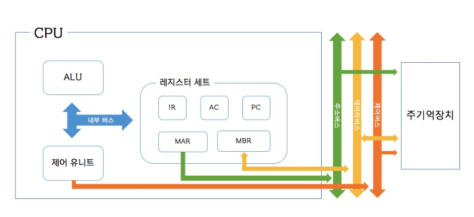
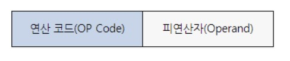

# CPU 작동원리

## <목차>
1. CPU란
2. CPU 구성  
    2.1 특수 목적 레지스터  
3. CPU 동작 과정
4. 명령어  
    4.1 명령어 세트  
    4.2 명령어 사이클  

 

## 1. CPU란
* `중앙처리장치로, 컴퓨터에서 가장 핵심적인 역할을 수행하는 부분으로서 인간의 두뇌에 해당`
* 프로그램을 실행하기 위해 메인 메모리에서 명령어를 인출하여 해독하고 실행

 

## 2. CPU 구성

 

   
    

 

* __연산 장치(ALU, 산술 논리 장치)__  
    * `산술 연산과 논리 연산 수행`
    * 연산에 필요한 데이터를 레지스터에서 가져오고, 연산 결과를 다시 레지스터로 보냄
* __제어 장치(CU)__
    * `명령어를 순서대로 실행할 수 있도록 제어하는 장치`
    * 주기억장치(메인메모리)에서 프로그램 명령어를 꺼내 해독하고, 그 결과에 따라 명령어 실행에 필요한 제어 신호를 기억장치, 연산장치, 입출력 장치로 보냄
    * 위 장치들이 보낸 신호를 받아 다음에 수행할 동작 결정
* __레지스터__
    * `명령어 주소, 코드, 연산에 필요한 데이터, 연산 결과 등을 임시로 저장하는 고속 기억장치`
    * 용도에 따라 범용 레지스터와 특수목적 레지스터로 구분
        * 범용 레지스터 : 연산에 필요한 데이터나 연산 결과를 임시로 저장
        * 특수목적 레지스터 : 특별한 용도로 사용하는 레지스터

 

### 2.1 특수 목적 레지스터
* __메모리 주소 레지스터(MAR)__
    * 읽기와 쓰기 연산을 수행할 주기억장치의 주소 저장
* __프로그램 카운터(PC)__
    * 다음에 수행할 명령어의 주소 저장
* __명령어 레지스터(IR)__
    * 현재 실행 중인 명령어 저장
* __메모리 버퍼 레지스터(MBR)__
    * 주기억장치에서 읽어온 데이터나 주기억장치에 저장할 데이터 임시 저장
* __누산기(AC)__
    * 연산 결과 임시 저장

 

## 3. CPU 동작 과정
1. 주기억장치는 입력장치에서 입력받은 데이터 또는 보조기억장치에 저장된 프로그램 읽어옴
2. CPU는 프로그램 실행을 위해 주기억장치에서 저장된 프로그램 명령어와 데이터를 읽어와 처리하고 결과를 다시 주기억 장치에 저장
3. 주기억장치는 처리 결과를 보조기억장치에 저장하거나 출력장치로 보냄
4. 제어 장치는 1 ~ 3 과정에서 명령어가 순서대로 실행되도록 각 장치를 제어

 

## 4. 명령어

 

### 4.1 명령어 세트

 

   
    

 

* `CPU가 실행할 명령어의 집합`
* 연산코드
    * 실행하는 연산의 종류에 따라 4가지 기능으로 나뉨  
        * 연산기능 : 산술논리연산 수행
        * 제어기능 : 명령어의 실행 순서 제어
        * 데이터 전달기능 : 레지스터와 주기억장치 사이에서 데이터 전달
        * 입출력 기능 : 프로그램 데이터를 주기억장치에 전달하고 연산 결과는 출력장치로 전달
* 피연산자
    * 주소 : 기억장치 혹은 레지스터의 주소 저장
    * 숫자/문자
    * 논리 데이터

 

### 4.2 명령어 사이클
* `CPU가 주기억장치에서 하나의 명령으를 읽어와 수행하는 일련의 과정으로 크네 4가지로 나뉨`
    * __인출(fetch)__
        * `기억장치로부터 저장되어 있는 명령어를 인출하는 과정`
    * __실행(execute)__
        * `명령어 인출과정으로 통해 IR 레지스터에 실린 명령어를 해독하고, 해독한 명령어에 따라 필요한 연산 수행`
        * 수행되는 연산 종류 : 데이터 이동/처리/저장/제어
    * __간접(indirect)__
        * `간접주소지정방식에서 명령어 오퍼랜드의 유효주소를 결정하는 과정`
        * 인출 사이클에서 인출된 명령어가 간접주소지정방식을 사용하면, 간접 사이클이 실행 사이클 보다 먼저 실행
    * __인터럽트(interrupt)__
        * `CPU의 정상적인 동작 중에 인터럽트 요청이 발생했을 때 실행되는 과정`
        * 실행 사이클이 끝난 직후에 인터럽트가 발생했는지를 검사하며, 발생하였다면 인터럽트 서비스 루틴(ISR)이 시작되도록 하는 것

 

## [면접질문 예시]
Q. GPU와 CPU의 차이에 대해 설명하세요.  
A. CPU는 입출력장치, 기억장치, 연산장치 등을 포함한 컴퓨터 리소스를 관리하는 최상위 계층의 중앙처리장치이다. 데이터 처리와 더불어 프로그램에서 작업의 우선순위를 지정하고 전환하며 가상 메모리를 관리하는 등의 역할을 한다.CPU는 직렬 처리에 최적화된 몇 개의 코어로 구성되어 있다.  
GPU는 반복적이고 비슷한 대량의 연산을 수행하며 이를 병렬적으로 나누어 작업하기 때문에 CPU에 비해 속도가 압도적으로 빠르다. GPU는 병렬 처리용으로 설계된 수천 개의 보다 소형이고 효율적인 코어로 구성되어있다.

 

## Reference
https://gyoogle.dev/blog/computer-science/computer-architecture/%EC%A4%91%EC%95%99%EC%B2%98%EB%A6%AC%EC%9E%A5%EC%B9%98%20%EC%9E%91%EB%8F%99%20%EC%9B%90%EB%A6%AC.html  
https://akdl911215.tistory.com/413  
https://velog.io/@sejin3319/%EC%A4%91%EC%95%99%EC%B2%98%EB%A6%AC%EC%9E%A5%EC%B9%98CPU-%EC%9E%91%EB%8F%99-%EC%9B%90%EB%A6%AC  
https://ndb796.tistory.com/7  
https://velog.io/@gothae/%EC%BB%B4%ED%93%A8%ED%84%B0-%EA%B5%AC%EC%A1%B0-CPU-%EC%9E%91%EB%8F%99%EC%9B%90%EB%A6%AC

