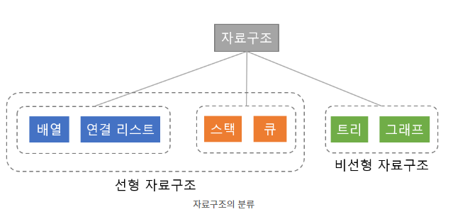
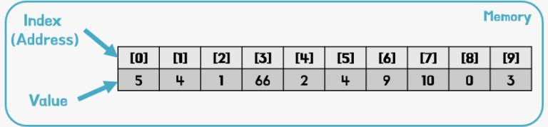
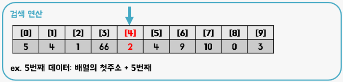
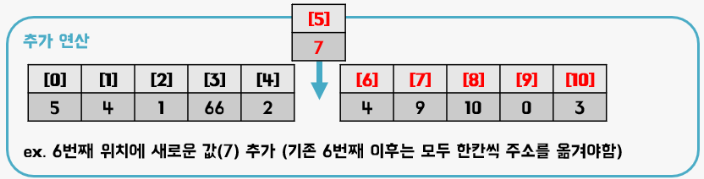

# 배열(Array)

## 자료구조에 대한 간단한 설명

 

  
 
 
 
  
 
데이터의 **논리적 관계**를 표현하고, **조직화**한 구조.
서비스나 어플리케이션에서 필요한 데이터를 메모리에 구조적으로 잘 정리해서 담아두고 관리
 
 
→ 효율적으로 일을 처리하기 위해서는 기능에 적합한 알맞은 자료구조를 써야한다.
 
**자료구조 공부 key point**
- **`Order`** : 자료 구조 안에 있는 데이터들의 순서가 보장이 되는지
- **`Unique`** : 중복된 데이터가 들어갈 수 있는지
- **`Search`** : 검색할 때 얼마나 효율적인지
- **`Modification`** : 우리가 원하는 기능에 따라서 수정할 때 얼마나 효율적인지
→ 자료구조를 공부할 때, 이것들이 어떻게 구현될 수 있는지 큰 그림을 그려가며 공부하는 것이 BEST
 
 

---

# 배열(Array)
 
 

## 목차
1. 배열의 특징
2. 배열의 장점
3. 배열의 단점
4. 배열의 필요성

 
## 1. 배열의 특징 
 

 

  
  

  
   

  실제 메모리 공간에 <strong>순차적(ordered)</strong>으로 저장된 선형의 데이터</u> 모음
 

*index: 배열의 순서. 배열에서 위치를 가리키는 숫자배열은 0부터 순서를 매긴다.
 
 
  

✔️ 같은 타입의 변수들로만 이루어진다(int, string …)
   
   
✔️ 초기에 배열 항목의 크기가 결정된다(4byte int 데이터를 담는 배열 선언 -> 항목의 크기 또한 4byte)
   
   
✔️ 순차적으로 데이터를 저장하여,  같은 종류의 데이터를 효율적으로 관리해야 하는 경우에 사용
   
   
 
 

## 2. 배열의 장점

 

  
 
 
 
  
 
### Acess

**항목 접근 속도가 일정하고 빠르다** 
O(1)의 시간에 인덱스를 통해, 메모리 주소 값에 접근하는 것을 **random access**라고 한다. 
찾고자 하는 항목의 index값, 즉 위치만 안다면 배열의 데이터에 빠르게 접속 가능하다.

**데이터 Acess 방식** : [[ + 데이터 타입의 크기 * 인덱스 번호]위치 계산]

 
 
  
## 3. 배열의 단점

 

  

 

 

### Insert/Delete
배열 중간 요소의 삽입/삭제가 발생할 시, 빈공간을 만들기 위해/빈공간을 채우기 위해 요소들이 움직어야 한다.
 
 
### 자료크기의 고정
크기를 변경할 수 없다. 크기를 변경해야 할 경우 새로운 배열을 생성 후 데이터를 복사해야 한다.
만약, 크기 변경을 피하기 위해 충분히 큰 배열을 생성하면, 메모리가 낭비된다.
 
 

## 4. 배열의 필요성
배열은 순차적으로 데이터를 저장하고, index를 이용해 특정 항목을 찾고 조작이 가능하다는 는 특징을 가지고 있다. 
따라서, 순차적으로 데이터가 저장되는 **시계열 데이터**에 접근할 때 유용하게 쓰인다.
 

Array를 적용시키면 좋은 예로 주식 차트가 있다.

주식 차트에 대한 데이터는 요소가 중간에 새롭게 추가되거나 삭제되는 정보가 아니며, 날짜별로 주식 가격이 차례대로 저장되어야 하는 데이터이다.

즉, 순서가 굉장히 중요한 데이터이므로 Array 같이 순서를 보장해주는 자료구조를 사용하는 것이 좋다.

Array를 사용하지 않고 순서가 없는 자료 구조를 사용하는 경우에는 날짜별 주식 가격을 확인하기 어려우며 매번 전체 자료를 읽어 들이고 비교해야 하는 번거로움이 발생할 것이다.

(Array의 데이터를 삭제하고 추가할 때 실제 메모리 상에서 이루어지는 작업이 커서, 보통 정보가 자주 삭제/추가 되는 데이터일 경우 Array를 사용하지 않는 것이 좋다.)

