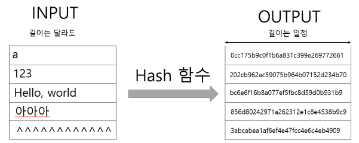
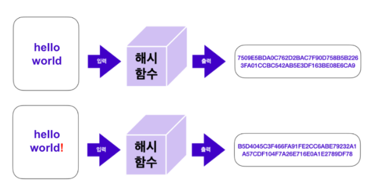
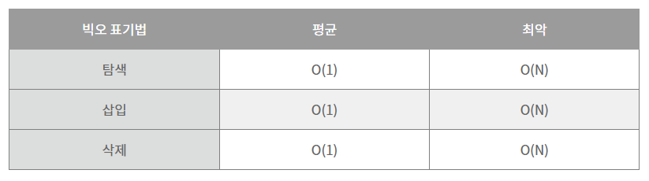

# Hash
## 목차
1. 해시란?
2. 해시 특징
3. 해시 테이블 장/단점<br>
   3.1. 장점<br>
   3.2. 단점
4. 해시테이블 VS 해시맵
5. 해시 테이블 시간복잡도
6. 구현코드

<br>
<br>

### 1. 해시란?
<p><b>해시</b></p>
<p>임의의 크기를 가진 데이터(Key)를 고정된 크기의 데이터(Value)로 변화시켜 저장하는 것</p><br>
<br>

<p><b>해시 함수(hash function)</b><br>
- 키에 대한 해시값을 만드는 함수(알고리즘)<br>
- 임의의 길이를 가진 데이터를 입력받아 고정된 길이의 값, 즉 해시값을 출력하는 함수이다.<br><br>
<br>
  
<p><b>해시 테이블</b></p>
- (Key, Value)로 데이터를 저장하는 자료구조<br>
- 키(Key), 해시함수(Hash Function), 해시(Hash), 값(value), 저장소(Bucket, Slot)로 이루어져 있다.<br>
<br>

<p><b>해시 맵</b></p>
- 해시 함수를 이용하여, [키,값]으로 연관(맵)시킨 자료구조<br>

<br>
<div align='center'> 

</div>
<br>
<p>해시값은 입력 데이터로부터 유도되기 때문에 동일한 입력은 항상 동일한 해시값을 갖게 된다.</p><br>

✔️ 해시 함수에 의해 반환되는 값 :  해시값(hash value), 해시 코드(hash code), 다이제스트(digest) 또는 간단히 해시(hash)라고도 한다.


<br><br><br>

### 2. 해시 특징
#### 1. 단방향성
<br>
<div align='center'> 

</div>
<br>

해시 함수는 단방향성을 가져, `입력 데이터에서 해시값으로의 변환은 쉽지만, 해시값에서 원래 데이터로의 역변환은 거의 불가능`
<br> :<b>이는 해시 함수가 데이터의 무결성을 보장하고, 보안 용도로 활용되는 데에 중요한 특징</b>
<br><br><br>
 
#### 2. 해시충돌
충돌 : 키에 대한 해시값이 같은 경우
<br><br>
해시충돌 : 해시 함수는 서로 다른 입력에 대해 동일한 해시값을 출력할 수 있다는 특징.
<br> 
<br>
<div align='center'> 

</div>
<br> 

좋은 해시함수는 `충돌을 최소화`해야 하며, 보안 측면에서 안전한 해시 함수는 `매우 낮은 충돌 확률을 보장해야 한다.`
<br><br><br>

#### 3. 고정된 결과값의 길이
해시 함수는 항상 일정한 길이의 결괏값을 출력한다.<br><br>

💡 입력 데이터의 크기가 다르더라도 항상 동일한 길이의 해시값을 반환 -> 블록체인과 같은 분산 시스템에서 `데이터의 일관성과 효율적인 처리를 보장하는 데에 유용`
<br><br>


<br>

### 3. 해시 테이블 장, 단점
#### 3.1 장점
- 해시 충돌이 없는 상태에서 배열, 리스트 같은 선형적인 구조는 물론 트리와 같은 선형적인 구조보다 빠른 탐색
- 해시를 사용하기에 해시 값을 알아도 key를 예측하기 어려움
<br>

#### 3.2 단점
- 충돌
- 공간 복잡도가 커진다.
- 순서가 있는 배열에는 어울리지 않는다.
- 해시 함수 의존도가 높아진다. (해시 함수의 성능에 따라 해시 테이블 전체 성능이 크게 영향을 받는다.)
<br><br><br>

### 4. 해시테이블 VS 해시맵
` 동기화 지원 여부, NULL 값 허용 여부 `
 - 병렬 처리를 하면서 자원의 동기화를 고려해야 하는 상황이라면 해시테이블(HashTable)을 사용
 - 병렬 처리를 하지 않거나 자원의 동기화를 고려하지 않는 상황이라면 해시맵(HashMap)을 사용

<br><br><br>

### 5. 해시 테이블 시간복잡도
<br>
<div align='center'> 

</div>
<br> 

- 키값이 배열의 인덱스로 변환되기 때문에 탐색,저장,삭제가 빠르다. 평균 시간 복잡도가 O(1)이다.
- 평균 시작 복잡도인 이유는 collision 때문이다.

<br><br><br>

### 6. 구현
(해시 테이블 구현 코드)

<h3>자바</h3>

```
public static class Item {
    public String key;
    public Object value;

    public Item(String key, Object value) {
        this.key = key;
        this.value = value;
    }
}

public static class HashTable {
    private static int HASH_TABLE_CAPACITY = 1000;
    private Item[] data = new Item[HASH_TABLE_CAPACITY];
    private int size = 0;

    private int getHash(String key) {
        int hash = 0;
        for (int i = 0; i < key.length(); i++) {
            char val = key.charAt(i);
            hash = (hash + val*(i + 1)) % HASH_TABLE_CAPACITY;
        }
        return hash;
    }

    public Object get(String key) {
        if (key != null) {
            int hash = getHash(key);
            while (data[hash] != null && !data[hash].key.equals(key)) {
                hash = (hash + 1) % HASH_TABLE_CAPACITY;
            }
            return data[hash] != null ? data[hash].value : null;
        }
        return null;
    }

    public void put(String key, Object value) {
        if (key != null) {
            int hash = getHash(key);
            while (data[hash] != null && !data[hash].key.equals(key)) {
                hash = (hash + 1) % HASH_TABLE_CAPACITY;
            }
            data[hash] = new Item(key, value);
            size++;
        }
    }

    public Object remove(String key) {
        Object removed = null;
        if (key != null) {
            int hash = getHash(key);
            while (data[hash] != null && !data[hash].key.equals(key)) {
                hash = (hash + 1) % HASH_TABLE_CAPACITY;
            }
            if (data[hash] != null) {
                removed = data[hash];
                data[hash] = null;
                size--;
            }
        }
        return removed;
    }

    public int size() {
        return size;
    }

    public String toString() {
        String out = "<HashTable>\n";
        for (int i = 0; i < data.length; i++) {
            Item item = data[i];
            if (item != null) {
                out += "  Key(hash, index): " + data[i].key
                        + "(" + getHash(data[i].key) + ", " + i + ")"
                        + ", Value: " + data[i].value + "\n";
            }
        }
        return out;
    }
}
```
[ 코드 출처 ](https://codechacha.com/ko/java-simple-hashtable-implementation/)<br>

<br>
<h3>파이썬</h3>

```
class LinkedTuple:
    def __init__(self):
        self.items = list()

    def add(self, key, value):
        self.items.append((key, value))

    def get(self, key):
        for k, v in self.items:
            if key == k:
                return v

class LinkedDict:
    def __init__(self, length):
        self.items = []
        for i in range(length):
            self.items.append(LinkedTuple())

    def put(self, key, value):
        index = hash(key) % len(self.items)
        self.items[index].add(key, value)


    def get(self, key):
        index = hash(key) % len(self.items)
        return self.items[index].get(key)

menu = LinkedDict(4)
menu.put("apple", 1000)
menu.put("potato", 500)
menu.put("melon", 9000)
menu.put("iceCream", 1500)
print(menu.get("apple"))	# 1000
print(menu.get("potato"))	# 500

```

### 기술 면접 질문
<b>Q.해시 테이블(Hash Table)과 시간 복잡도에 대해 설명해주세요. </b><br>
A. 해시 테이블은 (Key, Value)로 데이터를 저장하는 자료구조 중 하나로 빠르게 데이터를 검색할 수 있는 자료구조입니다.
빠른 검색 속도를 제공하는 이유는 내부적으로 배열(버킷)을 사용하여 데이터를 저장하기 때문입니다.
각 Key값은 해시함수에 의해 고유한 index를 가지게 되어 바로 접근할 수 있으므로 평균 O(1)의 시간 복잡도로 데이터를 조회합니다. 하지만 index값이 충돌이 발생한 경우 Chanining에 연결된 리스트들까지 검색해야 하므로 O(N)까지 증가할 수 있습니다.
<br><br>
<b>Q. 💡 Hash Map과 Hash Table의 차이점에 대해 설명해주세요. </b><br>
A.동기화 지원 여부와 null 값 허용 여부의 차이가 있습니다.<br>
해시 테이블(Hash Table) : 
병렬 처리를 할 때 (동기화를 고려해야 하는 상황) Thread-safe 하다.
Null 값을 허용하지 않는다.
<br>
해시 맵(Hash Map) : 
병렬 처리를 하지 않을 때 (동기화를 고려하지 않는 상황) Thread-safe하지 않는다.
Null 값을 허용한다.
<br><br>

### 참고자료
[ 해시 함수 개념, 블록체인 ](https://www.codestates.com/blog/content/%EB%B8%94%EB%A1%9D%EC%B2%B4%EC%9D%B8-%ED%95%B4%EC%8B%9C%ED%95%A8%EC%88%98) <br>
[ 해시 충돌(디테일 예시) ](https://runa-nam.tistory.com/84)<br>
[ 해시테이블 자바 구현 코드 ](https://codechacha.com/ko/java-simple-hashtable-implementation/)<br>
[ 해시테이블 VS 해시맵 ](https://mangkyu.tistory.com/102)<br>
[ Hash, Hashing, Hash Table(해시, 해싱 해시테이블) 자료구조의 이해 ](https://velog.io/@cyranocoding/Hash-Hashing-Hash-Table%ED%95%B4%EC%8B%9C-%ED%95%B4%EC%8B%B1-%ED%95%B4%EC%8B%9C%ED%85%8C%EC%9D%B4%EB%B8%94-%EC%9E%90%EB%A3%8C%EA%B5%AC%EC%A1%B0%EC%9D%98-%EC%9D%B4%ED%95%B4-6ijyonph6o)
<br>
