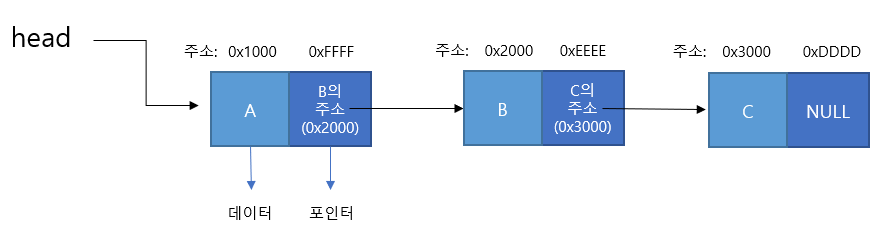
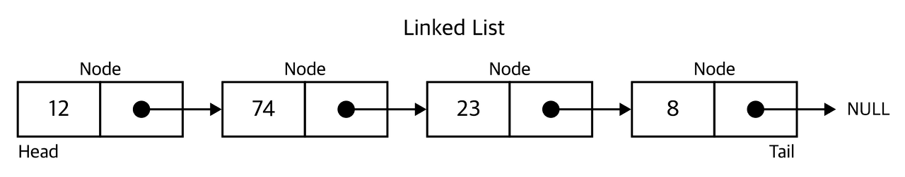
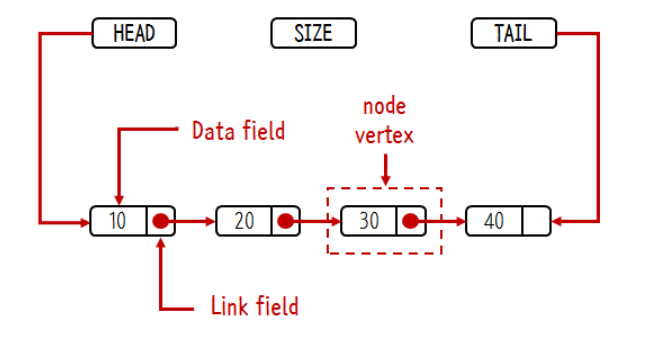

# LinkedList
<br>

## 목차
1. LinkedList란?<br>
   1-1. LinkedList<br>
   1-2. LinkedList의 구성<br>
   1-3. ArrayList와 비교<br>
2. LinkedList 종류
3. LinkedList Java 구현
4. 면접 예상질문
<br>
<br>

## 1. LinkedList란?
### 1-1. LinkedList
- 사전적 정의 : 각 노드가 데이터와 포인터를 가지고 한 줄로 연결되어 있는 방식으로 데이터를 저장하는 자료구조
<br>

### 1-2. LinkedList의 구성
<div align='center'>   
    
</div>

<br>

- 노드와 노드가 연결(Link)된 형태 <br>
- 각 노드는 **데이터의 내용을 담는 부분**과 **다음 노드의 주소값을 갖는 포인터 변수**로 구성되어 있다. <br>
- 리스트의 첫 번째 노드를 "헤드(Head)", 마지막 노드를 "테일(Tail)"이라고 한다. <br>
- 테일의 포인터 변수는 NULL을 가리킨다. <br>
<br>

### 1-3. ArrayList와 비교


### 특징 비교
<br>

#### (1) ArrayList 
- 중복을 허용하고 순서를 유지하며 인덱스로 원소들을 관리 (배열과 유사) <br>
- 배열과 다르게 배열을 추가하고 삭제하는 메서드가 존재 (크기 지정하지 않고 동적으로 값 추가, 삭제) <br>
- 데이터 추가시 더 큰 용량의 임시 배열을 만들어 복사 <br>
<br>

#### (2) LinkedList 
- 연결된 노드들의 집합으로, 각 노드는 데이터와 포인터로 구성 <br>
- 데이터 추가시 새로운 데이터 노드를 만들고 이전 노드의 포인터가 새 노드를 가리키도록 함 <br>
- 즉, 각 노드는 앞 뒤의 노드의 위치를 저장 <br>
<br>

### 어떨때 사용하면 좋을까?
#### (1) ArrayList
- 인덱스 기반 자료구조, get(int index)을 통해 무작위 접근 가능 "O(1)시간복잡도" <br>
- 삽입, 삭제시 배열을 임시배열에 복사하는 방식 "O(N)시간복잡도" <br>
<br>

#### (2) LinkedList
- 처음노드부터 찾고자 하는 노드까지 순차적으로 탐색. 최대 "O(N)시간복잡도" <br>
- 삽입, 삭제시 이전노드와 다음 노드를 참조하는 상태만 변경 "O(1)시간복잡도" <br>
<br>

### 결론 ✔️
- 검색 : ArrayList가 빠르다 <br>
- 삽입, 삭제 : LinkedList가 빠르다 <br>
<br>

### 검색, 삽입, 삭제시 LinkedList와 ArrayList의 성능 차이
<div align='center'>   
    
</div>
<br>

## 2. LinkedList 종류
### 1) 단순 연결 리스트
<div align='center'>   
    
</div>
<br>
- 각 노드에 한 개의 자료 공간과 한 개의 포인터 공간
- 각 노드의 포인터는 다음 노드 가리킴

### 2) 이중 연결 리스트
<div align='center'>   
    
</div>
<br>
- 단순 연결 리스트 단점 보완 (단순 연결 리스트는 이전 노드로는 가지 못함)
- 이중 연결 리스트는 앞 노드의 메모리 주소를 보관하는 포인터 prev를 만들어준 형태

### 3) 원형 연결 리스트
<div align='center'>   
    
</div>
<br>
- 단순 연결 리스트의 마지막 노드의 포인터가 NULL이 아닌 헤드를 가리키는 형태 (끝이 존재하지 않는다)


## 3. LinkedList Java 구현

### 객체 생성

### LinkedList.java

```java
public class LinkedList
````
### Main.java

```java
public class Main {
	public static void main(String[] args) {
    	LinkedList numbers = new LinkedList();
    }
}
````

<br>

### 노드 구현

- head : 첫 번째 노드를 지정하는 참조값
- tail : 마지막 노드
- size : 노드의 크기, 노드 변경시 수정 필요
- data : 노드의 값 (객체 Node의 내부 변수)
- next : 다음 노드의 참조값 (객체 Node의 내부 변수)
<div align='center'>   
    
</div>

<br>

```java
public class LinkedList {
	// 첫번째 노드를 가리키는 필드
    private Node head;
    private Node tail;
    private int size = 0;
    
    private class Node{
    	private Object data; //데이터가 저장될 필드 
        private Node next; 	 //다음 노드를 가리키는 필드
        
        public Node(Object input) {
        	this.data = input;
            this.next = null;
        }
       	
        public String toString() { //노드의 내용 출력
        	return String.valueOf(this.data)
        }
    }
}
````
<br>

### 데이터 추가

### (1) 시작에 추가

```java
public void addFirst(Object input){
	Node newNode = new Node(input); //노드 생성
    
    newNode.next = head; //새로운 노드의 다음 노드로 헤드를 지정
    
    head = newNode; //head를 새로운 노드로 지정 
    size++; 
    
    if(head.next == null)
    	tail = head;
}
````
<br>

### (2) 끝에 추가

```java
public void addLast(Object input) {
	Node newNode = new Node(input); //노드 생성
    
    if(size == 0) //리스트의 노드가 없는 경우, 첫번째 노드로 추가하는 메소드 사용 
    	addFirst(input); 
    else {
    	tail.next = newNode; //마지막 노드의 다음 노드로 생성한 노드를 지정
        tail = newNode; //마지막 노드를 갱신 
        size++; 
    	}
 }
````

<br>

### (3) 중간에 추가

```java
Node node(int index) {
	Node x = head;
    for(int i = 0; i < index; i++)        
    	x = x.next;
    return x;
 }
public void add(int k, Object input){
// k = 0이면 첫 번째 노드에 추가하는 것, addFirst 사용
	if(k==0)
    	addFirst(input);
    else {
    	Node temp1 = node(k-1); //k-1번째 노드를 temp1로 지정
        Node temp2 = temp1.next; //k번째 노드를 temp2로 지정
        
        Node newNode = new Node(input); 
        temp1.next = newNode; //temp1의 다음 노드로 새로운 노드를 지정
        newNode.next = temp2; //새로운 노드 다음 노드로 temp2 지정
        size++;
        
        if(newNode.next == null)
        	tail = newNode; 
            //새로운 노드의 다음 노드가 없다면
            //새로운 노드가 마지막 노드이기 때문에 
    }

}
````
<br>

### 데이터 삭제
### (1) 처음 노드 삭제

```java
public Object removeFirst() {
	Node temp = head; //첫번째 노드를 head로 지정
    head = temp.next; //head의 값을 두번째 노드로 변경
    
    Object returnData = temp.data; //데이터 삭제 전 리턴할 값을 임시 변수에 담아둔다.
    temp = null;
    size--;
    return returnData;
}
````
<br>

### (2) 중간 노드 삭제
```java
public Object remove(int k) {
	if(k == 0)
    	return removeFirst();
    
    Node temp = node(k-1); //k-1번째 node를 temp의 값으로 지정 
    
    Node todoDeleted = temp.next; 
    //삭제할 노드를 todoDeleted에 기록
    // 삭제 노드를 지금 제거하면 삭제 앞 노드와 삭제 뒤 노드를 연결할 수 없다. 
    
    temp.next = temp.next.next; 
    //삭제 앞 노드의 다음 노드로 삭제 뒤 노드를 지정한다. 
    
    Object returnData = todoDeleted.data; 
    //삭제된 데이터를 리턴하기 위해서 returnData에 저장한다. 
    
    if(todoDeleted == tail)
    	tail = temp;
   	
    todoDeleted = null;
    size--;
    return returnData;
}
````
<br>


## 4. 면접 예상질문
* ArrayList와 LinkedList의 차이가 무엇인가요?
<br>
* Array와 LinkedList의 차이가 무엇인가요? 
  - Array : Random Access 지원, 요소들을 인덱스를 통해 접근 가능, 고정 길이를 가지고 있다.
  - LinkedList : Sequencial Access를 지원, 요소에 접근할 때 순차적으로 검색해야 한다.


## (기타 지식) Array 와 ArrayList의 차이
* Array : Array는 static하다(길이 고정). Array 객체를 생성한 후에는 Array의 길이를 마음대로 변경할 수 없다.
<br>
* ArrayList : ArrayList는 사이즈가 dynamic하다. 각각의 ArrayList Object는 ArrayList의 size를 나타내는 capacity 인스턴스 변수를 가지고 있다. ArrayList에 요소들이 더해지면 ArrayList의 capacity 또한 자동적으로 늘어난다. 만약 설정한 capacity를 넘어서 더 많은 객체가 들어오면, 배열 크기를 1.5배 증가시킨다.


#### Reference
https://ko.wikipedia.org/wiki/%EC%97%B0%EA%B2%B0_%EB%A6%AC%EC%8A%A4%ED%8A%B8<br>
https://hyeinisfree.tistory.com/64<br>
https://velog.io/@frombozztoang/Java-Linked-List-%EA%B5%AC%ED%98%84%ED%95%98%EA%B8%B0 (면접 예상질문 참고)<br>
https://velog.io/@humblechoi/%EC%9E%90%EB%A3%8C%EA%B5%AC%EC%A1%B0-Array-vs-ArrayList (Array와 ArrayList 차이)<br>
