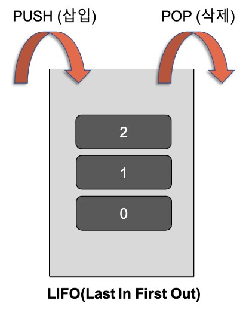
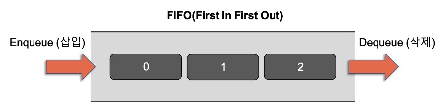
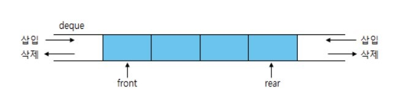

# Stack & Queue

## <목차>
1. 스택  
    1.1 스택(Stack)이란?  
    1.2 스택의 특징  
    1.3 스택의 활용 예시 
    1.4 배열을 이용한 java의 스택 구현
2. 큐  
    2.1 큐(Queue)란?  
    2.2 큐의 특징  
    2.3 큐의 다른 형식
    2.4 큐의 활용 예시  
    2.5 배열을 이용한 java의 큐 구현
3. 덱
4. 오버플로우와 언더플로우

<br />

## 1. 스택  

<br />

<div align='center'>   
    
</div>

<br />

### 1.1 스택(Stack)이란?  
* 스택이란 "쌓다"라는 의미로, 데이터를 차곡차곡 쌓아 올린 형태의 선형 자료구조  
* 후입선출(LIFO, Last In First Out) 방식의 자료구조

<br />

### 1.2 스택의 특징  
* 정해진 방향으로만 쌓을 수 있음
* 스택의 내부의 데이터는 top(가장 마지막에 들어온 자료를 가리킴)을 통해서만 접근 가능
    * push 연산 : 데이터 삽입 연산으로, top이 가리키는 자료의 위에 쌓음
    * pop 연산 : 데이터 삭제 연산으로, top이 가리키는 자료를 삭제
* 시간복잡도  
    * 데이터 삽입, 삭제 : O(1)
    * 데이터 검색 : O(n)


<br />

### 1.3 스택의 활용 예시  
* 웹 브라우저 방문 기록 뒤로가기
    * 가장 나중에 열린 페이지부터 뒤로 가기를 실행
* 문서작업에서 Ctrl+Z(실행 취소)
    * 가장 마지막에 실행된 것부터 실행을 취소
* 역순 문자열 만들기
    * 가장 마지막에 입력된 문자부터 출력
* 후위 표기법 계산
* 수식의 괄호 검사
    * 연산자 우선순위 표현을 위한 괄호 검사
* `함수의 콜스택`
    * 함수 호출과 복귀에 따른 순서 관리
* `DFS, 재귀 알고리즘`

<br />

### 1.4 배열을 이용한 java의 스택 구현
```java
class Stack
{
    private int arr[];
    private int top;
    private int capacity;
 
    // Stack 초기화를 위한 생성자
    Stack(int size)
    {
        arr = new int[size];
        capacity = size;
        top = -1;
    }
 
    // Stack에 요소 `x`를 추가하는 유틸리티 함수
    public void push(int x)
    {
        if (isFull())
        {
            System.out.println("Overflow\nProgram Terminated\n");
            System.exit(-1);
        }
 
        System.out.println("Inserting " + x);
        arr[++top] = x;
    }
 
    // Stack에서 최상위 요소를 꺼내는 유틸리티 함수
    public int pop()
    {
        // Stack 언더플로 확인
        if (isEmpty())
        {
            System.out.println("Underflow\nProgram Terminated");
            System.exit(-1);
        }
 
        System.out.println("Removing " + peek());
 
        // Stack 크기를 1로 줄이고 (선택적으로) 팝된 요소를 반환합니다.
        return arr[top--];
    }
 
    // Stack의 최상위 요소를 반환하는 유틸리티 함수
    public int peek()
    {
        if (!isEmpty()) {
            return arr[top];
        }
        else {
            System.exit(-1);
        }
 
        return -1;
    }
 
    // Stack의 크기를 반환하는 유틸리티 함수
    public int size() {
        return top + 1;
    }
 
    // Stack이 비어 있는지 확인하는 유틸리티 함수
    public boolean isEmpty() {
        return top == -1;               // or return size() == 0;
    }
 
    // Stack이 가득 찼는지 확인하는 유틸리티 함수
    public boolean isFull() {
        return top == capacity - 1;     // or return size() == capacity;
    }
}
 
class Main
{
    public static void main (String[] args)
    {
        Stack stack = new Stack(3);
 
        stack.push(1);      // Stack에 1 삽입
        stack.push(2);      // Stack에 2 삽입
 
        stack.pop();        // 상단 요소 제거(2)
        stack.pop();        // 최상위 요소 제거(1)
 
        stack.push(3);      // Stack에 3 삽입
 
        System.out.println("The top element is " + stack.peek());
        System.out.println("The stack size is " + stack.size());
 
        stack.pop();        // 최상위 요소 제거(3)
 
        // Stack이 비어 있는지 확인
        if (stack.isEmpty()) {
            System.out.println("The stack is empty");
        }
        else {
            System.out.println("The stack is not empty");
        }
    }
}
```
<br />

## 2. 큐  

<br />

<div align='center'>   
    
</div>

<br />

### 2.1 큐(Queue)란?  
* 큐란 "줄을 서서 기다린다"라는 의미로, 선입선출(FIFO, First In First Out) 방식의  선형 자료구조

<br />

### 2.2 큐의 특징  
* 스택과 달리 삽입, 삭제가 다른 방향에서 이루어짐
* 가장 첫 원소를 가리키는 front, 가장 끝원소를 가리키는 rear로만 접근 가능
    * dnQueue : 데이터 삭제 연산으로, front에서만 이루어짐 (Java에서는 poll())
    * enQueue : 데이터 삽입 연산으로, rear에서만 이루어짐 (Java에서는 offer())  
* 시간복잡도  
    * 데이터 삽입, 삭제 : O(1)  
    * 데이터 검색 : O(n)    
* 삽입 삭제를 반복하다보면 front가 한 칸씩 뒤로 밀려나면서 큐의 가용 범위가 줄어들면서 큐의 재사용 또한 불가능하게 됨

### 2.3 큐의 다른 형식
* 원형 큐(Circle Queue)
    * 선형 큐의 단점인 공간의 효율성을 보완하여 메모리 재사용을 가능하게 한 큐  
    * 초기 front와 rear는 맨 처음 인덱스의 위치  
    * front와 rear를 회전시키기 위해서 모듈러(%)연산 사용  
    * 배열을 이용하여 구현 가능
* 우선순위 큐(Priority Queue)
    * 저장한 순서에 상관없이 우선순위가 높은 것 부터 꺼냄
    * 배열 또는 연결 리스트 또는 힙을 이용하여 구현 가능

<br />

### 2.4 큐의 활용 예시
* 우선순위가 같은 작업 예약  
    * 프린터 인쇄 대기열  
* `OS의 스케줄러(프로세스 관리)`
* `BFS 알고리즘`

<br />

### 2.5 배열을 이용한 java의 큐 구현
```java
// Queue를 나타내는 클래스
class Queue
{
    private int[] arr;      // Queue 요소를 저장할 어레이
    private int front;      // 앞은 Queue의 앞 요소를 가리킴
    private int rear;       // 후면은 Queue의 마지막 요소를 가리킵니다.
    private int capacity;   // Queue의 최대 용량
    private int count;      // Queue의 현재 크기
 
    // Queue를 초기화하는 생성자
    Queue(int size)
    {
        arr = new int[size];
        capacity = size;
        front = 0;
        rear = -1;
        count = 0;
    }
 
    // 앞 요소를 큐에서 빼는 유틸리티 함수
    public int dequeue()
    {
        // Queue 언더플로 확인
        if (isEmpty())
        {
            System.out.println("Underflow\nProgram Terminated");
            System.exit(-1);
        }
 
        int x = arr[front];
 
        System.out.println("Removing " + x);
 
        front = (front + 1) % capacity;
        count--;
 
        return x;
    }
 
    // Queue에 항목을 추가하는 유틸리티 함수
    public void enqueue(int item)
    {
        // Queue 오버플로 확인
        if (isFull())
        {
            System.out.println("Overflow\nProgram Terminated");
            System.exit(-1);
        }
 
        System.out.println("Inserting " + item);
 
        rear = (rear + 1) % capacity;
        arr[rear] = item;
        count++;
    }
 
    // Queue의 앞 요소를 반환하는 유틸리티 함수
    public int peek()
    {
        if (isEmpty())
        {
            System.out.println("Underflow\nProgram Terminated");
            System.exit(-1);
        }
        return arr[front];
    }
 
    // Queue의 크기를 반환하는 유틸리티 함수
    public int size() {
        return count;
    }
 
    // Queue가 비어 있는지 확인하는 유틸리티 함수
    public boolean isEmpty() {
        return (size() == 0);
    }
 
    // Queue가 가득 찼는지 확인하는 유틸리티 함수
    public boolean isFull() {
        return (size() == capacity);
    }
}
 
class Main
{
    public static void main (String[] args)
    {
        // 용량이 5인 Queue 생성
        Queue q = new Queue(5);
 
        q.enqueue(1);
        q.enqueue(2);
        q.enqueue(3);
 
        System.out.println("The front element is " + q.peek());
        q.dequeue();
        System.out.println("The front element is " + q.peek());
 
        System.out.println("The queue size is " + q.size());
 
        q.dequeue();
        q.dequeue();
 
        if (q.isEmpty()) {
            System.out.println("The queue is empty");
        }
        else {
            System.out.println("The queue is not empty");
        }
    }
}
```

<br />

### 3. 덱

<div align='center'>   
    
</div>

<br />

* Double - Ended Queue의 줄임말
* Stack과 Queue의 연산을 모두 지원 
* 삽입, 삭제가 양 끝에서 모두 가능
* 가변적 크기
* index를 통해 임의의 원소에 바로 접근 가능
* Scroll : 입력 제한 덱 (입력 한쪽만 + 출력 양쪽에서)
* Shelf : 출력 제한 덱 (입력 양쪽에서 + 출력 한쪽만)
* 시간복잡도  
    * 데이터 삽입, 삭제 : O(1)  
    * 데이터 검색 : O(1)   

<br />

### 4. 오버플로우와 언더플로우
* 오버플로우 : 특정한 자료구조가 수용할 수 있는 데이터의 크기를 넘어가는 삽입 연산 수행시 발생
* 언더플로우 : 비어있는 자료구조에서 삭제 연산을 수행할 때 발생

<br />

### [면접 예상 질문]  
1. Stack과 Queue의 구조에 대해 설명해주세요.  
Stack과 Queue는 선형 자료구조의 일종입니다.
Stack은 후입선출(LIFO)방식 즉, 나중에 들어간 원소가 먼저 나오는 구조이고
Queue는 선입선출(FIFO)방식 즉, 먼저 들어간 원소가 먼저 나오는 구조를 갖습니다.

2. Stack과 Queue의 실사용 예를 들어 간단히 설명해주세요.  
Stack - 자바의 Stack 메모리 영역
지역변수와 매개변수 데이터 값이 저장되는 공간이며, 메소드 호출시 메모리에 할당되고 종료되면 메모리가 해제되며,
LIFO(Last In First Out)구조를 가집니다.

Queue - OS의 스케쥴러
자원의 할당과 회수를 하는 스케쥴러 역할을 큐가 할 수 있습니다.
메모리에 적재된 다수의 프로세스 중 어떤 프로세스에게 자원을 할당할 것인가 그 순서를 결정하는 것이 자원의 효율적인 사용에 있고,
가장 단순한 형태의 스케쥴링 정책이 선입선처리(First Com First Served) 즉, 큐라고 볼 수 있습니다.

3. Priority Queue(우선순위 큐)에 대해 설명해주세요.  
우선순위 큐는 들어간 순서에 상관없이 우선순위가 높은 데이터를 먼저 꺼내기 위해 고안된 자료구조입니다.
우선순위 큐 구현 방식에는 배열, 연결 리스트, 힙이 있고, 그중 힙 방식이 worst case라도 시간 복잡도 O(logN)을 보장하기 때문에 일반적으로 완전 이진트리 형태의 힙을 이용해 구현합니다.


### Reference
https://dev-coco.tistory.com/159  
https://jud00.tistory.com/entry/%EC%9E%90%EB%A3%8C%EA%B5%AC%EC%A1%B0-%EC%8A%A4%ED%83%9DStack%EA%B3%BC-%ED%81%90Queue%EC%97%90-%EB%8C%80%ED%95%B4%EC%84%9C-%EC%95%8C%EC%95%84%EB%B3%B4%EC%9E%90  
https://wooono.tistory.com/395  
https://velog.io/@humblechoi/%EC%9E%90%EB%A3%8C%EA%B5%AC%EC%A1%B0-Stack-Queue  
https://leejinseop.tistory.com/39  
https://velog.io/@falling_star3/%EC%9E%90%EB%A3%8C%EA%B5%AC%EC%A1%B0-%EC%8A%A4%ED%83%9DStack%ED%81%90Queue%EB%8D%B1Deque  
https://www.techiedelight.com/ko/stack-implementation-in-java/  
https://www.techiedelight.com/ko/queue-implementation-in-java/  