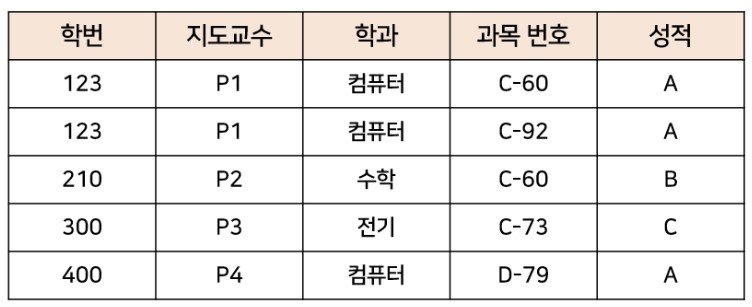
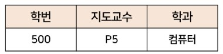
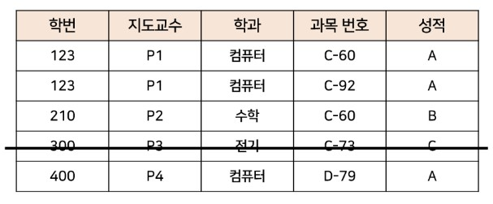
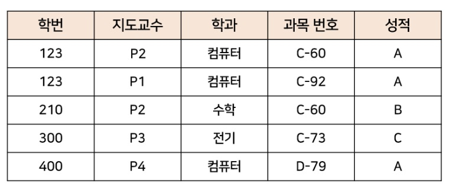

# 이상현상

## <목차>
1. 이상현상이란?
2. 삽입 이상
3. 삭제 이상
4. 갱신 이상

## 1. 이상현상이란?
* 테이블 내의 데이터들이 불필요하게 중복되어 테이블을 조작할 때 발생되는 데이터 불일치 현상
* 테이블을 설계할 때 잘못 설계하여 삽입, 삭제, 수정 시 발생하는 논리적인 오류

 

   
    

 

## 2. 삽입 이상
자료를 삽입할 때 불필요한 데이터를 추가해야만 자료를 테이블에 추가할 수 있는 현상

<예시>

 

### [강의를 수강하지 않는 학생을 테이블에 추가하고 싶은 경우]

   
    

 

- 위와 같은 형태의 데이터를 삽입할 수 없으므로, 과목 번호와 성적에 null 값이 들어가거나 불필요한 데이터를 추가해야 삽입이 가능

 

## 3. 삭제 이상
자료를 삭제할 때 필요한 데이터를 함께 삭제 하지 않고서는 원하는 데이터를 삭제하는 것이 불가능한 현상

<예시>

 

### [학번이 300인 학생이 과목 수강을 취소하여 테이블에서 삭제하고자 하는 경우]

   
    

 

- 과목 번호가 C-73인 강의에 대한 정보도 함께 삭제됨

 

## 4. 갱신 이상
자료를 갱신할 때 반복되는 데이터 중에 일부만 변경하여 데이터가 불일치가 발생하는 현상

<예시>

 

### [학번이 123인 학생의 지도교수가 P2로 변경된 경우]

   
    

 

- 학번 123인 학생이 수강하는 모든 과목 행에서의 지도교수를 변경시켜 주지 않을 경우, 학생의 지도교수가 누구인지 알 수 없게 됨

## 5. 이상현상과 정규화
- 이상현상들은 대부분 데이터의 중복성으로 인하여 발생하는데, 정규화를 통해 방지할 수 있다.

## [면접예상질문]
Q. 이상현상의 종류에 대해 설명해주세요.

## [Reference]
* [정규화&함수종속성&이상현상](https://rebro.kr/159)
* [데이터베이스 이상현상(Anomaly)](https://velog.io/@ex0831/0531-TIL-%EB%8D%B0%EC%9D%B4%ED%84%B0%EB%B2%A0%EC%9D%B4%EC%8A%A4-%EC%9D%B4%EC%83%81-%ED%98%84%EC%83%81Anomaly)
* [신입 개발자 기술면접 질문 정리 - 데이터베이스](https://dev-coco.tistory.com/158)