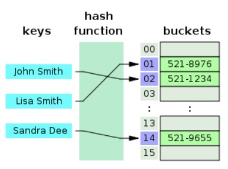
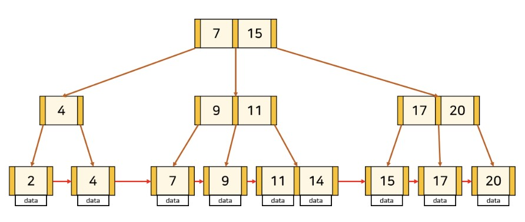
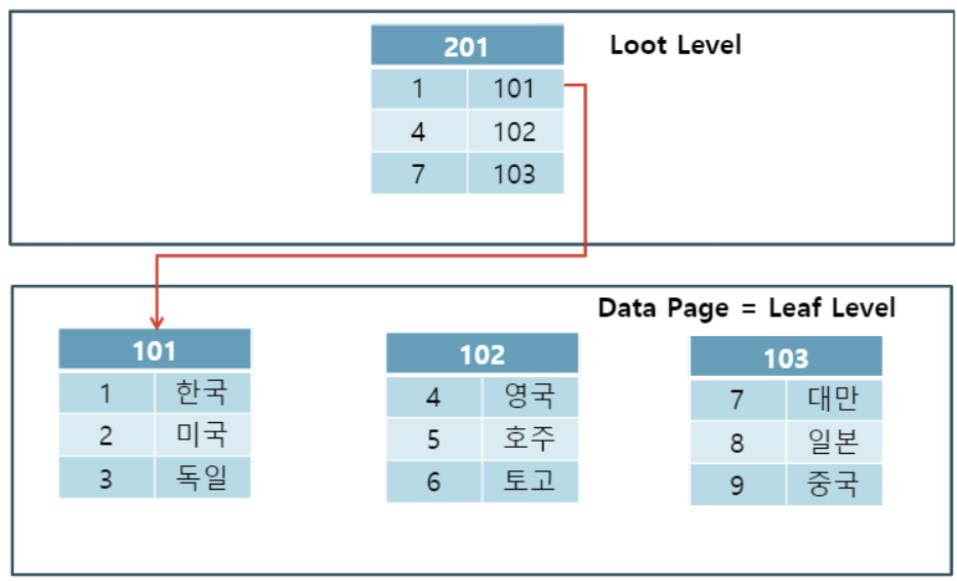
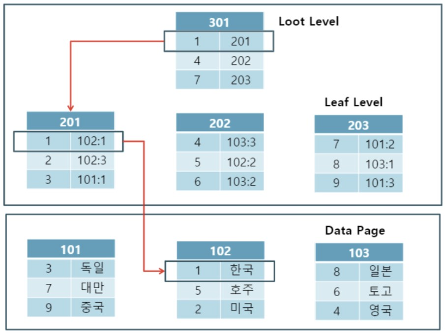
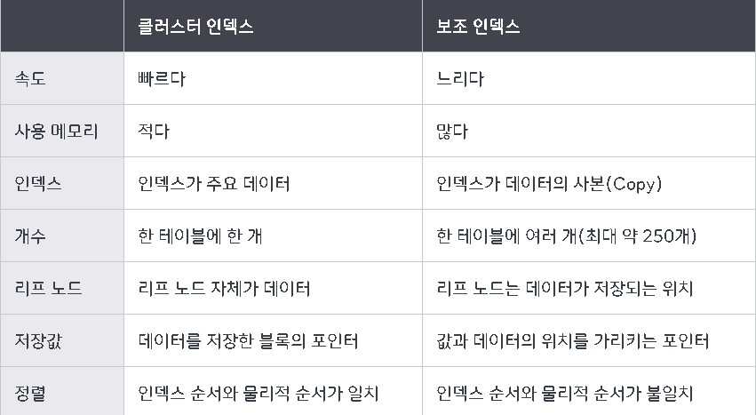

# 인덱스

## <목차>
1. 인덱스란?
2. 인덱스 자료구조  
    2.1 해시 테이블  
    2.2 B+ 트리  
3. 인덱스 종류  
    3.1 클러스터형 인덱스  
    3.2 넌클러스터형 인덱스  
4. 인덱스의 장단점  
    4.1 장점(사용이유)  
    4.2 단점(인덱스 사용시 주의할 점)  
5. 인덱스가 동작하지 않는 경우
6. 효과적인 인덱스 설정

<br/>

## 1. 인덱스란?
* `데이터베이스 테이블에 대한 검색 성능의 속도를 높여주는 자료구조` (오름차순으로 정렬)
* 특정 컬럼의 인덱스 생성 시 해당 컬럼의 데이터들을 정렬하여 별도의 메모리 공간에 데이터의 물리적 주소와 함께 저장
* 인덱스 생성 시 DB크기의 약 10% 정도 되는 추간 공간이 필요

> ___테이블 생성시, 3가지 파일 생성___  
> -FRM(테이블 구조 저장 파일)  
> -MYD(실제 데이터 파일)  
> -MYI(Index 정포 파일)

<br/>

## 2. 인덱스 자료구조
### 2.1 해시 테이블

<br/>

<div align='center'>

</div>

<br/>

* (key, value) = (컬럼의 값, 물리적 주소) 쌍으로 저장하는 자료구조
* 등호(=) 연산에 최적
* 해시 테이블 내의 데이터들이 정렬되어 있지 않아 부등호(>,<) 연산에 적합하지 않음
* DB에서는 부등호(>,<) 연산이 자주 사용되기 때문에 실제 인덱스에서 잘 사용되지 않음

<br/>

### 2.2 B+ 트리

<br/>

<div align='center'>

</div>

<br/>

* 대부분의 DBMS와 오라클에서 중점적으로 사용하고 있는 가장 보편적인 인덱스
* Root Node(기준), Branch Node(중간), Leaf Node(말단)의 계층적 구조
* B-Tree를 개선시킨 자료구조
* Leaf Node만 인덱스(key)와 함께 데이터(value)를 가짐 나머지 Node는 인덱스만 가짐
* Leaf Node까리 LinkedList로 연결되어 부등호를 이용한 순차 검색 연산을 용이하게 함

<br/>


## 3. 인덱스 종류
### 3.1 클러스터형 인덱스 

<br/>

<div align='center'>

</div>

<br/>

* Clutered Index 구성을 위해 물리적으로 행을 재배열하여 root 페이지 생성
* root 페이지는 leaf 페이지의 주소로 구성, `leaf 페이지는 실제 데이터 페이지`로 구성되어 인덱스 페이지 용량이 작음
* `테이블당 단 하나의 Clustered Index만 존재`
* Clustered Index를 따로 지정하지 않으면 기본 키가 클러스터드 인덱스가 됨
* 물리적으로 정렬되어 있어 `검색 속도가 빠르지만 데이터의 입력, 수정, 삭제가 느림`
* 사용되는 경우
    * 자주 업데이트 되지 않는 테이블
    * MIN, MAX, COUNT를 이용한 범위 또는 Group By 절 조회
    * 항상 정렬된 방식으로 데이터 반환해야하는 경우(부하가 심한 Order By 절에 의한 정렬과정 피할 수 있음)
    * 읽기 작업이 월등히 많은 경우

<br/>

### 3.2 넌클러스터형 인덱스

<br/>

<div align='center'>

</div>

<br/>

* `데이터 원본은 정렬되지 않고, 인덱스 페이지만 정렬`됨
* Leaf Level 인덱스 테이블이 필요
* Leaf 페이지는 키 값과 데이터가 위치하는 포인터(RID)로 구성
* 포인터(RID) : '파일그룹번호 + 데이터페이지 번호 + 페이지 내의 로우 번호'로 구성된 포인팅 정보
* 테이블당 약 250개의 NonClustered Index를 만들 수 있다
* Unique key 설정시 자동으로 생성
* 데이터 검색을 하는데 거쳐야하는 단계가 더 추가되어 `검색 속도는 느리지만 데이터의 입력, 수정, 삭제는 빠름`
* 사용되는 경우
    * where절이나 join절과 같이 조건문을 활용할 경우
    * 데이터가 자주 업데이트될 경우
    * 특정 컬럼이 쿼리에서 자주 사용 될 경우

<br/>

<div align='center'>

</div>

<br/>

## 4. 인덱스의 장단점
### 4.1 장점(사용이유) 
* `데이터가 정렬되어 있기 때문에 테이블에서 검색과 정렬 속도를 향상`
    * 조건 검색 Where절의 효율성
    * Order By 절의 효율성
    * MIN, MAX의 효율적인 처리
* 테이블 행의 고유성 강화
* 적은 처리량으로 결과를 얻을 수 있기에 전반적인 시스템의 부하를 줄임

<br/>

### 4.2 단점(인덱스 사용시 주의할 점)  
* 데이블 변경시 정렬된 상태를 계속 유지시켜야함(과도한 테이블 변경으로 인한 부하 발생)
    * INSERT : 새로운 데이터에 대한 인덱스를 추가
    * DELETE : 삭제하는 데이터의 인덱스를 사용하지 않는다는 작업 진행
    * UPDATE : 기존의 인덱스를 사용하지 않음 처리 후 갱신된 데이터에 대해 인덱스 추가
* 무조건 인덱스 스캔이 유리한 것이 아님
    * 레코드 수가 작은 경우 풀 스캔이 유리할 수 있음
    * 검색할 데이터가 전체 데이터의 20% 이상이라면 Mysql에서 인덱스를 사용하지 않음(10%~15%이내 권장)
* 추가적인 저장공간을 필요로하기 때문에 인덱스를 많이 생성하면 성능 부하를 초래(테이블당 4~5개 권장)

<br/>

## 5. 인덱스가 동작하지 않는 경우
* 인덱스 컬럼 변형
    * where절에 사용할 인덱스에 함수를 적용 ( lower(name) == 'word', to_char(hire_date))하거나 연산( where idx - 1 == 5 )을 하는등의 변형을 가한 경우
* 내부적 데이터 변환(묵시적 형변환)
    * where 절에 인덱스에 맞지 않는 데이터 타입을 주는 경우
    (hire_date는 date타입인데, where절에 hire_date = '21-01-01' 형태로 조건을 주는 경우)
* IS NULL/IS NOT NULL 구문 사용
    * 위 구문 사용 시 대부분 풀 스캔이 일어나므로, ''혹은 0값을 직접 사용하는 것이 나음
* NOT 또는 IN 연산자 사용
    * NOT에 사용된 값이 아닌 데이터 비율이 높거나 IN에 포함된 데이터 비율이 높다면 FULL SCAN이 더 낫다고 판단
* LIKE문장에서 범위 전체 지정
    * %표시가 앞쪽에 사용된 경우(where name like '%S')
* 부정형 조건(!=)의 사용
* OR 조건 사용

## 6. 효과적인 인덱스 설정(인덱스 선정 기준)
* `카디널리티가 높을수록`
    * 카디널리티 : 컬럼에 사용되는 값의 다양성 정도
    * 중복도가 작으면 카디널리티가 높음
* `선택도가 낮을수록`
    * 선택도 : 데이터에서 특정 값을 얼마나 잘 선택할 수 있는지  
    ```
     = 컬럼의 특정 값의 row 수 / 테이블의 총 row 수 * 100 
     = 컬럼의 특정 값들의 평균 row수 / 테이블의 총 row tn * 100
    ```  
    <예시>  
    ```
    SELECT COUNT(1) FROM '학생' WHERE '학번' = 1;
    (모두 고유하므로 특정 값: 1)
    
    ‘학번’의 선택도 = 1/10*100 = 10%  
    ```
    * 5~10% 적정
* `활용도가 높을수록`
    * 해당 컬럼이 쿼리의 where절에 자주 활용되는지
* `중복도가 없을수록`

## 7. 결합 인덱스
* 2개 이상의 컬럼을 합쳐서 생성한 인덱스
* 사용 경우
    * where 절에서 and 조건으로 자주 결합되어 사용되면서 각각의 분포도보다 두 개 이상의 컬럼이 결합될 때 분포도가 좋아진 컬럼들
    * 다른 테이블과 조인의 연결고리로 자주 사용되는 컬럼들
    * order by에서 자주 사용되는 컬럼들
    * 하나 이상의 키 컬럼 조건으로 같은 테이블의 컬럼들이 자주 조회될 때
* 컬럼 순서 고려 시 우선순위
    * where절 조건이 많이 사용되는 컬럼이 우선시
    * 등호('=')로 사용되는 컬럼 우선
    * 분포도가 좋은 컬럼 우선
    * 자주 이용되는 순서대로 결합 인덱스 컬럼의 순서 결정

## [면접 예상 질문]
Q. 데이터베이스 인덱스 선정기준이 뭔가요?  
Q. 성별, 유무 같은 boolean 컬럼에도 인덱스를 걸면 좋은가요  
Q. 트리기반 인덱스와 해시 기반 인덱스가 쓰이는 곳이 어떻게 다른가요?

## [Reference]
* [인덱스 기술질문 면접리스트 -1](https://land-turtler.tistory.com/120)
* [인덱스 기술질문 면접리스트 -2](https://fors.tistory.com/641)
* [DB 인덱스란](https://velog.io/@alicesykim95/DB-%EC%9D%B8%EB%8D%B1%EC%8A%A4Index%EB%9E%80)
* [클러스터드 인덱스, 넌클러스터드 인덱스-1](https://velog.io/@sweet_sumin/%ED%81%B4%EB%9F%AC%EC%8A%A4%ED%84%B0%EB%93%9C-%EC%9D%B8%EB%8D%B1%EC%8A%A4-Clustered-Index-%EB%84%8C-%ED%81%B4%EB%9F%AC%EC%8A%A4%ED%84%B0%EB%93%9C-%EC%9D%B8%EB%8D%B1%EC%8A%A4-Non-Clustered-Index)
* [클러스터드 인덱스, 넌클러스터드 인덱스-2](https://inpa.tistory.com/entry/MYSQL-%F0%9F%93%9A-%EC%9D%B8%EB%8D%B1%EC%8A%A4index-%ED%95%B5%EC%8B%AC-%EC%84%A4%EA%B3%84-%EC%82%AC%EC%9A%A9-%EB%AC%B8%EB%B2%95-%F0%9F%92%AF-%EC%B4%9D%EC%A0%95%EB%A6%AC)
* [DB 인덱스 효과적 설정법](https://yurimkoo.github.io/db/2020/03/14/db-index.html)
* [결합인덱스](https://coding-factory.tistory.com/755)
* 참고 : [실행계획 분석을 위한 SCAN의 종류와 속도](https://coding-factory.tistory.com/744)