# 목차
1. 함수적 종속
2. 정규화의 등장 배경
    - 삽입 이상
    - 삭제 이상
    - 수정 이상
    - 해결안방안
2. 정규화란?
3. 정규형
    - 1차 정규형
    - 2차 정규형
    - 3차 정규형
    - 보이스-코드 정규형
4. 예상 면접 질문

 
 

# 함수적 종속(functional dependency)
## 개념
> 어떤 테이블 R에 존재하는 필드들의 부분 집합을 각각 X와 Y라고 할 때, X의 한 값이 Y에 속한 하나의 값에만 매핑 될 경우 `Y는 X에 함수 종속적`이다 라고 한다. 

- 논리적 설계 단계에서 데이터 중복 문제를 해결하기 위해 `테이블을 분해`해야하고, 이때 함수적 종속이라는 개념이 필요하다.
- 함수적 종속은 무결성 제약의 한 종류로, 테이블 내 `필드 간의 관계성`을 표현한다.

 

## 표기법
> `X -> Y`  
> X : 결정자(determinant)  
> Y : 종속자(dependent) 
 

> `Y는 X에 함수 종속된다.` = `X는 Y를 함수적으로 결정한다.` 
 

## 예제
- Table name : student
- Field 
    - stu_id : 학번(기본키)
    - resident_id : 학생의 주민번호
    - name : 학생의 이름
    - year : 학생의 학년
    - address : 학생의 주소
    - dept_id : 학과 번호
    - dept_name : 학과명
    - office : 학과실

   
    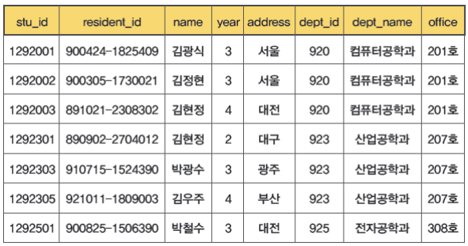

 

- name은 stu_id에 함수적으로 종속된다.
    - stu_id는 name을 결정한다.
- resident_id는 stu_id에 함수적으로 종속된다.
    - stu_id는 resident_id를 결정한다.
    - stu_id -> resident_id
- stu_id는 resident_id에 함수적으로 종속된다.
    - resident_id -> stu_id
    => stu_id와 resident_id는 서로 종속된다.   
 

- (stu_id, dept_name) -> office
- stu_id -> (name, dept_name)

 
 

# 정규화의 등장 배경
## 삽입 이상(insertion anomaly)
> 데이터를 삽입할 수 없거나 원치 않는 데이터를 삽입한다.
 

   
    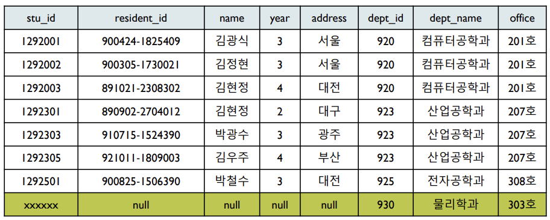

 

**상황** : student 테이블에 새로운 학과 정보('930', '물리학과', '303호')를 입력한다면?
 

**현상** : stu_id는 기본키 이므로 null 삽입이 불가능하다. 따라서 새로운 학과 정보를 삽입하고 싶다면, stu_id에 임의의 값을 생성해서 넣어야 한다.
 
 

## 삭제 이상(deletion anomaly)
> 삭제되지 말아야 할 정보까지 함께 삭제되는 현상이다.
 

   
    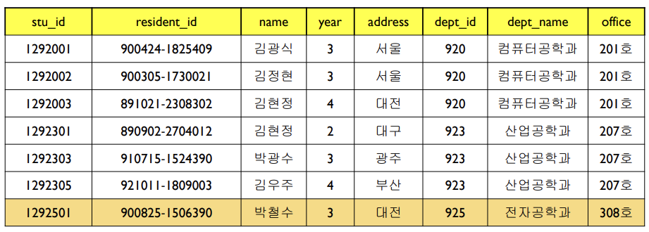

 

**상황** : 학번이 ‘1292501’인 레코드를 삭제한다면?
 

**현상** : '전자공학과'의 office가 '308호'라는 사실도 함께 삭제된다. 만약 이 학생이 '전자공학과'의 유일한 학생이라면 문제가 발생하게 된다.
 
 

## 수정 이상(update anomaly)
> 중복된 정보의 일부만 수정하여 정보의 불일치(inconsistency)가 발생하는 현상이다.
 

   
    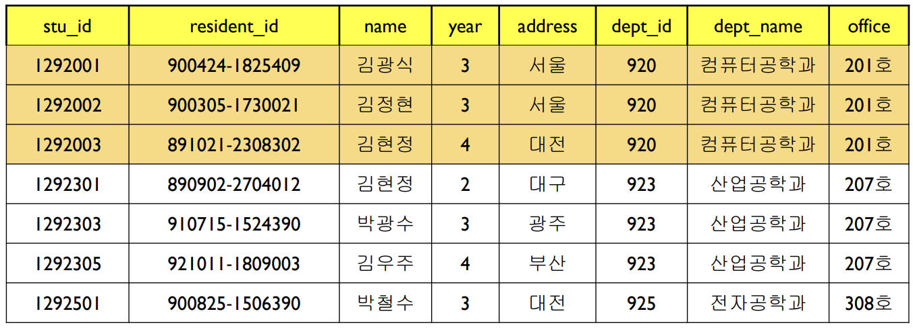

 

**상황** : '컴퓨터공학과'의 office가 '201호'에서 '211호'로 변경된다면?
 

**현상** : dept_name이 '컴퓨터공학과'인 모든 레코드를 수정해야 한다. 만약 세 레코드 중 일부만 수정한다면 정보의 불일치가 발생하게 된다.
 
 

## 해결 방안

   
    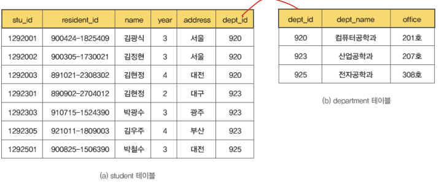

1. student 테이블에서 학과 정보를 `분리`하여 department 테이블을 생성한다.
2. dept_id(학과 번호) 필드를 이용하여 외래키로 학과 정보를 연결한다.

 
 

# 정규화란?
> 불필요한 데이터 중복을 피하기 위해 스키마를 분해하는 과정이다.
 

## 정규형의 종류
- 1차 정규형(1NF : first normal form)
- 2차 정규형(2NF : second normal form)
- 3차 정규형(3NF : third normal form)
- 보이스-코드 정규형(BCNF : Boyce=codd normal form)
- 4차 정규형(4NF : forth normal form)
- 5차 정규형(5NF : fifth normal form)
 

- 청규형이 높아질수록 테이블을 더 세부적으로 쪼개져 테이블의 수가 많아진다.
- 데이터베이스 설계시 일반적으로 4, 5차 정규형은 고려하지 않는다.
 
 

# 정규형
## 1차 정규형
### 개념
> 테이블 R에 속한 모든 도메인이 `원자값`으로만 구성되어 있다.
> (관계형 데이터 모델의 정의를 따르는 모든 테이블은 1차 정규형을 만족한다.)

   
    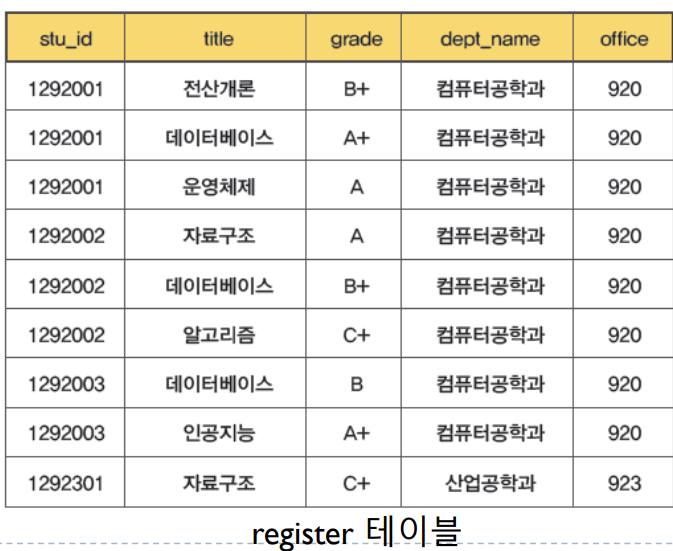

 

- (stu_id, title) -> grade
- stu_id -> dept_name
- dept_name -> office
=> stu_id -> office (이행규칙)
 

### 문제점
- 삽입 이상 : 학번이 '1234567'인 학생이 '전자공학'에 소속된다는 사실을 테이블에 삽입하려면 최소한 이 학생이 하나의 과목을 수강해야만 가능하다.
- 삭제 이상 : stu_id가 '1292301'인 학생이 '자료구조'를 수강한다는 사실을 삭제하면 이 학생이 '산업공학과'에 소속된다는 정보까지 동시에 삭제된다.
- 수정 이상 : 학번이 '1292001'인 학생의 소속이 '컴퓨터공학과'에서 '산업공학과'로 변경하면 모든 해당 레코드를 변경해야 한다.
 

#### 문제 발생 원인

   
    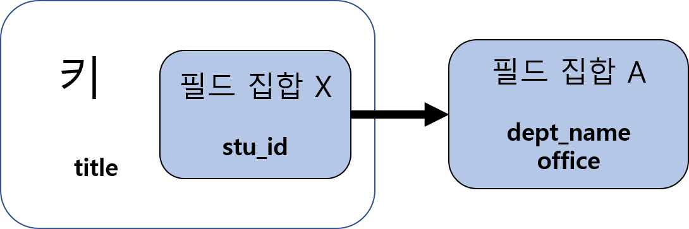

 

> `부분 종속`(partial dependency)  
> 키가 아닌 필드(A)가 키의 일부인 필드(X)에 종속된다.

- register 테이블
    - 기본키 : (stu_id, title)
    - dept_name 필드는 stu_id에 함수적으로 종속된다.
        => stu_id 필드는 dept_name을 결정한다.
    - stu_id가 동일한 레코드에 대해 dept_name이 중복해서 나타난다.
 

#### 해결방안
- 부분 종속에 해당하는 결정자와 종속자를 별도의 테이블로 분리한다.
 
 

## 2차 정규형
### 개념
> 테이블 R에서 키가 아닌 모든 필드가 키에 함수적으로 종속되며, 부분 종속(키의 부분 집합이 결정자가 됨)이 존재하지 않는다.
 

   
    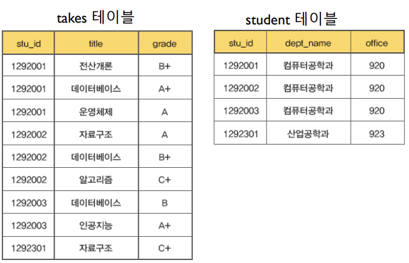

 

- 함수적 종속이 그대로 보존된다.

   
    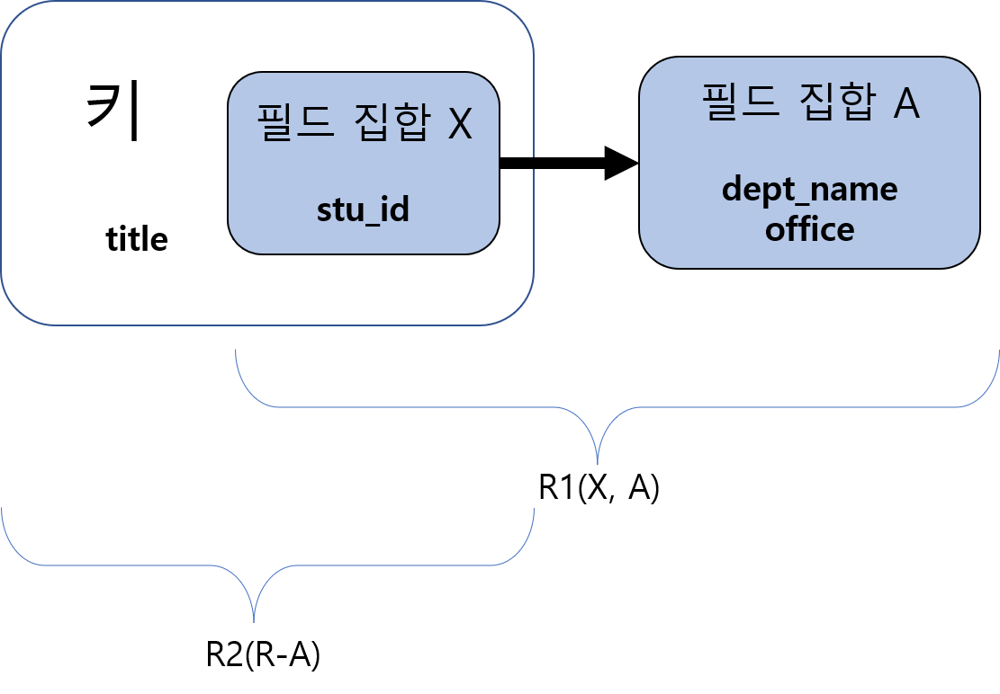

 

- student 테이블
    - stu_id -> dept_name
    - dept_name -> office
- takes 테이블
    - (stu_id, title) -> grade
 

### 문제점
- 삽입 이상 : student 테이블에서 '물리학과'의 사무실이 '930호'라는 정보를 삽입할 경우 '물리학과'에 소속된 학생이 존재하지 않으면 삽입이 불가능하다.
- 삭제 이상 : 학번이 '1292301'인 학생의 정보를 삭제할 경우 '산업공학과' 정보도 함께 삭제된다.
- 수정 이상 : '컴퓨터공학과'의 사무실을 변경할 경우 3개의 레코드에 대해 모두 변경해야 한다.

#### 문제 발생 원인
> `기본키의 이행 종속` 
 

- stu_id -> dept_name  
- dept_name -> office  
=> **stu_id -> office** 
=> office 필드가 기본키 stu_id에 `이행 종속`
 

#### 해결 방안
- 이행 종속에 참여한 필드들을 다른 테이블로 분해한다.

 
 

## 3차 정규형
### 개념
> 테이블 R이 2차 정규형이면서 키에 속하지 않은 모든 필드가 기본키에 이행 종속되지 않는다.
> 부분 종속과 이행 종속이 없다.
 

   
    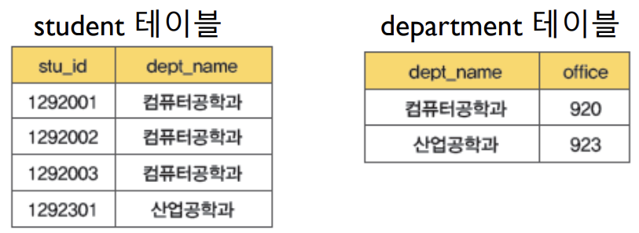

 

   
    

 

### 문제점

   
    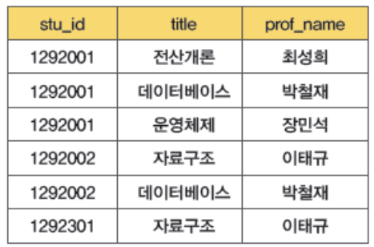

 

- 기본키 : (stu_id, title)
- 후보키 : (stu_id, prof_name)
- (stu_id, title) -> prof_name
- prof_name -> title (교수는 하나의 과목만 강의한다고 가정)
 

- 삽입 이상 : '홍길동' 교수가 '자료구조'를 강의한다는 사실을 저장할 경우 수강생이 없다면 저장할 수 없다.
- 삭제 이상 : 학번이 '1292001'인 학생이 '운영체제'를 수강한다는 사실을 삭제할 경우 '장민석' 교수가 '운영체제'를 강의한다는 사실도 함께 삭제된다.
- 수정 이상 : '박철재' 교수가 강의하는 과목이 '운영체제'로 변경되는 경우 2개의 레코드를 변경해야 한다.
 

#### 문제 발생 원인
> 키에 포함되는 필드 집합 A(title)와 키에 포함되지 않은 필드 집합 X(prof_name)에 대하여 X -> A라는 함수적 종속이 존재할 경우, `데이터 중복 발생`
 

- 키가 아닌 prof_name이 title을 결정하는 'prof_name -> title'이 성립한다.
 
 

## 보이스-코드 정규형
### 개념
> 테이블 R에 존재하는 모든 함수적 종속에서 결정자 X가 후보키이다.
 

   
    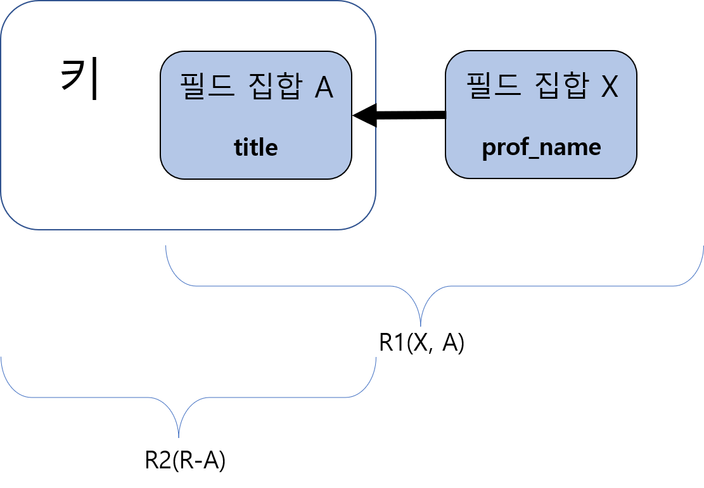

 

   
    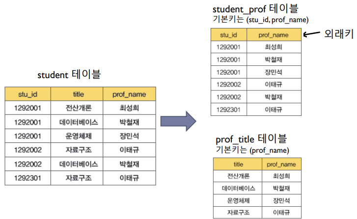

 

### 문제점
- 함수적 종속이 보존되지 않는다.
- 분해 전 보존되었던 '(stu_id, title) -> prof_name'이 유지되지 않는다.

 
 

# 예상 면접 질문
Q. 정규화와 역정규화에 대해 설명해주세요.  
A. 정규화란 무결성을 유지하기 위해 데이터를 구조화하는 작업입니다. 대표적으로 제 1, 2, 3형이 있으며 각 유형은 ~ 입니다. 그러나 정규화를 거치면 릴레이션 간의 연산(JOIN 연산)이 많아지는데, 이로인해 성능이 저하될 우려가 있습니다. 이때 역정규화를 고려할 수 있습니다. 역정규화란 데이터베이스의 비용을 최소화하기 위해 중복을 허용하며 엔티티를 다시 통합하거나 분할하는 과정입니다. 
