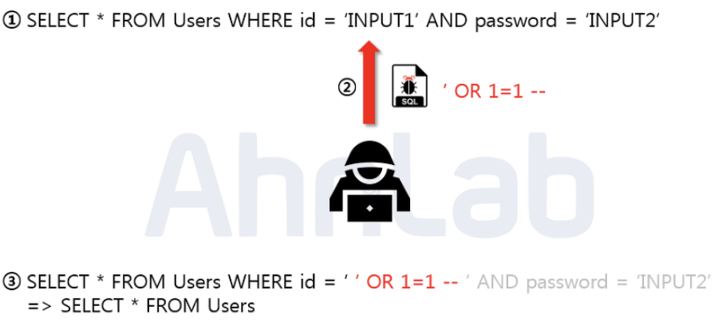
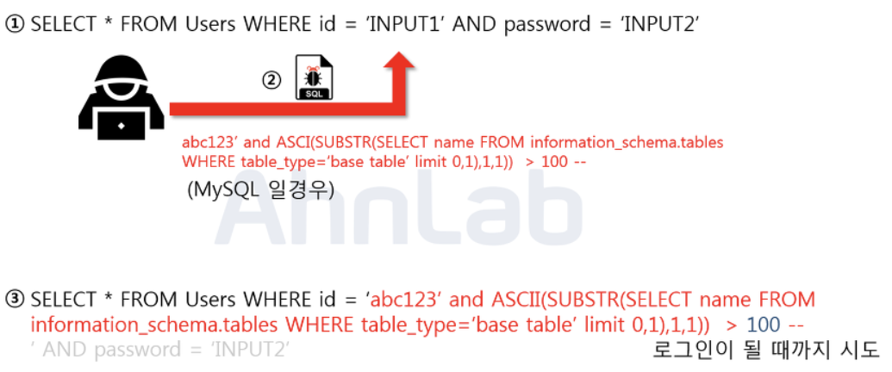
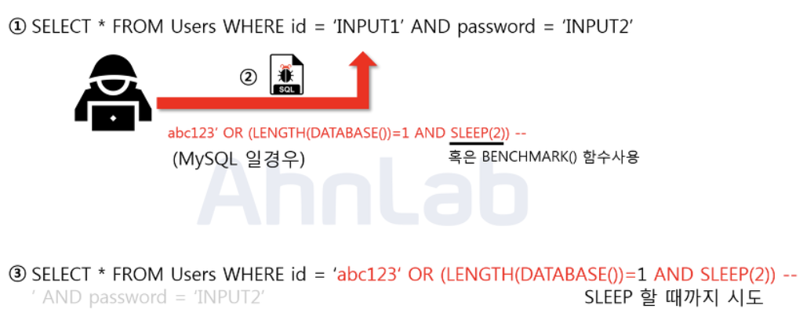

# SQL Injection

## <목차>
1. SQL Injection이란?
2. 공격 종류 및 대응방안
    
    2.1 Error based SQL Injection
    
    2.2 Union based SQL Injection
    
    2.3 Blind SQL Injection[1] - Boolean based SQL
    
    2.4 Blind SQL Injection[2] - Time based SQL
    
    2.5 Stored Procedure SQL Injection
    
    2.6 Mass SQL Injection
    
    2.7 대응방안

 

### 1. SQL Injection이란?
    
응용 프로그램 보안상의 취약점을 이용하여, 임의의  SQL 문을 주입하고 실행하게 하여 데이터베이스가 비정상적인 동작을 하도록 조작하는 공격 기법

 

### 2. 공격 종류 및 방법

2.1 Error based SQL Injection

- 논리적인 에러를 이용한 SQL Injection
- 에러가 발생되는 사이트에서는 에러 정보들을 이용하여 DB 및 쿼리 구조 등의 정보를 추측 가능

[Example]

로그인 쿼리문을 이용하여 관리자 계정 탈취

   
    

과정 : 싱글쿼터를 닫아주기 위한 싱글쿼터와, OR 1=1 구문을 이용해 WHERE 절을 모두 참으로 만들고, -- 를 넣어줌으로써 뒤의 구문을 모두 주석 처리 해버림

결과 : Users 테이블에 있는 모든 정보를 조회하게 됨으로써 가장 먼저 만들어진 계정 (보통 관리자 계정) 으로 로그인할 수 있게 됨 → 관리자 계정 탈취

 

2.2 Union based SQL Injection

- Union 명령어를 이용한 SQL Injection
- Union : 두 개의 쿼리문에 대한 결과를 통합해서 하나의 테이블로 보여주게 하는 키워드
- 정상적인 쿼리문에 하나의 추가 쿼리를 삽입하여 원하는 정보를 획득함
- 2가지 조건 만족해야함
    - UNION하는 두 테이블이 컬럼 수가 같아야 함
    - UNION하는 두 테이블의 데이터 형이 같아야 함

[Example]

게시글 조회 쿼리문을 이용한 사용자 개인정보 탈취

   
    

과정 : 싱글쿼터를 닫아주기 위한 싱글쿼터와, UNION 키워드를 이용해서 사용자의 id와 passwd를 요청하는 쿼리문을 주입함

결과 : 사용자의 개인정보가 게시글과 함께 화면에 보여짐

 

2.3 Blind SQL Injection[1] - Boolean based SQL

- 데이터베이스로부터 특정한 값이나 데이터를 전달받지 않고 쿼리를 통해 단순히 참과 거짓의 정보만 알 수 있을 때 사용
- 에러가 발생되지 않는 사이트에서는 논리적 에러를 이용하거나 UNION을 이용할 수가 없기 때문에 Blind를 통해 정상적인 쿼리가 수행되는지, 혹은 쿼리가 수행되지 않아 쿼리 결과가 없는지를 판단
- 서버가 응답하는 성공과 실패 여부를 이용하여 DB의 테이블 정보 추출 가능

[Example]

로그인 쿼리문 통해 데이터베이스의 테이블명 알아내기

   
    

과정 : 임의로 가입한 아이디와 함께 뒤의 구문을 주입. limit 키워드를 통해 하나의 테이블만 조회하고 SUBSTR 함수로 테이블명의 첫 글자만 얻은 뒤, 마지막으로 ASCII를 통해 ascii값으로 변환하여 그 값을 뒤의 100이라는 숫자와 비교

결과 : 거짓이면 로그인에 실패하고, 참이 될 때까지 뒤의 100이라는 숫자를 변경해 가면서 비교. 공격자는 이 프로세스를 자동화 스크립트로 만들어 단기간 내에 테이블 명을 알아낼 수 있음

 

2.4 Blind SQL Injection[2] - Time based SQL

- 쿼리 결과를 특정 시간만큼 지연시키는 것
- 에러가 발생되지 않는 조건에서 사용하며, 참 혹은 거짓이라는 결과값이 나오지 않으므로 시간을 재는 것
- DB 구조를 파악하기 위함

[Example]

로그인 쿼리문 통해 데이터베이스 테이블명 길이 알아내기

   
    

과정 : 임의로 가입한 아이디와 함께 뒤의 구문을 주입. DATABASE함수로 DB의 이름을 반환하고 LENGTH를 통해 문자열의 길이을 반환하여 1과 비교, 참이면 SLEEP(2)가 동작하고 거짓이면 동작하지 않음

결과 : 숫자 1부분을 조작하여 데이터베이스 테이블명 길이 알아낼 수 있음

 

2.5 Stored Procedure SQL Injection

- 저장된 프로시저에서의 SQL Injection
- 저장 프로시저 : 편의를 위해 일련의 쿼리들을 모아 하나의 함수처럼 모아둔 것
- 공격자가 시스템 권한을 획득해야하므로 공격 난이도가 높으나 공격에 성공한다면 서버에 직접적인 피해를 입힐 수 있음

[Example]

MS-SQL에 있는 xp_comshell

이 저장프로시저 권한을 획득하면 윈도우 명령어를 사용할 수 있게 됨

 

2.6 Mass SQL Injection

- 다량의 SQL Injection
- 한 번의 공격으로 다량의 DB가 조작되어 큰 피해를 입힘
- 보통 MS-SQL을 사용하는 ASP 기반 웹 애플리케이션에서 많이 사용됨
- 쿼리문은 HEX인코딩 방식으로 인코딩하여 공격
- 데이터베이스 값을 변조하여 데이터베이스에 악성 스크립트를 삽입하고, 사용자들이 변조된 사이트에 접속 시 좀비PC로 감염되어 이 PC들이 DDos 공격에 사용

 

2.7 대응방안

- 입력 값에 대한 검증
    - 입력된 값이 개발자가 의도한 값(유효값)인지 검증하여 의도하지 않은 입력값에 대해 검증하고 차단
- Prepared Statement 구문 사용
    - DBMS 에 동일하거나 비슷한 쿼리문을 효율적이고 반복적으로 실행하기 위해 사용되는 기능
    - 이 구문을 사용하면 사용자의 입력 값이 데이터베이스의 파라미터로 들어가기 전에 DBMS가 미리 컴파일하여 실행하지 않고 대기.
    - 그 후 사용자의 입력 값을 문자열로 인식하게 되어 공격퀴리가 들어간다고 하더라도 단순 문자열로 인식하기 때문에 공격자의 의도대로 작동하지 않음.
- Error Message 노출 금지
    - 에러 발생 시 따로 처리 해주지 않았다면 에러가 발생한 쿼리문과 함께 에러에 관한 내용을 반환하여 데이터베이스의 정보(테이블명, 컬럼명 등)이 노출
    - 데이터 베이스에 대한 오류발생 시 사용자에게 보여줄 수 있는 페이지를 제작 혹은 메시지박스를 띄우도록 처리해야함
- 웹 방화벽 사용
    - 웹 공격 방어에 특화되어 있는 웹 방화벽을 이용
    - 소프트웨어 형 : 서버 내 직접 설치
    - 하드웨어 형 : 네트워크 상에서 서버 앞 단에 직접 하드웨어 장비로 구성
    - 프록시 형 : DNS 서버 주소를 웹 방화벽으로 바꾸고 서버로 가는 트래픽이 웹 방화벽을 먼저 거치도록 함

 

[면접 예상 질문]
1. SQL Injection에 대해서 설명하시오.  
응용 프로그램 보안 상의 허점을 의도적으로 이용해서 악의적인 SQL문을 실행되게 함으로써 데이터베이스를 비정상적으로 조작하는 코드 인젝션 공격 방법입니다.

2. SQL 인젝션을 막기 위한 한 방법으로 Prepared Statement 사용이 있습니다. Prepared Statement가 무엇이고 이게 왜 방어 전략이 되는지 설명해주세요.  

Prepared Statement 란 DBMS 에 동일하거나 비슷한 쿼리문을 효율적이고 반복적으로 실행하기 위해 사용되는 기능입니다. 플레이스홀더 자리에서 사용자 입력 값을 미리 검사하고 실행할 수 있기 때문에 SQL 인젝션을 방어 전략이 되기도 합니다.

 

Reference

[https://www.cho-log.io/10](https://www.cho-log.io/10)

[https://noirstar.tistory.com/264](https://noirstar.tistory.com/264)

SQL 작성 실습 사이트 모음 : [https://gomguk.tistory.com/118](https://gomguk.tistory.com/118)