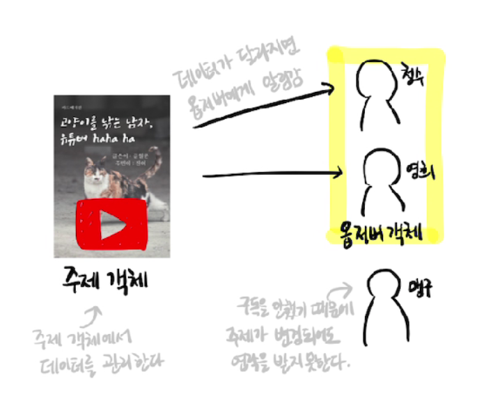
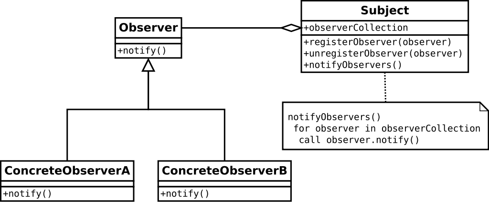

# Observer Pattern

## 목차
1. 옵저버 패턴이란?
2. 사용목적 및 구현원리<br>
    2.1 사용목적<br>
    2.2 구현원리
3. 사용예시
4. 장단점
5. 면접질문
6. 참고자료

<br />

## 1. 옵저버 패턴이란?
GoF의 디자인 패턴 중 행위 패턴에 해당
<br>
어떤 `객체의 상태가 변할 때` 그와 연관된 `객체들에게 알림을 보내고 자동으로 갱신`되도록 하는 디자인 패턴

예제 : 유튜브 구독시, 유튜버 - (subject) / 구독자 - (Observer)로 가정
<div align='center'>   
    
</div>

- 구독자(Observer) - 데이터 변경에 대해 관심을 가지고 지켜보는 객체
- 유튜버(subject) - 데이터 변경이 발생하는 객체

옵저버 패턴에서는 한 객체의 상태가 바뀌면 그 객체에 의존하는 다른 객체들에게 알림이 가고, 자동으로 내용이 갱신되는 방식으로 `1대多(one-to-many) 의존성`을 정의한다.<br>
따라서, 번거롭게 새로운 데이터 변경 소식을 확인할 필요없이, 알림만 기다리면 된다.


<br />

## 2. 사용목적 및 구현원리


### 2.1 사용목적
- 주로 분산 이벤트 핸들링 시스템을 만들 때 사용. 발행/구독 모델로 알려져 있기도 하다.

- 클래스를 밀접하게 연결하지 않고, 관련 객체간의 일관성을 유지해야 하는 경우

<br>

### 2.2 구현원리
옵저버 패턴의 핵심은 `옵저버` 또는 리스너(listener)라 불리는 하나 이상의 객체를 관찰 대상이 되는 객체에 등록시킨 후 각각의 옵저버들은 관찰 대상인 객체가 발생시키는 이벤트를 받아 처리하는 것이다.

<div align='center'>   
    
</div>

이벤트가 발생하면 각 옵저버는 `콜백(callback)`을 받는다.
`notify 함수`는 관찰 대상이 발행한 메시지 이외에, 옵서버 자신이 생성한 인자값을 전달할 수도 있다.

Subject 내부 메서드
- 등록(register) : 새로운 옵저버를 목록에 등록
- 제거(unregister) : 목록에서 옵저버를 제거

> 느슨한 결합(Loose Coupling) :
다른 클래스를 직접적으로 사용하는 클래스의 의존성을 줄이는 것을 말한다.
시스템을 더욱 유지 할 수 있도록 만들고, 전체 프레임워크를 더욱 안정적으로 만들고 시스템의 유연성을 증가하게 하려는 의도를 가진 포괄적인 개념이다.

느슨한 결합으로 즉, 상속을 통한 구현이 아닌 구성(Composition)을 이용해 `한 객체에 객체를 포함시키는 것이 아닌 인터페이스(Interface)를 포함하는 방식`으로 많이 구현

*인터페이스(interface)란 다른 클래스를 작성할 때 기본이 되는 틀을 제공하면서, 다른 클래스 사이의 중간 매개 역할까지 담당하는 일종의 추상 클래스를 의미*
<br />

## 3. 사용예제


### Vue.js 3.0 옵저버 패턴 코드 예시
ref나 reactive로 정의하면 해당 값이 변경되었을 때 자동으로 DOM에 있는 값이 변경되는데, 이는 Proxy 객체를 이용한 옵저버 패턴을 이용하여 구현한 것

``` vue

<template>
  <div>
    <button @click="notifyObservers">Notify Observers</button>
  </div>
</template>

<script>
import { ref, reactive } from 'vue';

export default {
  setup() {
    // 옵저버 목록을 관리하기 위한 반응적인 Set 객체
    const observers = reactive(new Set());

    // 옵저버를 등록하는 함수
    function registerObserver(observer) {
      observers.add(observer);
    }

    // 옵저버를 제거하는 함수
    function unregisterObserver(observer) {
      observers.delete(observer);
    }

    // 옵저버에게 알림을 보내는 함수
    function notifyObservers() {
      const data = 'Hello, Observers!';
      observers.forEach((observer) => observer.notify(data));
    }

    return {
      registerObserver,
      unregisterObserver,
      notifyObservers
    };
  }
};
</script>


```
이렇게 Vue.js 3.0에서 proxy 객체를 활용하여 옵저버 패턴을 구현하면, 반응적인 데이터 관리와 상태 변화 감지를 쉽게 구현 가능


<br />

## 4. 장단점
### 장점
- 실시간으로 한 객체의 변경사항을 다른 객체에 전파할 수 있다.

- 느슨한 결합으로 시스템이 유연하고 객체간의 의존성을 제거할 수 있다.

> 디자인원칙 :
 서로 상호작용을 하는 객체 사이에서는 가능하면 느슨하게 결합하는 디자인을 사용해야 한다.

### 단점
- 너무 많이 사용하게 되면, 상태 관리(유지보수)가 힘들다. 

<br />


## 5. 면접질문
Q : 옵저버 패턴을 어떻게 구현하나요?

A : 여러 가지 방법이 있지만 Proxy 객체를 써서 하곤 합니다. Proxy 객체를 통해 객체의 속성이나 메서드 변화 등을 감지하고, 이를 미리 설정해 놓은 Observer들에게 전달하는 방법으로 구현합니다.

<br />

## 6. 참고 자료
- 유튜버 예시 자료 참고 : https://velog.io/@hanna2100/%EB%94%94%EC%9E%90%EC%9D%B8%ED%8C%A8%ED%84%B4-2.-%EC%98%B5%EC%A0%80%EB%B2%84-%ED%8C%A8%ED%84%B4-%EA%B0%9C%EB%85%90%EA%B3%BC-%EC%98%88%EC%A0%9C-observer-pattern

- observer 패턴 사용이유 : https://blog.naver.com/dev_wise/222844625132

- `느슨한 결합 예제 참고` : https://velog.io/@sktkddn777/%EA%B0%95%ED%95%9C-%EA%B2%B0%ED%95%A9%EA%B3%BC-%EB%8A%90%EC%8A%A8%ED%95%9C-%EA%B2%B0%ED%95%A9

- observer 패턴의 장단점 : https://coding-factory.tistory.com/710

- Vue.js 3.0에서의 observer 패턴 : https://thebook.io/080326/0026/

- 면접질문 : <면접을 위한 CS 전공지식 노트> 참고                                          
        