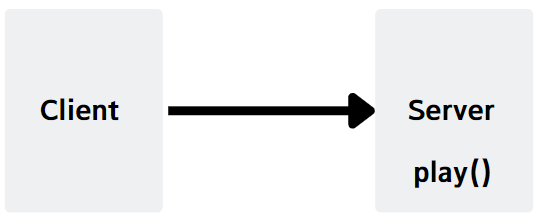
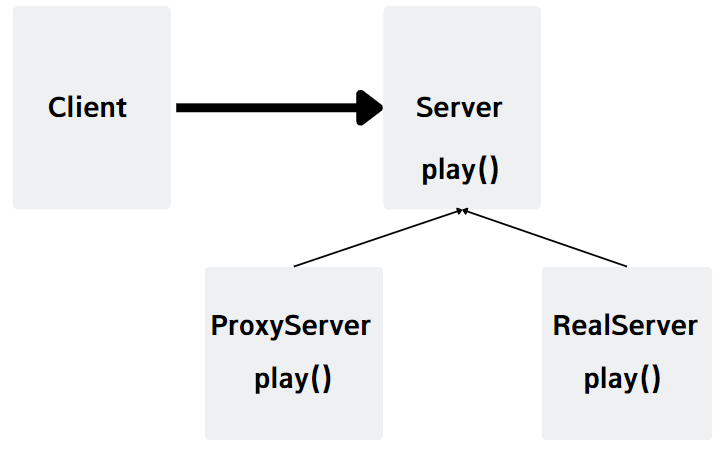
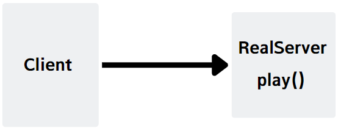
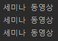
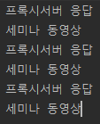

# 프록시 패턴
<br />

## 목차
1. 프록시 개념
2. 프록시 패턴
3. 활용 예시
4. 구현
5. 문제점

<br/>
<br/>

## 1. 프록시 개념
<div align='center'>   
    
</div> 

### 1-1. 개념
- 대리인이라는 뜻으로, 중간에서 요청을 대신 처리해주는 의미를 가진다.
- 중간에서 요청을 처리하기 때문에 다음과 같은 역할을 할 수 있다.
### 1-2. 프록시 역할
<strong>접근 제어</strong>
- 권한에 따른 접근 차단
- 캐싱 (대신 서버의 자원을 저장하고 요청이 오면 중간에서 바로 응답)
- 지연 로딩 (필요할 때 서버에 요청을 보냄)
<br/>

<strong>부가 기능 추가</strong>
- 원래 서버가 제공하는 기능에 추가적으로 다른 기능을 수행한다
- EX) 요청 메서드의 실행시간을 측정하거나 요청,응답 결과를 변경시킨다.

<br />

## 2. 프록시 패턴
- 프록시를 사용하는 패턴은 다양하지만, GOF 디자인 패턴에서는 사용하는 역할에 따라 패턴을 구분한다.
- 프록시 패턴은 <strong>접근 제어</strong>가 목적인 디자인 패턴이다.
- 데코레이터 패턴도 프록시를 사용하지만, 데코레이터 패턴은 새로운 기능 추가가 목적인 패턴

<br />

## 3. 프록시 패턴 종류
- 원격 프록시 : 원격 객체에 대한 접근 제어 가능
- 가상 프록시 : 생성 소요 비용이 큰 자원에 대해 접근 제어 가능
- 보호 프록시 : 접근 권한이 필요한 자원에 대해 접근 제어 가능
- 캐시 프록시 : 중간에서 접근을 제어하여 대신 응답

<br/>

## 4. 구현

- 캐시 프록시 구현 예시
<br/>
<div align='center'>   
    
</div>

```java
public interface Server {
    String play();
}
```

```java
public class Client {
    private Server server;

    public Client(Server server){
        this.server = server;
    }

    public void execute(){
        System.out.println(server.play());
    }
}
```

<br/>
<br/>


<div align='center'>   
    
</div>

```java
public class RealServer implements Server {
    @Override
    public String play() {
        sleep(3000);
        return "세미나 동영상";
    }
    private void sleep(int millis) {
        try {
            Thread.sleep(millis);
        } catch (InterruptedException e) {
            e.printStackTrace();
        }
    }
}
```

```java
public class ProxyServer implements Server{

    private Server target;
    private String cacheData;

    public ProxyServer(Server target){
        this.target = target;
    }

    @Override
    public String play() {
        System.out.println("프록시서버 응답");
        if(cacheData == null){
            cacheData = target.play();
        }
        return cacheData;
    }
}
```
<br/>

### 프록시 미사용/사용 테스트
<div align='center'>   
    
</div> 
<br/>
<div align='center'>   
    
</div> 

```java
public class ProxyPatternTest {
    @Test
    void 프록시_미사용() {
        Server server = new RealServer();
        Client client = new Client(server);

        client.execute();
        client.execute();
        client.execute();
        sleep(3000);
    }
    
    @Test
    void 프록시_사용() {
        Server server = new RealServer();
        Server proxyServer = new ProxyServer(server);
        Client client = new Client(proxyServer);

        client.execute();
        client.execute();
        client.execute();
        sleep(3000);

    }

    private void sleep(int millis) {
        try {
            Thread.sleep(millis);
        } catch (InterruptedException e) {
            e.printStackTrace();
        }
    }
}
```
### 프록시_미사용 결과

- 3초마다 "세미나 동영상" 출력
<div align='center'>   
    
</div>

<br/>

### 프록시_사용 결과

- 첫 "세미나 동영상" 출력만 3초가 걸리고, 
- 이후부터 "세미나 동영상" 바로 출력 (캐시에서 응답)
<div align='center'>   
    
</div>


<br/>
<br/>

## 5. 문제점
- 객체를 생성할 때 한단계가 더 추가됨으로 성능이 저하될 여지가 있다.
- 로직이 복잡해질 수 있다