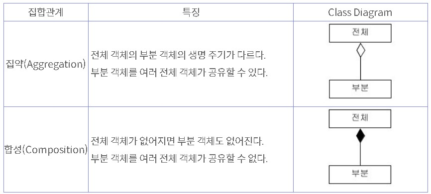
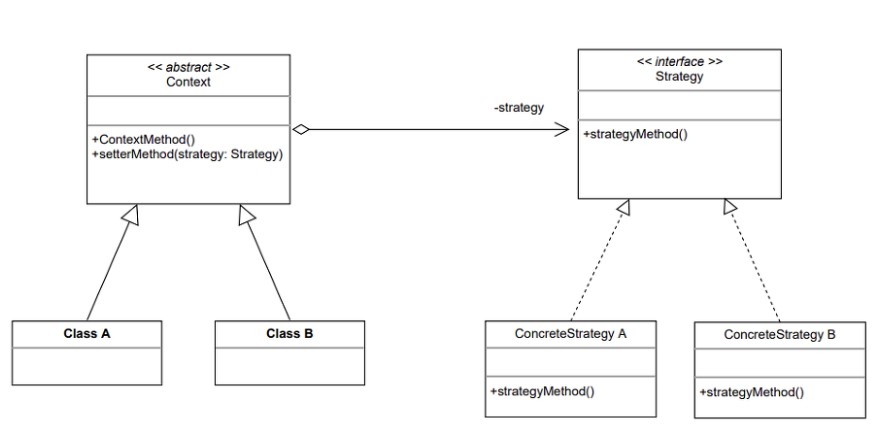
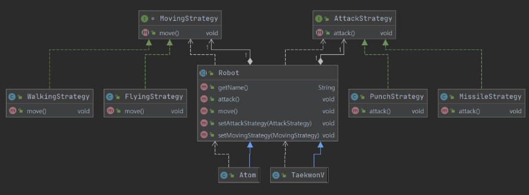

# Strategy Pattern

## <목차>
1. 집합관계
2. 스트래티지 패턴이란
3. 예시
4. 장단점

<br />

## 1. 집합관계
UML 연관 관계의 특별 경우로 전체와 부분의 관계를 명확하게 명시하고자할때 사용하며, 집약과 합성 관계로 나뉨

<br />

<div align='center'>   
    
</div>

<br />

### __집약관계 예시__
```JAVA
public class Computer {
    private MainBoard mb;
    private CPU c;
    private Memory m;
    private PowerSupply ps;

    // 생성자에서 외부 객체 참조 받아 사용
    public Computer(MainBoard mb, CPU c, Memory m, PowerSupply ps) {
        this.mb = mb;
        this.c = c;
        this.m = m;
        this.ps = ps;
    }
}
```

<br />

### __합성관계 예시__
```JAVA
public class Computer {
    private MainBoard mb;
    private CPU c;
    private Memory m;
    private PowerSupply ps;

    // 생성자가 컴퓨터 부품이 되는 객체들을 생성
    public Computer() {
        this.mb = new MainBoard();
        this.c = new CPU();
        this.m = new Memory();
        this.ps = new PowerSupply();
    }
}
```

<br />

## 2. 스트래티지 패턴이란
* 전략을 쉽게 바꾸도록 해주는 디자인 패턴
* 행위 패턴의 하나로, 행위를 클래스로 캡슐화하여 동적으로 행위를 자유롭게 바꿀 수 있게 해주는 패턴
* 특히 게임 프로그래밍에서 게임 캐릭터가 자신이 처한 상황에 따라 공격이나 행동하는 방식을 바꾸고 싶을 때 스트래티지 패턴이 매우 유용

> 행위패턴?  
>  ‣ 객체나 클래스 사이의 알고리즘이나 책임 분배에 관련된 패턴  
>  ‣ 한 객체가 혼자 수행할 수 없는 작업을 여러 개의 객체로 어떻게 분배하는지, 또 그렇게 하면서도 객체 사이의 결합도를 최소화하는 것을 중점으로 둠

<br />

### __디자인원칙__
* 코드에서 달라지는 부분 찾아내고, 달라지지 않는 부분으로부터 분리시킨다
* 상속보다는 구성을 활용한다 (상속 보다는 객체의 합성을 중요시하자)
* 구현이 아닌 인터페이스에 맞춰서 프로그래밍한다

<br />

<div align='center'>   
    
</div>

<br />

* Strategy
    * 외부에서 동일한 방식으로 알고리즘을 호출할 수 있도록 명시해둔 인터페이스
* ConcreteStrategy
    * 스트래티지 인터페이스에서 명시해둔 코드를 실제로 구현한 클래스
* Context
    * 스트래티지 패턴을 이용하는 역할을 수행
    * 필요에 따라 동적으로 구체적인 전략을 바꿀 수 있도록 하기 위해 setter 집약관계 메서드를 제공

<br />

## 3. 예시
### __로봇 만들기__

<div align='center'>   
    
</div>

<br />

### __<공격방법에 대한 전략 구현>__
AttackStrategy.class
```JAVA
// 공격방법에 대한 Strategy
public interface AttackStrategy { void attack(); }
```

<br />

MissileStrategy.class
```JAVA
// 공격방법에 대한 ConcreteStrategy
public class MissileStrategy implements AttackStrategy {
    public void attack() { System.out.println("I have Missile."); }
}
```

<br />

PunchStrategy.class
```JAVA
// 공격방법에 대한 ConcreteStrategy
public class PunchStrategy implements AttackStrategy {
    public void attack() { System.out.println("I have strong punch."); }
}
```

<br />

### __<이동방법에 대한 전략을 구현>__
MovingStrategy.class
```JAVA
// 이동방법에 대한 Strategy
public interface MovingStrategy { void move(); }
```

<br />

FlyingStrategy.class
```JAVA
// 이동방법에 대한 ConcreteStrategy
public class FlyingStrategy implements MovingStrategy {
    public void move() { System.out.println("I can fly."); }
}
```

<br />

WalkingStrategy.class
```JAVA
```JAVA
// 이동방법에 대한 ConcreteStrategy
public class WalkingStrategy implements MovingStrategy {
    public void move() { System.out.println("I can only walk."); }
}
```

위와 같이 각 전략들을 캡슐화하여 차후추가 및 변경이 발생하여도 Robot에 대한 변경이 발생하지 않는다.

### __<Robot 클래스 구현>__
Robot.class
```JAVA
// 위 Strategy들에 대한 Context
public abstract class Robot {
    private String name;
    private AttackStrategy attackStrategy;
    private MovingStrategy movingStrategy;

    public Robot(String name) { this.name = name; }
    public String getName() { return name; }
    public void attack() { attackStrategy.attack(); }
    public void move() { movingStrategy.move(); }

    // setter 메서드를 이용한 집약관계
    public void setAttackStrategy(AttackStrategy attackStrategy) {
        this.attackStrategy = attackStrategy; }
    public void setMovingStrategy(MovingStrategy movingStrategy) {
        this.movingStrategy = movingStrategy; }
}
```

<br />

### __<Robot 서브 클래스>__

TaekwonV.class
```JAVA
public class TaekwonV extends Robot {
    public TaekwonV(String name) { super(name); }
}
```
Atom.class
```JAVA
public class Atom extends Robot {
    public Atom(String name) { super(name); }
}
```

<br />

### __<Main 클래스>__

Main.class
```JAVA
      public static void main(String[] args) {
        Robot taekwonV = new TaekwonV("TaekwonV");
        Robot atom = new Atom("Atom");

        // 전략 변경 방법
        taekwonV.setMovingStrategy(new WalkingStrategy());
        taekwonV.setAttackStrategy(new MissileStrategy());
        atom.setMovingStrategy(new FlyingStrategy());
        atom.setAttackStrategy(new PunchStrategy());

        /* 아래부터는 동일 */
        System.out.println("My name is " + taekwonV.getName());
        taekwonV.move();
        taekwonV.attack();

        System.out.println();
        System.out.println("My name is " + atom.getName());
        atom.move();
        atom.attack();
    }
```

<br />

### __<실행결과>__
```JAVA
>>>My name is TaekwonV
>>>I can only walk.
>>>I have Missile.

>>>My name is Atom
>>>I can fly.
>>>I have strong punch.
```

<br />

## 4. 장단점
* 장점
    * Context 코드의 변경 없이 새로운 전략을 추가할 수 있다.  
    즉, Context에 대한 OCP원칙을 만족하게 된다.
    > OCP원칙?
    > ‣ 개방-폐쇄 원칙(Open-Closed Principle)
    > ‣ 소프트웨어 개체는 확장에 대해 열려 있어야 하고, 수정에 대해서는 닫혀있어야한다는 프로그래밍 원칙
* 단점
    * 사용되는 전략이 적다면, 복잡성만 늘어난다.

<br />

## [면접예상질문]  
Q. 제일 잘 설명할 수 있는 패턴에 대해 알고리즘 적으로 설명해주세요(싱글톤패턴, 빌더패턴 제외)

<br />

## Reference
https://www.crocus.co.kr/1526  
https://defacto-standard.tistory.com/104  
https://gmlwjd9405.github.io/2018/07/06/strategy-pattern.html  
https://velog.io/@cham/Design-Pattern-%EC%8A%A4%ED%8A%B8%EB%9E%98%ED%8B%B0%EC%A7%80-%ED%8C%A8%ED%84%B4Strategy-Pattern  