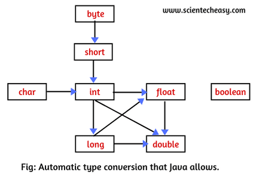

# Promotion & Casting(형변환)


## 목차

1. 개념


## 1. 개념

`**Promotion(묵시적 형변환)**`

- 묵시적으로 **자동으로 타입을 변환**하는 것을 의미(**업캐스팅**)
- 표현할 수 있는 값의 Range가 작은 타입이 허용 범위가 큰 타입으로 대입될 때 발생


```java
Parent p = new Child();
```

- (Parent) new Child() 할 필요 X


<div align='center'>   
    
</div>


`**Casting(명시적 형변환)**`

- 캐스팅 할 내용을 적어줘야하는 경우(**다운캐스팅**)
- 표현할 수 있는 값의 Range가 큰 타입을 작은 타입으로 변환
- 데이터의 손실이 발생하더라도, 형변환을 하고 싶을 때 사용

```java
int a;
float b = 1.1;

a = (int) b; // 컴파일 에러 해결

// 원시타입의 경우에는 데이터앞에 타입만 명시하면 변환 O
```


```java
Parent p = new Child();
Child c = (Child) p;

// 객체간의 Casting 
// instanceof : 상속관계에 있는지 확인
// 상속관계에 있지 않은 객체를 형변환하려면 에러 발생
public void casting(Parent parent) {
    if(parent instanceof Child) {
        Child child = (Child) parent; // Casting
    }
}
```

- 다운캐스팅은 업캐스팅이 발생한 이후에 작용


## 바인딩(binding)


`**동적바인딩(Dynamic Binding)**`

런타임 시점에 객체 타입을 기준으로 실해될 함수를 호출

`**정적바인딩(Static Binding)**`

컴파일 시점에 객체 타입을 기준으로 실행될 함수를 호출

 > static 키워드 : 이 키워드가 붙으면 JVM에서 객체가 먼저 생성되기 전에 메모리에 올라간다.
 > 따라서 객체가 생성되지 않아도
 > `class명.변수명` or `class명.메서드명`으로 접근 가능


```java
class Polymorphism {
    public static void main(String[] args) {
      SuperClass var = new SubClass(); // Promotion : 자동 타입변환, Pholymorphism
      // 동적 바인딩(Dynamic Binding)
      var.methodA(); // Runtime 시에 결정된다. SubClass의 메서드 호출
      // 정적 바인딩(Static Binding)
      var.staticMethodA(); // static 메서드는 compile 시에 결정, SuperClass의 메서드 호출
   }
}

class SuperClass {
    public void methodA();
    public static void staticMethodA();
}

class SubClass extends SuperClass {
    @Override
    void methodA() { 
      System.out.println("SubClass");
    }
  
    /*
     * 아래 코드는 Error 발생
     * static 으로 선언된 메서드는 오버라이딩 불가능
     */
    @Override
    static void staticMethodA() { 
      System.out.println("SubClass"); 
    }
}
```


## Boxing, UnBoxing

`**boxing**`

- 기본형을 참조형으로 변환


`**unboxing**`

- 참조형을 기본형으로 변환


## 참고자료


- [바인딩](https://medium.com/webeveloper/%EC%9E%90%EB%B0%94-%ED%98%95%EB%B3%80%ED%99%98-casting-promotion-%EA%B3%BC-%EB%B0%94%EC%9D%B8%EB%94%A9-binding-ef3e453eb8a6)

- [boxing, unboxing](https://wookcode.tistory.com/191)


