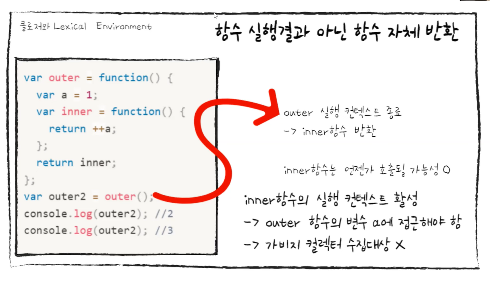
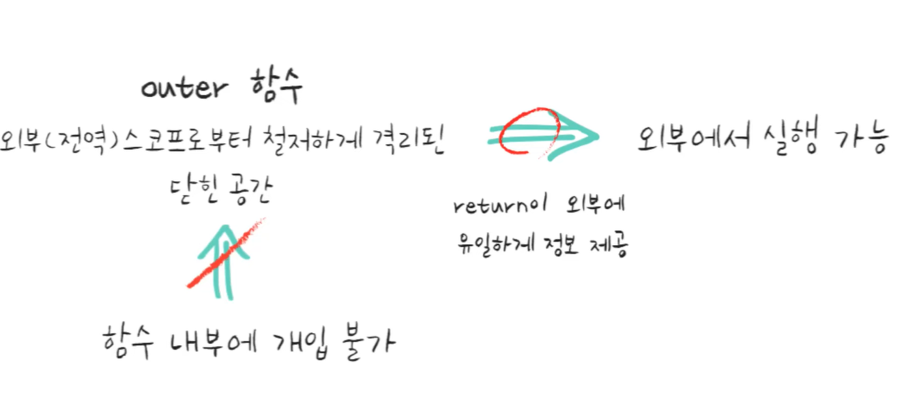

# Closure
## 목차
1. 스코프란?
2. 스코프의 종류
3. 스코프 체인
4. 클로저란?
5. 클로저를 통한 은닉화
6. 반복문 클로저
7. 면접 질문 예시
<br><br>

### 1. 스코프
스코프란?  
`식별자가 유효한 범위 , 식별자(변수)에 접근할 수 있는 범위` <br>

✔️ 자바 스크립트를 포함한 모든 프로그래밍 언어의 기본적이며 중요한 개념이다! <br><br>


### 2. 스코프의 종류(유효 범위로 구분)

전역 스코프 : 어디서든 참조 가능 <br>

지역 스코프 : 자신의 지역 스코프& 하위 스코프에만 유효 <br>
<br><br>

### 3. 스코프 체인

함수는 중첩이 가능 → 지역 스코프도 중첩 가능 <br>

✔️ 스코프가 함수의 중첩에 의해 계층적 구조를 가짐. <br>

<div align='center'>   
    
</div>
<br>
<b>스코프 체인이란?</b> <br>
스코프가 계층적으로 연결된 것 <br>

변수를 참조했을 때, 해당 스코프안에 변수가 없을 시  참조하는 코드의 상위 스코프로 올라가 변수를 찾음 <br>
⇒ `상위 스코프에서 선언한 변수를 하위에서 참조 가능`
<br><br><br>
<b>Lexical Scope</b><br>
함수를 어디에 정의했는지에 따라 함수의 정의가 평가되는 시점에 상위 스코프가 정적으로 결정되는 것.<br>
변수의 선언위치 고려 = 렉시컬<br>
<br>
`자신이 정의된 스코프 === 자신의 상위 스코프`

<br>
 `lexcial` 이란 어휘적 범위 지정과정에서 변수가 어디에서
  사용 가능한지 알기 위해 그 변수가 소스코드 내 어디에서 선언되었는 지, 고려한다는 것을 의미한다. 

  
<br><Br>
✔️ 함수 정의 실행 → 함수 객체 생성 → 상위 스코프 기억
<br><br>

### 4. 클로저란?
<b>클로저란?</b><br>
→ 독립적인 (자유) 변수를 가리키는 함수이다. 또는, 클로저 안에 정의된 함수는 만들어진 환경을 ‘기억한다’. <br>
<br>
함수와 함수가 선언된 어휘적 환경의 조합이다. - MDN
<br><br>
✔️ 생성될 당시의 환경을 기억하는 함수를 말한다. 환경이라고 하면 스코프체인 자체를 말하는데 스코프체인을 통해 접근할 수 있는 변수나 함수가 스코프가 해제되어야 할 시점에도 사라지지 않는다는 말이다. 이런 스코프는 객체가 갖는 성질인 캡슐화와 은닉화를 구현하는데 사용될 수 있다.

<div align='center'>   
    
</div>


클로저에게 참조된 변수 = 자유 변수

<div align='center'>   
    
</div>
흔히 함수 내에서 함수를 정의하고 사용하면 클로저라고 한다.
하지만 대개는 정의한 함수를 리턴하고 사용은 바깥에서 하게된다.
<br>
<br>

예시)
```jsx
function getClosure() {
  var text = 'variable 1';
  return function() {
    return text;
  };
}

var closure = getClosure();
console.log(closure()); // 'variable 1'
```

위에서 정의한 `getClosure()`는 함수를 반환하고, 반환된 함수는 `getClosure()` 내부에서 선언된 변수를 참조하고 있다. 또한 이렇게 참조된 변수는 함수 실행이 끝났다고 해서 사라지지 않았고, 여전히 제대로 된 값을 반환하고 있는 걸 알 수 있다.

여기서 `반환된 함수가 클로저`인데, MDN에서 정의된 내용에서도 말했듯 환경을 기억하고 있는 것처럼 보인다.
<br>
아래는 다른 예제이다.

```jsx
var base = 'Hello, ';
function sayHelloTo(name) {
  var text = base + name;
  return function() {
    console.log(text);
  };
}

var hello1 = sayHelloTo('승민');
var hello2 = sayHelloTo('현섭');
var hello3 = sayHelloTo('유근');
hello1(); // 'Hello, 승민'
hello2(); // 'Hello, 현섭'
hello3(); // 'Hello, 유근'
```

출력된 결과를 보면 `text` 변수가 동적으로 변화하고 있는 것처럼 보인다. 실제로는 `text`라는 변수 자체가 여러 번 생성된 것이다. 즉, `hello1()`과 `hello2()`, `hello3()`은 서로 다른 환경을 가지고 있다.
<br><br>

### 5. 클로저를 통한 은닉화
<br>
<b>클로저 활용</b>
<br>
상태를 안전하게 활용하고 유지하기 위해 사용
<br>
⇒ 상태가 의도치 않게 변경되지 않도록 상태를 안전하게 은닉(특정 함수만 상태 변경 허용)
<br><br>
✅ 자바 스크립트는 정보 은닉을 완전하게 지원하지 않음 == 변수 자체에 접근 권한을 직접 부여하도록 설계되어 있지 X <br>
(ex. public, protected , private)현재에는 선두에 #를 붙이는 private 정의 방법이 있긴 하지만, 예전엔 아예 없었다.)<br>

클로저 → `함수 차원에서 public, private 구분`

외부 스코프에서 선택적으로 일부 변수에 대한 접근 권한 부여 가능.


<div align='center'>   
    
</div>
<br>

✔️ <b>클로저를 이용해 접근 제어하기 </b>

1. 함수에서 지역변수 및 내부 함수 등을 생성
2. 외부에 접근 권한을 주고자 하는 대상들로 구성된 참조형 데이터 return
<br>

```jsx
function hello(name) {
  var _name = name;
  return function() {
    console.log('Hello, ' + _name);
  };
}

var hello1 = hello('승민');
var hello2 = hello('현섭');
var hello3 = hello('유근');

hello1(); // 'Hello, 승민'
hello2(); // 'Hello, 현섭'
hello3(); // 'Hello, 유근'
```

특별히 인터페이스를 제공하는 것이 아니라면, 여기서는 외부에서 `_name`에 접근할 방법이 전혀 없다. 이렇게 은닉화도 생각보다 쉽게 해결할 수 있다.

<br><br>

### 결국 정리하자면 클로저란? 

<div align='center'>   
    
</div>
<br>


<br><br><br>
(➕)****반복문 클로저****

```jsx
var i;
for (i = 0; i < 10; i++) {
  setTimeout(function() {
    console.log(i);
  }, 100);
}
```

간단하게 0-9까지의 정수를 출력하는 코드이지만 실제로 돌려보면 엉뚱하게도 10만 열 번 출력되는 걸 볼 수 있다. 왜일까?

먼저 `setTimeout()`에 인자로 넘긴 익명함수는 모두 0.1초 뒤에 호출될 것이다. 그 0.1초 동안에 이미 반복문이 모두 순회되면서 `i`값은 이미 10이 된 상태. 그 때 익명함수가 호출되면서 이미 10이 되어버린 `i`를 참조하는 것이다.
<br>
이 경우에도 클로저를 사용하면 원하는 대로 동작하도록 만들 수 있다.
<br>

```jsx
var i;
for (i = 0; i < 10; i++) {
  (function(j) {
    setTimeout(function() {
      console.log(j);
    }, 100);
  })(i);
}
```

중간에 `setTimeout()`에 걸린 익명함수를 클로저로 만들었다. 앞서 말한대로 클로저는 만들어진 환경을 기억한다. 이 코드에서 `i`는 IIFE내에 `j`라는 형태로 주입되고, 클로저에 의해 각기 다른 환경속에 포함된다. 반복문은 10회 반복되므로 10개의 환경이 생길 것이고, 10개의 서로 다른 환경에 10개의 서로 다른 j가 생긴다. <br><br>
<br><br><br>
### 6. 면접 질문 예시
<b>클로저(closure)에 대해 설명해 보세요.</b><br>
클로저는 함수와 함수가 선언된 어휘적 환경의 조합으로 외부 함수의 변수에 접근할 수 있는 내부 함수입니다.<br>
<br><br>
<b>어휘적 환경의 조합은 어떤 의미이죠?</b><br>
어휘적 환경의 조합이란 “변수와 함수의 선언 형태의 조합”을 말하는 것인데요, 자바스크립트는 함수가 호출되는 환경과는 별개로, 기존에 선언되었던 환경을 기준으로 변수를 조회하려는 특성이 있기 때문입니다.
<br>
즉, 클로저가 생성된 시점의 유효 범위에 있는 모든 지역 변수를 사용하는 환경을 말하는 것입니다.
<br><br>
<b>클로저의 특징을 설명해 보세요.</b><br>
클로저는 캡슐화와 모듈화의 특징을 가지고 있습니다. 외부 함수의 변수가 함수 밖으로 노출되지 않아 정보의 접근을 제한해 클로저로 자바스크립트에서 캡슐화를 구현할 수 있습니다. 또한 클로저는 데이터를 보존하는 함수입니다. 외부 함수의 실행이 끝나더라도 외부 함수 안의 변수가 메모리에 저장되어 값을 기억하고 있습니다. 이러한 특징으로 클로저 모듈 패턴을 구현할 수 있습니다.
<br><br>
<b>클로저를 사용했을 때, 단점을 설명할 수 있나요?</b><br>
외부 함수 스코프가 내부 함수에 의해 언제든지 참조될 수 있기 때문에, 클로저 패턴은 메모리 상에 남게 됩니다. 이는 일반 함수였다다면 실행 종료 후 자바스크립트 메모리 관리에 의해 가비지 컬렉션이 되었을 객체가 남아있게 되는 것입니다. 따라서 클로저를 남발할 경우 퍼포먼스 저하가 발생할 수 있다고 알고 있습니다.
<br><Br>
<br>
### 참고자료
[클로저의 개념](https://hyunseob.github.io/2016/08/30/javascript-closure/)<br>
[스코프와 클로저](https://www.youtube.com/watch?v=xJtVVLPxgco)<br>
[클로저 기술 질문](https://velog.io/@rmaomina/job-interview-closure)
