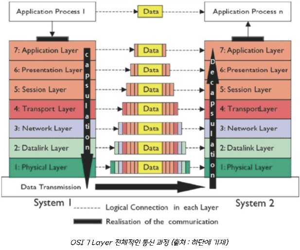
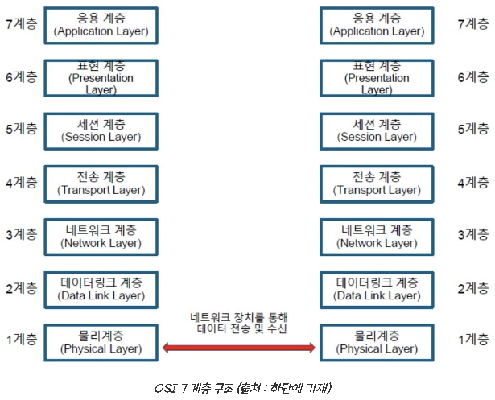
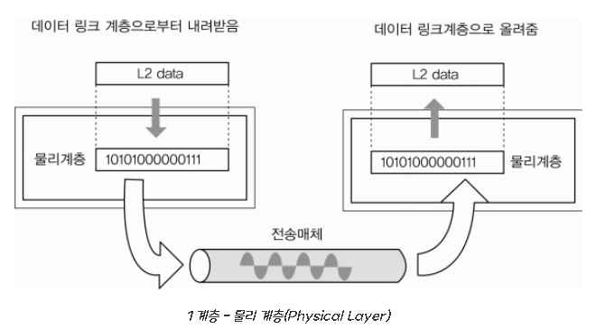
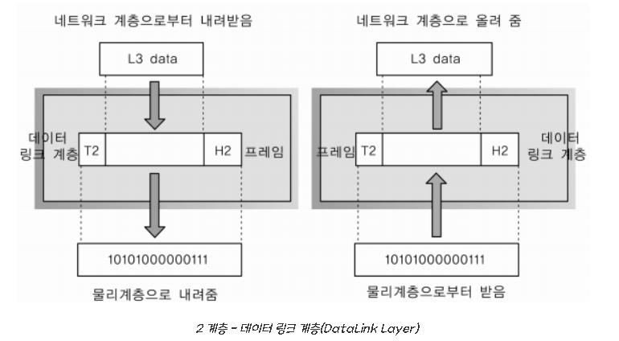
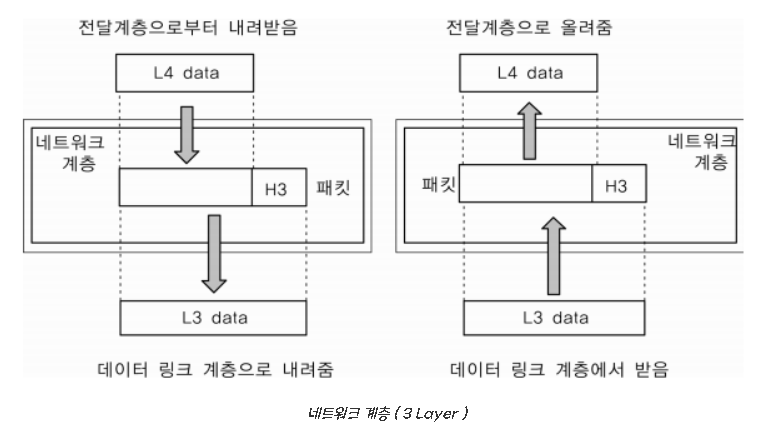
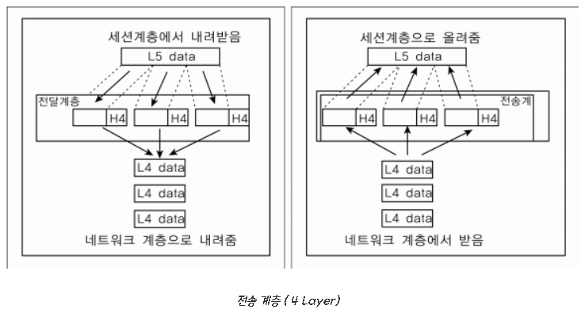
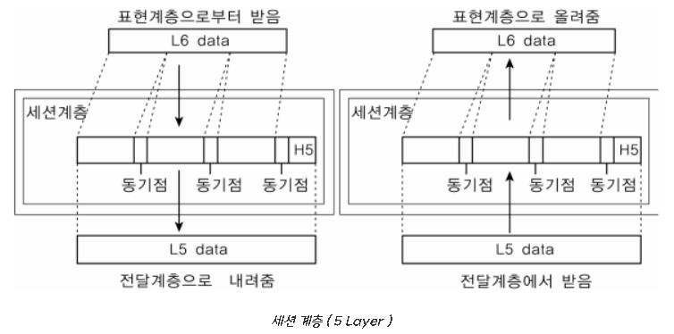
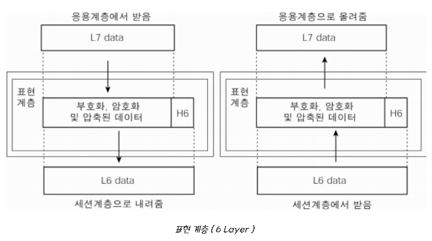
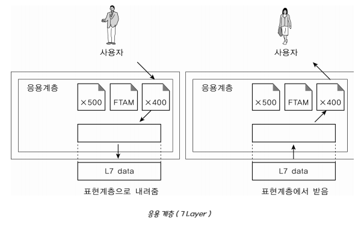

# OSI 7 계층

### <목차>

1. OSI 7 계층이란?
2. OSI 7 계층을 나눈 이유?
3. 특징 및 작동원리
    
    3.1 특징
    
    3.2 작동원리
    
4. OSI 7 계층별 설명
    
    4.1 물리 계층
    
    4.2 데이터 링크 계층
    
    4.3 네트워크 계층
    
    4.4 전송 계층
    
    4.5 세션 계층
    
    4.6 표현 계층
    
    4.7 응용 계층  
  
  

## 1. OSI 7 계층이란?
    
### 1984년 국제표준화기구(ISO)에서 개발한 모델로써, 네트워크에서 통신이 일어나는 과정을 7단계로 정의한 국제 통신 표준 규약으로, OSI 참조 모델 혹은 OSI 7 계층이라 불림
    
※ OSI(Open System Interconnection) :  누구나 참조 및 부가적인 추가가 가능한 개방형 시스템
    
 

## 2. OSI 7 계층을 나눈 이유?
* 표준 규격
     - 네트워크 구성 요소를 표준화함으로써 서로 다른 통신 장치와의 상호 호환 가능
* 각 계층이 독립되어 있어 유지보수가 수월함
     - 역할의 분리로 문제 발생 시 어떤 계층에 문제가 생겼는지 파악이 가능하며 해당 단계만 고쳐서 해결이 가능
* 설계가 간단해지고 통신이 일어나는 과정을 단계별로 파악할 수 있어 흐름을 한눈에 알아보고 이해하기 용이함
   
 

 ## 3. 특징 및 작동원리
    
 ### 3.1 특징
    
* 각 계층은 독립적인 모듈로 구성되며 상하 계급 구조를 가짐
* 각 계층은 하위 계층을 사용하여 현재 계층의 기능을 포함하여 상위 계층에 제공하므로 상위 계층의 프로토콜이 제대로 동작하기 위해서는 하위의 모든 계층에 문제가 없어야함
* 물리 계층 : 하드웨어 / 데이터링크 계층: 하드웨어 + 소프트웨어 / 이후 3계층 부터는 소프트웨어로 구성
    
     
    
 ### 3.2 작동원리(통신 플로우)
 
 
   
    

* 캡술화 : 전송 시 7계층에서 1계층으로 각각의 층마다 인식할 수 있어야하는 헤더를 붙임
* 출발지에서 데이터가 전송될 때 헤더가 추가되는데 2계층에서만 오류제어를 위해 꼬리부분에 추가됨
* 물리 계층에서 1, 0의 신호가 되어 전송매체(동축케이블, 광섬유 등)을 통해 전송
* 역캡슐화 : 수신 시 1계층에서 7계층으로 헤더를 떼어내어 데이터 식별
* 목적지에 원하는 데이터 전송

 

## 4. OSI 7 계층별 설명
    
 

   
    

 
    
    💡 PDU(Process Data Unit) : 각 계층에서 전송되는 데이터 단위

 
   
 ### 4.1 물리 계층(Physical Layer)

 

   
    

 

* OSI 모델의 최하위 계층
* 상위 계층에서 전송된 데이터를 물리적이 전송 매체를 통해 데이터를 전기적인 신호로 변환해서 주고받는 기능만 수행
* 데이터의 종류나 오류 제어 하지 않음
    
 > PDU : 비트(Bit)  
 > 프로토콜 : Modem, Cable, Fiber, RS-232C  
 > 장비 : 케이블, 허브, 리피터  
 
 
    
 ### 4.2 데이터 링크 계층(DataLink Layer)

 

   
    

 

* 물리적인 네트워크 사이에 데이터 전송을 담당하는 계층
* Point to Point 간의 신뢰성 있는 전송을 보장하기 위한 계층으로 CRC기반의 오류제어와 흐름 제어가 필요
      - 오류 검출 방식(패리티 검사, CRC, 체크섬, 해밍코드) :** [https://junboom.tistory.com/32](https://junboom.tistory.com/32)
* Mac 주소(컴퓨터 간 데이터를 전송하기 위한 컴퓨터의 물리적 주소)를 통해 통신
      - 프레임에 Mac 주소를 부여하고 에러검출, 재전송, 흐름제어를 진행
    
 > PDU : 프레임(Frame)
 > 프로토콜 : 이더넷, MAC, PPP, ATM, LAN, WiFi
 > 장비 : 브릿지, 스위치
 
  
 
 ### 4.3 네트워크 계층(Network Layer)

     

   
    

 

* IP주소를 제공하는 계층
* 데이터를 목적지까지 가장 안전하고 빠르게 전달하는 기능(라우팅)
* 라우팅 알고리즘을 사용하여 최적의 경로를 선택하여 IP 주소를 지정하고 해당 경로에 따라 데이터 전달
      - 전송되는 데이터는 패킷 단위로 분할하여 전송한 후 다시 합쳐짐
    
 > PDU : 패킷(Packet)
 > 프로토콜 : IP, ICMP
 > 장비 : 라우터, L3 스위치

 
    
 ### 4.4 전송 계층(Transport Layer)

 

   
    

    
 

* 양 끝단(End to End)의 사용자들이 신뢰성 있는 데이터를 주고 받을 수 있게 하는 계층
      - 패킷의 전송이 유효한지 확인 후 전송 실패한 패킷을 다시 보냄
* 발신지에서 목적지 간 제어와 에러를 관리
      - 오류 검출 및 복구, 흐름 제어와 중복 검사 등 수행
* 헤더에 포함되어 있는 Port 번호(디바이스에 있는 여러 프로세스 중 가야할 프로세스를 구분하기 위해 필요한 번호)를 통해 데이터 전송
      - TCP와 UDP 프로토콜을 통해 통신을 활성화(포트를 열어 프로그램들이 전송할 수 있도록 제공)
          - TCP : 신뢰성, 연결지향적
          - UDP : 비신뢰성, 비연결성, 속도가 빨라 실시간 서비스에 적합
    
 > PDU : 세그먼트(Segment)
 > 프로토콜 : TCP, UDP, ARP, RTP
 > 장비 : 게이트웨이(GateWay),  L4 스위치

 
    
 ### 4.5 세션 계층(Session Layer)

 
       

   
    

 
        
* 통신 세션을 구성하는 계층
      - 세션 : 클라이언트와 웹 서버 간 네트워크 연결이 지속 유지되고 있는 상태
      - 세션 설정, 유지, 종료, 전송 중단 시 복구의 기능 수행
* 포트 번호를 기반으로 연결하며 통신 장치 간 상호작용을 설정하고 유지하며 동기화
      - 동시 송수신 방식(duplex), 반이중 방식(half-duplex), 전이중 방식(Full Duplex)의 통신과 함께 체크 포인팅과 종료, 다시 시작 과정 등을 수행
* 통신하는 사용자들을 동기화하고 오류 복구 명령들을 일괄적으로 다룸
* 통신을 위한 세션을 확립/유지/중단(운영체제가 해줌)
* TCP/IP 세션을 만들고 없애는 역할
    
 > 프로토콜 : NetBIOS, SSH, TLS API, Socket

 
    
 ### 4.6 표현 계층(Presentation Layer)
    
 

   
    

    
  
    
* 응용 계층으로부터 전달받거나 전송하는 데이터의 인코딩 - 디코딩 및 암호화 등이 이루어지는 계층
        - 코드 간의 번역을 담당하여 데이터 형식상 차이를 다루는 부담을 응용 계층으로부터 덜어줌
* 송신 측과 수신 측 사이에서 데이터의 형식(png, jpg 등)을 정해줌
* 받은 데이터의 코드 변환, 구문 검색, 인코딩-디코딩 및 암호화, 압축의 과정을 통해 올바른 표준 방식으로 변환
        - MIME : [https://server-talk.tistory.com/183](https://server-talk.tistory.com/183)
    
    > 프로토콜 : JPG, MPEG, SMB, AFP
    > 
    
 ### 4.7 응용 계층(Application Layer)
    

   
    

    
* 사용자와 바로 연결되어 있으며 응용 SW를 도와주는 계층
* 사용자로부터 정보를 입력받아 하위 계층으로 전달하고 하위 계층에서 전송한 데이터를 사용자에게 전달
* 파일 전송, DB, 메일 전송 등 여러가지 응용 서비스를 네트워크에 연결해주는 역할
    
    > 프로토콜 : HTTP, DNS, Telnet, FTP
    > 
    
    Reference
    
    [https://backendcode.tistory.com/167](https://backendcode.tistory.com/167)
    
    [https://turtledeveloper.tistory.com/38](https://turtledeveloper.tistory.com/38)
    
    [https://velog.io/@dyllis/OSI-7계층-정리](https://velog.io/@dyllis/OSI-7%EA%B3%84%EC%B8%B5-%EC%A0%95%EB%A6%AC)