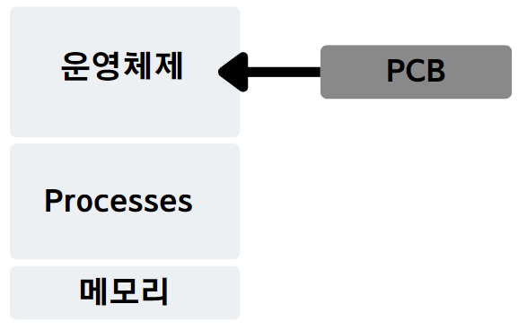
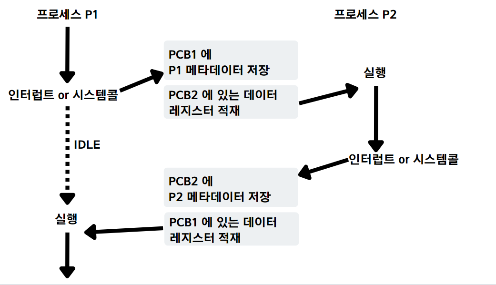

# PCB & Context Switching

 

## <목차>
1. PCB

    1.1 PCB란
   
    1.2 Process Metadata

    1.3 PCB를 사용하는 이유
2. Context Switching
    
    2.1 Context Switching 필요한 이유
    
    2.2 Context Switching 과정

    2.3 Process Context Switching VS Thread Context Switching
3. 예상 면접 질문

 

## 1. PCB

### 1-1. PCB란
- 프로세스의 메타데이터들이 저장되는 공간
- 프로세스가 생성되면 해당 PCB가 생성되고 프로세스 종료 시 제거된다.
- Linked List 방식으로 관리

 

### 1-2. Process Metadata
- Process ID (프로세스 고유 번호)
- Process State (프로세스 상태)
- Process Priority (프로세스 우선순위)
- CPU Registers (레지스터 정보)
- Owner
- CPU Usage
- Memeory Usage

 

### 1-3. PCB를 사용하는 이유

- CPU는 하나의 프로세스만 계속 처리하지 않는다.  
만약 하나의 Task만 처리할 수 있다면 다른 Task들은 계속 기다리게 되고  
반응성이 현저히 떨어지게됨
- 그래서 Context Switching 을 통해 CPU는 여러 Task를 바꿔 가며 처리를 하게 되는데,  
이때 다시 수행이 필요한 프로세스들은 PCB에 저장해두는 것이다

 
 

## 2. Context Switching

- CPU가 이전 프로세스의 정보들을 PCB에 잠시 저장하고,  
다음 실행할 Task의 PCB의 정보를 읽어 레지스터에 적재하고 처리하는 과정

 

### 2-1. Context Switching 필요한 이유
- 멀티태스킹을 통해 여러 프로세스가 동시에 처리되는 것처럼 보이는 효과를 받을 수 있고  
하나씩 처리되는 것보다 빠른 반응 속도로 응답이 가능하다.

 

### 2-2 Context Switching 과정

  

### 2-3 Process Context Switching VS Thread Context Switching
- Process Context Switching 의 경우 비용이 더 크다.
- Thread의 경우는 스택 영역만 교체하면 되지만,  
Process 는 모든 데이터 영역을 교체해야 한다.

 

## 3. 예상 면접 질문

### Q1. 왜 Context Switching 이 필요한가요 ?
순서대로 작업을 처리하면 처리 시간이 길어지기 때문입니다.

### Q2. Context Switching 은 어떻게 진행되나요 ?
Task 즉 프로세스 정보는 PCB에 의해 관리되고 있으며,  
다음에 실행할 Task의 PCB 정보를 불러오고 이전에 실행했던 Task를 다시 PCB에 저장하는 것을 통해서  
Context Switching 이 진행됩니다.

## Reference
- https://gyoogle.dev/blog/computer-science/operating-system/PCB%20&%20Context%20Switching.html
- https://nesoy.github.io/articles/2018-11/Context-Switching
- https://velog.io/@curiosity806/Context-Switching%EC%9C%BC%EB%A1%9C-%EC%95%8C%EC%95%84%EB%B3%B4%EB%8A%94-process%EC%99%80-thread
- https://github.com/WeareSoft/tech-interview/blob/master/contents/os.md#context-switching