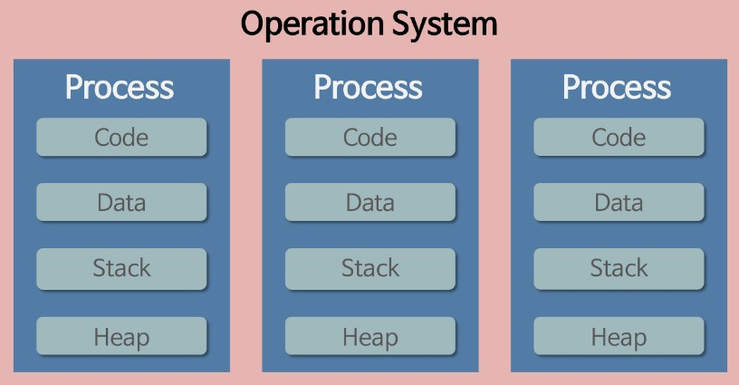
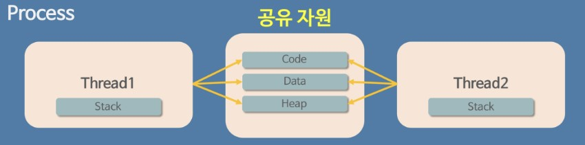

# Process vs Thread

 

## <목차>
1. 프로그램  
2. 프로세스  
    2.1 프로세스의 사전적 정의  
    2.2 프로세스의 특징  
    2.3 프로세스의 한계  
3. 스레드  
    3.1 스레드의 사전적 정의  
    3.2 스레드의 특징  
4. 프로세스와 스레드의 차이점  

 

## 1. 프로그램
* 어떤 작업을 위해 실행할 수 있는 파일
* 파일이 저장 장치에 있지만 메모리에 올라가 있지 않은 정적인 상태
 

## 2. 프로세스

 

   
    

 

### 2.1 프로세스의 사전적 정의
* `컴퓨터에서 연속적으로 실행하고 있는 컴퓨터 프로그램`
* 메모리에 올라와 실행되고 있는 프로그램의 인스턴스(독립적인 개체)
* 운영체제로부터 시스템 자원(CPU)을 할당받는 자원의 단위

 

### 2.2 프로세스의 특징
* `각각 독립된 메모리 영역(Code, Data, Stack, Heap)을 할당 받는다.`
    * 코드 영역(code area)
        * 실행할 프로그램의 코드나 명령어들을 기계어 형태로 저장하는 공간
        * CPU는 코드 영역에 저장된 명령어들을 하나씩 처리
    * 데이터 영역(data area)
        * 정적 변수, 전역 변수 등 프로그램이 사용하는 데이터를 저장하는 공간
        * 프로그램이 실행되면서 할당되고 종료되면서 소멸
    * 스택 영역(stack area)
        * 호출한 함수가 종료되면 되돌아올 메모리의 주소나 지역 변수, 매개 변수, 리턴값 등을 저정하는 공간
        * 함수 호출 시 기록되고 종료되면 제거
    * 힙 영역(heap area)
        * 생성자, 인스턴스와 같은 동적으로 할당되는 데이터를 저장하는 공간
        * 런타임 시에 크기가 결정
* 최소 1개 이상의 스레드(메인 스레드)를 가짐

 

### 2.3 프로세스의 한계
* 각 프로세스는 별도의 주소 공간에서 실행되어 기본적으로 다른 프로세스의 자원 접근 불가 (프로세스간 통신이 어려움)

 

## 3. 스레드

 

   
    

 

### 3.1 스레드의 사전적 정의
* `프로세스 내에서 실행되는 여러 흐름의 단위`
* 프로세스의 특정한 수행 경로
* 프로세스가 할당받은 자원을 아용하는 최소 실행 단위

 

### 3.2 스레드의 특징
* `프로세스 내에서 각 필요한 Stack만 할당 받고 Code, Data, Heap 영역은 공유`
* stack을 가짐으로써 독립적인 함수 호출이 가능하여 독립적인 실행 흐름을 가짐
* 자원을 효율적으로 관리할 수 있음

 

## 4. 프로세스와 스레드의 차이점
* `프로세스는 자원을 공유하지 않지만 스레드는 자원을 공유함`

  

Reference  
https://inpa.tistory.com/entry/%F0%9F%91%A9%E2%80%8D%F0%9F%92%BB-%ED%94%84%EB%A1%9C%EC%84%B8%EC%8A%A4-%E2%9A%94%EF%B8%8F-%EC%93%B0%EB%A0%88%EB%93%9C-%EC%B0%A8%EC%9D%B4  
https://gmlwjd9405.github.io/2018/09/14/process-vs-thread.html  
https://jaehoney.tistory.com/241  

