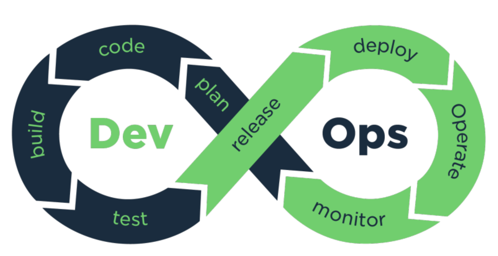
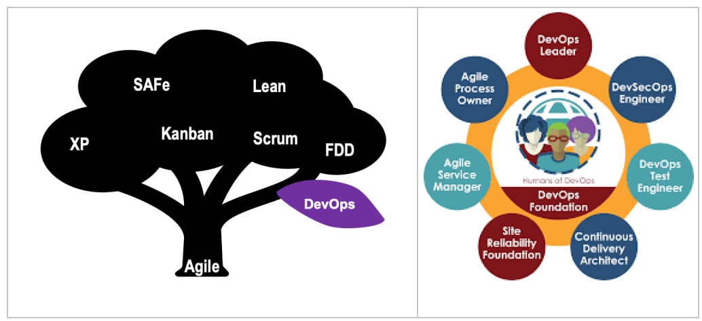
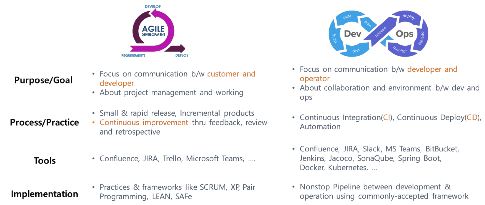
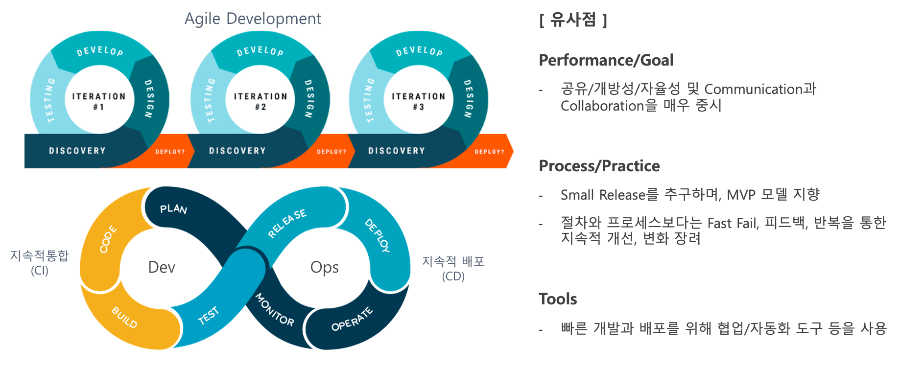
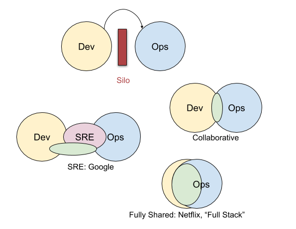

# DevOps

## 목차
1. 데브옵스(DevOps)란?
     1.2 DevOps의 목적
2. DevOps 작동 방식
     2.1 DevOps의 문화(데브옵스와 애자일)
     2.2 DevOps와 Agile의 유사점
     2.3 DevOps와 Agle의 차이점
3. DevOps의 업무
4. DevOps의 이점
5. DevOps가 중요한 이유
6. DevOps의 방식
7. DevOps 사례
7. 면접 질문

 

### 1. 데브옵스(DevOps)란?

   
    

- <b>데브옵스(DevOps)</b>는 `소프트웨어의 개발(Development)`과 `운영(Operations)`의 합성어로서, `소프트웨어 개발자와 정보기술 전문가 간의 소통, 협업 및 통합을 강조하는 개발 환경이나 문화`를 말한다. 
 
- 대개 [표준 개발 환경에서 코딩](https://www.redhat.com/ko/topics/middleware/what-is-ide) 작업을 하는 개발자는 IT 운영 담당자와 긴밀하게 협력하여 소프트웨어 빌드, 테스트, 출시 속도를 가속화할 수 있다. 

- DevOps는 새로운 소프트웨어 기능, 개선 요청 또는 버그 수정 등 `하나의 아이디어가 개발에서 배포에 이르는 프로세스의 속도를 높임`으로써 더 빨리 프로덕션 환경에 전달되어 사용자에게 가치를 전달하도록 한다. 
 
- DevOps를 확립하면 `셀프 서비스와 자동화`를 통해 `다양한 이점과 경쟁력`을 얻을 수 있다. 
 

 

### 1.2 DevOps의 목적
데브옵스의 목적은 개선된 배치(deployment) 주기를 포함한 전반적인 배포 파이프라인에 걸쳐있다.

- 제품 출시까지 걸리는 기간(time to market) 단축
- 새로운 판의 더 낮은 실패율
- 픽스 간 짧아진 리드 타임(상품 생산 시작부터 완성까지 걸리는 시간)
- 복구 시 더 빠른 평균 시간 (새로운 릴리스의 충돌 및 그 밖에 현재의 시스템를 비활성화하는 상황에서)

 데브옵스는 운영 프로세스의 예측 가능성, 효율성, 보안, 유지보수 가능성을 극대화하는 것이 목적이며, 가끔씩 자동화가 이러한 목표를 지원한다.

배치 주기란?

"배치 주기"는 개발자 및 운영팀이 `소프트웨어 시스템의 새로운 버전 또는 업데이트를 배포하는 주기`를 의미한다. 이는 소프트웨어 개발 및 운영의 일환으로, 새로운 기능, 버그 수정, 보안 패치 등을 시스템에 적용하기 위해 일정한 주기로 배포를 수행하는 것을 의미한다.

배포 파이프라인 이란?

- 배포 파이프라인 : 소프트웨어를 개발 환경에서부터 실제 운영 환경으로 자동화된 과정을 통해 배포하는 일련의 단계와 작업들의 조합이다. 
 
 
<b>배포 파이프라인의 단계</b>

1. 소스 코드 관리: 소프트웨어 개발에 사용되는 소스 코드를 버전 관리 시스템에 저장하고 관리

2. 빌드 (Build): 소스 코드를 컴파일하고 필요한 빌드 작업을 수행하여 실행 가능한 소프트웨어 패키지를 생성

3. 테스트 (Test): 생성된 패키지를 자동화된 테스트 환경에서 테스트하고 검증한다. 테스트 자동화를 통해 버그를 신속하게 탐지하고 품질을 확인한다.

4. 승인 (Approval): 테스트를 통과한 소프트웨어 패키지에 대해 승인 절차를 거친다. 보안 검토, 코드 리뷰 등의 작업을 수행한다.

5. 배포 (Deployment): 승인된 패키지를 운영 환경으로 배포한다. 이 단계에서는 서버에 소프트웨어를 설치하고 구성한다.

6. 모니터링 및 운영 (Monitoring and Operations): 배포된 애플리케이션을 모니터링하고 운영한다.  이 단계에서는 로그 분석, 성능 모니터링, 이벤트 처리 등을 수행한다.

배포 파이프라인은 이러한 단계들을 자동화하여 반복 가능하게 만들어 소프트웨어의 품질을 향상시키고, 배포 시간을 단축시키며, 오류 가능성을 줄여 안정적인 배포를 실현하는 데 도움을 준다.

 
 

### 2. DevOps 작동 방식

   
    

- DevOps 모델에서는 `개발팀과 운영팀이 때로는 단일팀으로 병합`되어 엔지니어가 개발에서 테스트, 배포, 운영에 이르기까지 전체 애플리케이션 수명 주기에 걸쳐 작업,단일 기능에 한정되지 않은 광범위한 기술을 개발한다.

- 일부 DevOps 모델에서 품질 보증팀과 보안팀 또한 애플리케이션 수명 주기에 걸쳐 개발 및 운영과 좀 더 긴밀하게 통합된다.` DevOps 팀 전체가 보안을 중점으로 두는 경우 때때로 DevSecOps`라고 불린다.

- 팀에서는 DevOps 방식을 사용하여 속도가 느리고 수동으로 수행되던 프로세스를 자동화하고 애플리케이션을 안정적으로 빠르게 운영하고 개선하는 데 도움이 되는 기술 스택과 도구를 사용한다. 
  

### 2.1 DevOps의 문화
<b> DevOps와 Agile </b> 
- DevOps는 [오픈소스 원칙]('https://www.redhat.com/ko/topics/open-source/what-is-open-source')에 부합하는 협업 문화와 투명한 [ 애자일 ]('https://www.redhat.com/ko/devops/what-is-agile-methodology') 접근 방식을 활용한다.
- Scrum, kanban, XP(eXtreme Programming)와 같은 애자일 소프트웨어 개발 프레임워크는 DevOps 및 CI/CD(지속적 통합/지속적 배포)와 같은 대중적인 소프트웨어 개발 프로세스의 기반을 형성한다.
(- from Red Hat)
 
 
이 부분에 있어 견해가 나뉜다. 우리는 위와 같이 끝내지 않고, 애자일과 데브옵스를 분리하여 유사점과 차이점에 대해 살펴보려 한다.  
애자일 진영에서는 데브옵스가 애자일로 대변되는 개발 생태계에서 파생된 하나의 새로운 실천 방법으로 본다.

   
    

 
어떤 이들은 애자일과 데브옵스를 별개의 방법으로 보고 다음과 같은 식으로 비교하기도 한다.

   
    

 <b>위의 비교 자료에서 볼 수 있는 큰 특징</b>
  

- 애자일은 `고객과의 상호작용`에 집중, `반복(Iteration)과 피드백을 통해 지속적인 개선을 추구`
 

- 데브옵스는 `개발팀과 운영팀간의 긴밀한 협력 관계 구축`에 집중, `지속적인 통합과 배포, 이를 위한 자동화와 이러한 CI/CD/Automation을 위해 프로세스 및 도구간 물흐르듯 연결하는 파이프라인(Pipline)을 추구`한다.
 

애자일 활동은 고객가치, 자율성, 자기주도성 등 약간 형이상학적인 개념이 강조되는 반면, 데브옵스는 도구를 활용하여 조직의 개발-운영 프로세스와 규칙을 정규화한다는 점에서 형이하학적인 성과물로 보여지는 측면이 있다.

 

### 2.2 DevOps와 Agile의 유사점

   
    

- <b>주기적인 릴리스 일정</b>: DevOps와 애자일 방식을 실행하는 이들은 모두 반복 작업과 테스트에 대한 일관된 기반을 바탕으로 새로운 빌드를 출시하는 것을 목표로 한다. 
 (DevOps 방식을 사용하는 스튜디오는 한 주에 여러 번 업데이트와 새 빌드를 릴리스하지만, 애자일 방식을 사용하는 스튜디오는 새 빌드에 대한 스프린트가 몇 주에서 몇 달까지 소요될 수 있는 스프린트 모델을 따른다.) 

- <b>고객 가치 제공</b>: 애자일 방식은 외부 피드백을 개발 프로세스에 포함시킨다. DevOps는 전체 소프트웨어 라이프사이클에 지속적인 모니터링을 적용하며 포함 범위가 더 넓다.

- <b>당면 과제</b>: DevOps 또는 애자일 시스템을 구현하는 과정은 개발 팀에 커다란 문화적 변화이다.

 

### 2.3 DevOps와 Agile의 차이점
- <b>범위</b> 
    - DevOps는 프로덕션, 프리 프로덕션, 출시, 출시 후 지원을 아우르는 포괄적 프로세스이다.
  
    - 애자일은 프로덕션에만 중점을 둔다.

- <b>지속적 개선과 모든 것의 지속</b>
    - DevOps는 `제품의 라이프사이클 전반에서 자동화`를 활용하여 비효율성을 줄이고` '모든 것을 지속'하는 데 주력`한다.
  
    - 애자일 소프트웨어 프로젝트 관리 프레임워크는 팀의 결속력과 집중력을 향상하고 고객과 이해관계자의 피드백을 스프린트에 제공하여 `지속적으로 개선하는 것을 목표`로 한다.

- <b>DevOps 툴과 애자일 툴 비교</b>
    - DevOps 라이프사이클 구현의 모든 단계는 `자동화와 확장에 중점`을 두기 때문에 `툴과 클라우드 서비스에 크게 의존`한다.
      
    - 애자일에서는 `프로세스와 미팅 주기가 더 중요`하며 툴은 백로그를 구성하고, 번다운 차트를 계산하고, 생산성을 트래킹하는 계획 단계에서 주로 사용한다.

 

### 3. DevOps의 업무
1. 소스 코드 제어(SCM: Source Code Management)  
서비스는 주로 팀 단위로 개발이 되는데, 서로 다른 팀에서 개발한 코드에 대한 버전과 이력을 관리해야 한다.

2. CI/CD  
지속적인 통합과 배포를 통해 애플리케이션 개발 단계를 자동화 하여 고객에게 보다 짧은 주기로 서비스를 제공하고 개선하는 방법이다.

3. 모니터링  
업데이트 빈도가 늘어남에 따라 일반적으로 요구되는 엄격한 테스트를 매번 수행할 필요가 없으므로 데브옵스 환경에서는 실시간으로 앱 성능 모니터링을 통하여 오류, 개선사항을 찾아 해결하는 것이 중요하다.

4. 네트워크 보안  
시스템에 접근해야 하는 사람들만 접근이 가능하게 하고, 악의적인 접근은 방지하기 위해서 퍼블릭 영역과 프라이빗 영역을 구분하거나 연결하는 일을 한다.

 

### 4. DevOps의 이점
- <b>속도</b> : 작업 속도가 빨라진다.  
- <b>신속한 제공</b> : 릴리스의 빈도와 속도를 개선하여 제품을 더 빠르게 혁신하고 개선할 수 있다.  
- <b>안정성</b> : 지속적 통합 및 지속적 전달과 같은 방식을 통해 각 변경사항 테스트 
 -> 최종 사용자에게 지속적으로 긍정적으로 경험을 제공, 애플리케이션 업데이트와 인프라 변경의 품질을 보장한다.  
- <b>확장</b> : 규모에 따라 인프라와 개발 프로세스를 운영 및 관리, 자동화와 일관성 지원 
->시스템을 효율적으로 관리할 수 있다.  
- <b>협업 강화</b> : 개발자와 운영팀이 긴밀히 협력, 비효율성을 줄이고 시간을 절약할 수 있다.  
- <b>보안</b> : 제어를 유지하고 규정을 준수하며 신속히 진행할 수 있다. 

 
 

### 5. DevOps가 중요한 이유
소프트웨어와 인터넷은 쇼핑에서 엔터테인먼트 그리고 뱅킹에 이르기까지 전 세계와 산업을 변화시켰다. 
서비스 제공자(기업)는 자신들의 서비스를 애플리케이션 사용자(고객)에게 전달하기 위해서 반드시 겪을 수밖에 없는 과정에 해결해야 하는 문제를 갖는다. 데브옵스 기반의 기술이 이 문제를 해결하는 데 도움이 되기 때문에, 시간이 갈수록 데브옵스의 수요가 증가하고 있다.
 
 

### 6. DevOps의 방식
다음은 DevOps 모범 사례이다. 

- <b>지속적 통합</b> : 자동화된 빌드 및 테스트가 수행된 후, 개발자가 `코드 변경 사항을 중앙 리포지토리에 정기적으로 병합`하는 소프트웨어 개발 방식이다.    
- <b>지속적 전달</b> : 프로덕션에 릴리스하기 위한 `코드 변경이 자동으로 빌드, 테스트 및 준비되는 소프트웨어 개발 방식`이다. 지속적 전달이 적절하게 구현되면, 개발자는 언제나 즉시 배포할 수 있고 표준화된 테스트 프로세스를 통과한 빌드 아티팩트를 보유하게 된다.   
- <b>마이크로 서비스</b> :
    -  마이크로 서비스 아키텍처는 단일 애플리케이션을 작은 서비스의 집합으로 구축하는 설계 접근 방식이다. 
    - 각 서비스는 자체 프로세스에서 실행되고, 주로 HTTP 기반 API(애플리케이션 프로그래밍 인터페이스)라는 간편한 메커니즘을 사용하는 잘 정의된 인터페이스를 통해 다른 서비스와 통신한다. 
    - 다양한 프레임워크 또는 프로그래밍 언어를 사용하여 마이크로 서비스를 작성하고, 이를 독립적으로 단일 서비스 또는 서비스 그룹으로 배포할 수 있다.   
- <b>코드형 인프라</b> : 버전 관리 및 지속적 통합과 같은 코드와 소프트웨어 개발 기술을 사용하여 인프라를 프로비저닝하고 관리하는 방식이다. 
 `인프라가 코드를 통해 정의`되므로 인프라와 서버를 표준화된 패턴을 사용하여 배포하고, 최신 패치와 버전으로 업데이트하거나, 반복 가능한 방식으로 복제할 수 있다.  
- <b>모니터링 및 로깅</b> : 조직은 지표와 로그를 모니터링하여 애플리케이션 및 인프라 성능이 제품의 최종 사용자 경험에 어떤 영향을 미치는지 확인한다. 이러한 데이터에 대한 실시간 분석을 수행하거나 알림을 생성하는 것은 조직이 좀 더 능동적으로 서비스를 모니터링하는 데 도움이 된다.   
- <b>커뮤니케이션 및 협업</b> : 조직에서 커뮤니케이션과 협업이 증가하는 것도 DevOps의 주요 문화적 측면 중 하나이다. 
    - DevOps 도구 및 소프트웨어 제공 프로세스 자동화를 사용시 `개발 및 운영의 워크플로와 책임을 물리적으로 합침`으로써 협업이 이루어진다.
        -  해당 팀에서는 이 위에 채팅 애플리케이션, 문제 또는 프로젝트 추적 시스템, wiki를 사용하여 `커뮤니케이션을 지원하고 정보를 공유하는 강력한 문화적 표준`을 확립
        -  이를 통해 `개발자와 운영 그리고 마케팅이나 영업과 같은 다른 팀 간에도 커뮤니케이션이 활발`해지면서 조직의 모든 부분에서 목표와 프로젝트에 좀 더 가깝게 다가갈 수 있다.

 
 

### 7. DevOps 사례
아래는 가장 대표적인 DevOps조직구조이다.

   
    

<b>IBM Weather</b>  
날씨 정보를 전세계에 공급하는 회사, 모바일폰에서 기본 제공되는 날씨 정보는 모두 이 회사에서 제공하고 있다.
  
이 회사의 DevOps조직은 개발조직과 운영조직이 한 TEAM을 이루어 작업하고 있어, 위 토폴로지 중 Fully Shared와 유사하다.

   
    

IBM Weather DevOps조직의 특성 2가지

1) 개발자와 운영자가 한 팀으로 구성됨

2) SDET(System Development Engineer in Test) 역할이 매우 중요

SDET는 테스트 전문가,  개발의 시작부터 테스트 방안을 설계하고 테스트 스크립트를 개발한다. 개발이 완료되면 배포 전에 시스템 테스트, 성능 테스트, 인수 테스트를 책임지고 수행한다.

단일 DevOps팀은 개발자 2~3명, SDET 1명, 운영자 1명으로 구성되며, 한 명의 SDET는 오직 한 팀에만 배정된다.
  

### 정리

결국 DevOps에서는 `프로세스의 통일 및 자동화가 핵심`이며 DevOps 엔지니어는 코드, 애플리케이션 유지관리, 애플리케이션 관리를 통합하는 데 중요한 역할을 한다. 이 모든 태스크에는 `개발 라이프사이클에 대한 이해`뿐 아니라 `DevOps 문화와 그 철학, 사례, 툴이 필요`하다. 

 

### 8. 면접 질문
- 배포 전략에 대해서 설명하라
- 데브 옵스의 개념과 목표에 대해 설명해보세요.
- CI/CD의 개념과 중요성에 대해 설명해 주세요.
- 클라우드 컴퓨팅과 데브옵스 간의 관련성에 대해 설명해 주세요.
- 배포 파이프라인을 구축하기위해 어떤 도구, 기술을 사용해 보셨나요?

 

### 참고자료
[ 코트 스테이츠 - 데브옵스의 개념, 업무 ](https://www.codestates.com/blog/content/%EB%8D%B0%EB%B8%8C%EC%98%B5%EC%8A%A4-%EC%9D%B4%ED%95%B4%ED%95%98%EA%B8%B0)

[ Red Hat - DevOps의 개념, (다루진 않았지만)Linux, 쿠버네틱스 활용과 자사 홍보 ](https://www.redhat.com/ko/topics/devops)

[ AWS - DevOps의 개념, 작동방식, 방식 ](https://aws.amazon.com/ko/devops/what-is-devops/)

[ 위키백과 - 데브옵스의 정의, 목적 ](https://ko.wikipedia.org/wiki/%EB%8D%B0%EB%B8%8C%EC%98%B5%EC%8A%A4)

[ Unity - 애자일과 데브옵스 ](https://unity.com/kr/solutions/agile-vs-devops)

[ 애자일과 데브옵스 ](https://engineering-skcc.github.io/devops/DevOps1-%EC%95%A0%EC%9E%90%EC%9D%BC%EA%B3%BC%EB%8D%B0%EB%B8%8C%EC%98%B5%EC%8A%A4/)

[ 데브옵스 사례 ](https://happycloud-lee.tistory.com/45)
