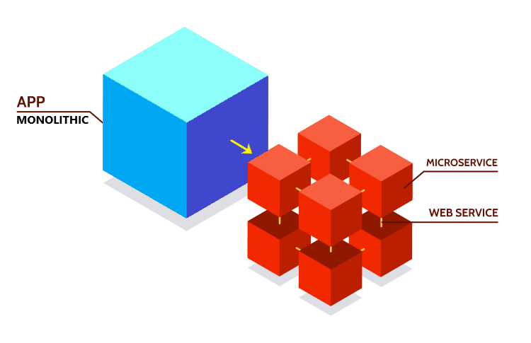
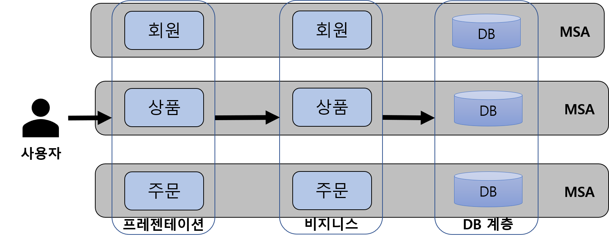

# 목차
1. Monolithic Architecture
2. MSA
3. 어느 아키텍처를 사용해야 하는가?
4. 예상 면접 질문
5. 참고 문헌
 
 

   
    

# Monolithic

   
    

## 개념
- 애플리케이션의 모든 구성 요소가 한 프로젝트에 통합되어 있는 형태
- 각 서비스를 메서드로 호출한다.

## 장점
- 단순한 아키텍처 구조로 개발에 용이하다.
- 실행 파일 또는 디렉토리가 하나여서 배포가 간단하다.
- 모든 코드가 한 곳에 있으므로 요청을 따라가며 디버깅 하기 간편하다.
- 하나의 중앙 집중식 장치이므로 MSA보다 End-to-End 테스트를 더 빠르게 수행할 수 있다.
 

## 단점
- 프로젝트 규모가 커지면 서비스 구동 시간, 빌드, 배포 시간이 길어진다.
- 작은 수정이 있어도 전체를 다시 빌드하고 배포해야한다.
- 많은 코드가 하나의 프로젝트에 몰려있다. 따라서 개발자들이 코드를 이해하고 유지보수하기 어렵다.
- 부분 장애가 전체 프로젝트에 영향을 미친다.(장애 전파)
- 기술 스택이 한 번 정해지면 나중에 바꾸기 어렵다.
- 전체 애플리케이션을 확장하기는 쉽지만, 부하 분산을 위해 각 컴포넌트를 독립적으로 확장하기는 어렵다.
- 팀을 역할(기획, 개발, 디자인, 인프라 등)별로 구분한다. 이러한 방식은 인력 관리와 운영에 유연성을 갖지만, 팀 간의 커뮤니케이션이 원활하지 않고, 협업에 걸리는 시간이 지연되는 경우가 많다. 

 
 

# MSA (Micro Service Architecture)

   
    

## 개념
- 하나의 큰 애플리케이션을 느슨하게 결합된 여러 개의 작은 컴포넌트의 모임으로 구조화하는 소프트웨어 개발 기법
- 하나의 micro service는 하나의 기능만 수행한다.
- REST 등의 가벼운 통신 아키텍처 또는 Kafka 등을 이용한 message stream을 주로 사용한다.
- ex) 작은 레고 블록(micro service) 하나 하나를 조립해서 하나의 큰 결과물을 만든다.
 

- API를 통해서만 각 서비스 간에 상호작용할 수 있다. 즉, 서비스의 end-point(접근점)을 API 형태로 외부에 노출하고, 실질적인 세부 사항은 모두 추상화한다. 내부의 구현 로직, 아키텍처와 프로그래밍 언어, DB와 같은 기술적인 사항들은 서비스 API에 의해 가려진다.

 

## 특징
### 장점
- `독립 배포` : 각 서비스마다 서버가 독립되어있고, 타 컴포넌트와 의존성이 없다. 따라서 하나의 서비스를 배포 시, 전체 서비스를 다시 배포하기 위해 서비스를 중단하지 않는다.
- `부분적 scale-out` : 트래픽이 증가한 해당 서비스의 서버만 확장하면 된다. 클라우드 기반 서비스 사용에 적합하다.
- `장애 격리` : 하나의 서비스에서 장애가 발생하더라도 부분적 장애에 대한 격리를 통해 전체 서비스로 확장될 가능성이 적다.
- `원활한 유지보수` : 팀 별로 프로젝트가 분리되어 있어, 코드의 이해도가 증가하고 이에 따라 유지보수가 쉽다.
- `polyglot programming(기술 다양성)` : 상황에 맞게 기술 스택을 유연하게 적용할 수 있다. 예를 들어 시간당 트랜잭션(TPS)가 높고, 읽기 작업이 많은 서비스에서는 Node+Redis로, 트랜잭션 및 안정성이 중요한 서비스에는 Spring+RDB를 적용할 수 있다.
- `팀의 독립성` : 서비스 별로 팀을 나누고 기확부터 설계, 개발 등이 하나의 팀 내에서 진행된다. 따라서 다른 팀에 대한 의존성이 사라지고 역할별 요청과 피드백이 빨라진다. 때문에 유연하고 지속적 운영 및 개발이 가능해진다. 하지만 각 팀의 역할 담당자들은 업무 성숙도를 가지고 있어야 하고, 개발자들은 인프라 핸들링이 가능해야 한다.
 

### 단점
- `설계의 어려움` : 모놀리식에 비해 상대적으로 많이 복잡하다. 서비스가 모두 분산되어 있기 때문에 개발자는 내부 시스템의 통신을 어떻게 할지 정해야한다. 또한, 통신의 장애와 서버의 부하 등이 있을 경우 어떻게 transaction을 유지할지 결정하고 구현해야한다.
- `성능 저하` : 각 컴포넌트는 서비스 형태로 구현되고, API를 이용하여 다른 서비스(컴포넌트)와 통신한다. 그러므로 통신 비용 및 지연 시간이 증가한다.
- `까다로운 테스트` : 단위테스트는 쉽지만, 통합 테스트 및 End-to-End 테스트 단위로 들어가면, 여러 서비스의 API를 검증해야 하므로 시간과 비용이 많이 든다.
- `데이터 관리` : 하나의 DB에 중앙 집중화를 하지 않고, 서비스마다 별도의 DB를 사용한다. 다른 컴포넌트의 데이터를 가져오기 위해서는 API 통신이 필요하므로 성능 저하 또는 트렌젝션으로 묶을 수 없는 문제가 발생할 수 있다.
 
 

# 어느 아키텍처를 사용해야 하는가?
- 초기에는 프로젝트의 규모가 작은 경우가 많으므로 Monolithic 아키텍처로 사용하다가 다음 관점들을 비교하여 이득이 된다면 MSA 아키텍처로 전환하는 것이 좋다.
 

- 비용: MSA 아키텍처를 도입할 경우, 모놀리식 아키텍처에 비해 비용을 얼마나 절감할 수 있는가?
- 개발 생산성: 마이크로 서비스를 요구할 만큼 시스템 복잡도가 높은가? 또는 복잡도를 지나치게 높인 마이크로 서비스가 생산성을 저해하고 있진 않은가?
- 운영: 개발 팀에게 개발과 운영을 동시에 할 만큼 인프라가 준비되어 있는가? 또는 개발 인력이 마이크로 서비스를 관리할 역량이 있는가?
- 배포: 배포를 충분히 자주 하고 있는가? MSA는 빠른 변화에 대응하기 위해 도입하는 것인데, 회사마다 배포 일이 정해져 있고, 배포가 가끔 일어난다면 효율이 떨어진다.

 
 

# 예상 면접 질문
Q. MSA 아키텍처의 주요 특징은 무엇인가요?  
A. MSA는 큰 애플리케이션을 작은 독립적인 마이크로 서비스 단위로 분할합니다. 각 마이크로 서비스는 자체적으로 개발, 배포, 확장이 가능하며, 단일 책임 원칙에 따라 하나의 특정 비지니스 기능을 수행합니다. 또한 각 마이크로 서비스는 네트워크를 통해 통신하며 분산 시스템을 형성합니다. 이를 통해 애플리케이션은 확장성과 유연성을 갖출 수 있습니다. 데이터는 각 서비스 내에서 자체적으로 관리되며, 각 서비스는 필요한 데이터를 비동기 방식으로 교환하며 DB나 서비스의 내부 상태를 공유하지 않습니다.
 

Q. MSA의 단점은 무엇인가요?  
A. MSA는 서비스를 독립적으로 분산하여 개발합니다. 따라서 내부 통신을 위해 API를 어떻게 요청하고 응답할지에 대한 설계가 어렵습니다. 더불어 API 호출을 통해 다른 서비스와 통신하기 때문에 통신 비용과 지연 시간이 증가합니다. DB의 경우, 서비스마다 분산화되어있기 때문에, 다른 컴포넌트의 데이터 사용을 위해 API 통신이 일어나게 되고 성능 저하 문제와 트랜션 관리가 어려운 문제가 발생할 수 있습니다. 통합 테스트 시에는 여러 서비스의 API를 검증해야 하므로 시간과 비용이 많이 듭니다. 
 

Q. MSA 아키텍처에서 발생할 수 있는 도전 과제는 무엇인가요?  
A. 분산 시스템을 관리하는 것은 복잡성을 증가시킬 수 있습니다. 서비스 간의 통신, 네트워크 문제, 장애 처리 등을 효과적으로 관리해야 합니다. 또한 각 마이크로서비스는 자체 데이터를 관리하므로 데이터 일관성을 유지하는 것이 중요합니다. 분산 트랜잭션 처리, Eventual Consistency(결과적 일관성) 등의 기술을 활용하여 데이터 일관성을 유지할 수 있습니다.
 
 

# 참고 문헌
- [예제 이미지](http://clipsoft.co.kr/wp/blog/%EB%A7%88%EC%9D%B4%ED%81%AC%EB%A1%9C%EC%84%9C%EB%B9%84%EC%8A%A4-%EC%95%84%ED%82%A4%ED%85%8D%EC%B2%98msa-%EA%B0%9C%EB%85%90/)
- [MSA 특징, 장단점](https://hahahoho5915.tistory.com/71) 
