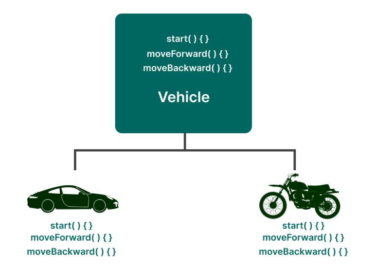
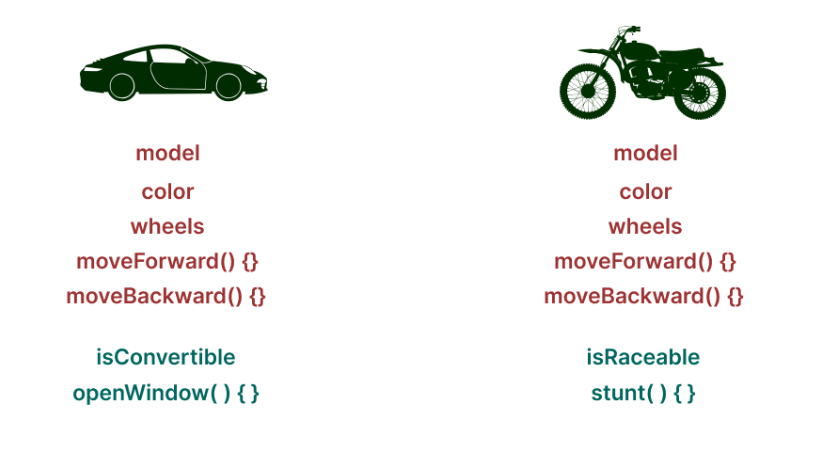
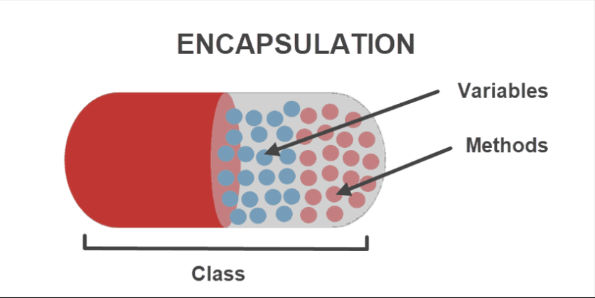

# OOP - 객체지향 프로그래밍

## 목차
1. OOP 개념
2. 특징
3. 5가지 설계원칙(SOLID)
4. 장단점
5. 면접질문
6. 참고자료

<br />

## 1. OOP 개념

- <strong>`객체지향(Object-Oriented)`</strong>
: 어떤 개념에 대한 자료형과 함수를 <strong>'객체'</strong> 형태로 함께 묶어서 관리하기 위해 등장한 패러다임.
    - 객체(object): 사용할 수 있는 실체

### 등장배경

`순차적 프로그래밍` : 순차적으로 위에서 아래로 흘러가는 프로그래밍 구조


`절차적(구조적) 프로그래밍` : 반복되는 동작을 함수 및 프로시저 형태로 모듈화하여, 추상화와 코드의 재사용성을 목표로 사용하는 패러다임

*프로시저: 리턴값이 없는 함수
ex. 데이터를 출력하는 용도로 사용하는 printf 와 같은 함수를 프로시저라고 한다*

반복 동작을 모듈화하여 코드를 많이 줄일 수 있다. 하지만 프로시저라는 것 자체가 너무 추상적이라는 단점이 있다.

> ex. 도서관의 도서 관리 프로그램을 개발할 시,
> - '책'이라는 자료형을 구현해야 함
> - 책에 대한 함수를 구현해야 함<br>
> But, 구조적 프로그래밍에서는 책은 책이고 책에 관한 함수는 따로 있기에, 같은 소스코드 파일 내에 있더라도 이 둘의 연관 여부는 단 번에 알아차리기 어렵다.
즉, 논리적으로 묶여있을 수 없는 구조이기 때문에 동작이 추상적인 것이다. 


`객체지향 프로그래밍` : 구조적 프로그래밍의 단점을 극복하기 위해 등장
-> <strong>객체 내부에 자료형 필드와 함수가 함께 존재</storng>

> ex. 객체지향 프로그래밍 방식으로 도서 관리 프로그램 개발할 시, 
<br>자료형 필드: {책의 제목, 저자, 페이지수}메소드: {대출하기, 반납하기} ⊂ `책`
-> '책'이라는 객체에 묶어서 관리 가능


> 절차지향 프로그래밍과 객체지향 프로그래밍의 큰 차이는 `class의 사용여부`이다


## 2. 특징

### 추상화

Class들의 공통적인 특성(변수, 메소드)들을 객체로 묶어 추출하는 것

java에서 추상화를 구현할 수 있는 요소
- `추상클래스`(abstract class)
- `인터페이스`(interface)

<div align='center'>   
    
</div>

> ex. 
```java

public interface Vehicle {
    public abstract void start()
    void moverForward();
    void moveBackward();
}
```

공통적인 기능을 추출하여 이동수단 인터페이스에 정의
-> 객체 지향적 설계에 있어서 인터페이스는 어떤 객체의 역할만을 정의하여 객체들 간의 관계를 보다 유연하게 연결하는 역할을 담당


### 상속(Inheritance)

부모 클래스의 모든 속성을 자식 클래스가 물려받는 것<br>

<div align='center'>   
    
</div>


java에서 상속방법
- `extends`키워드 사용
    - 공통적인 클래스의 속성과 기능들을 추출하여 extends 키워드를 통해 각각의 하위클래스로 확장


> 코드 중복을 줄이고, 코드를 재사용 가능한 조각으로 나눌 수 있다.


### 캡슐화(encapsulation)

데이터와 코드의 형태를 외부로부터 알 수 없게 하고, 데이터 속성과 데이터를 처리하는 메소드를 하나의 캡슐(Class)로 형태로 만드는 것

<div align='center'>   
    
</div>


<strong>정보은닉</strong> : 캡슐화에서 가장 중요한 개념으로, 다른 객체에게 자신의 정보를 숨기고 자신의 연산만을 통해 접근하는 것

<strong>캡슐화 방법</strong>

- 필드 값 앞에 접근 제어자 private를 사용
    -  외부 클래스에서 해당 필드에 엑세스하거나 수정할 수 없다.


> 정리하자면, 캡슐화는 어떻게 class 정보에 접근 혹은 수정하는지를 결정하는 권한을 제공한다. 이를 통해 어떤 정보를 노출하고 은닉할 것인지 결정한다. 


### 다형성

어떤 객체의 속성이나 기능이 상황과 맥락에 따라 다른 역할을 수행할 수 있는 객체지향의 특성. 한 타입의 참조변수를 통해 여러 타입의 객체를 참조할 수 있도록 만든 것을 의미한다.

<strong>다형성 사용방법</strong>
- `overriding` 
- `overloading` 

> ex. 오버라이드 예시
```java

// vehicle 인터페이스

public interface Vehicle {
    public abstract void start()
    void moverForward();
    void moveBackward();
}
```

```java

// Car 클래스

public class Car implements Vehicle { // 이동수단을 구체화한 자동차 클래스

    @Override
    public void moveForward() {
        System.out.println("자동차가 앞으로 전진합니다.");
    }

    @Override
    public void moveBackward() {
        System.out.println("자동차가 뒤로 후진합니다.");
    }
}
```
메서드 오버라이딩을 사용하면 같은 이름의 메서드지만 각각의 클래스 맥락에 맞게 재정의하여 사용 가능
-> 같은이름의 메서드가 상황에 따라 다른 역할 수행

- 상위 클래스를 `참조변수의 타입`으로 지정

> ex. 참조변수 타입 지정 예시
```java

// vehicle 인터페이스

class Friend {
    public void friendInfo() {
        System.out.println("나는 당신의 친구입니다.")
    }
}

class BoyFriend extends Friend {

    public void friendInfo() {
        System.out.println("나는 당신의 남자친구입니다.")
    }
}

class GirlFriend extends Friend {

    public void friendInfo() {
        System.out.println("나는 당신의 여자친구입니다.")
    }
}

public class FriendTest {

    public static void main(String[] args) {
        Friend friend = new Friend(); // 객체 타입과 참조변수 타입의 일치
        BoyFriend boyfriend = new BoyFriend();
        Friend girlfriend = new GirlFriend(); // 객체 타입과 참조 변수 타입의 불일치
    }
}
    
// 출력값
나는 당신의 친구입니다.
나는 당신의 남자친구입니다.
나는 당신의 여자친구입니다.
```


<br />


## 3. OOP의 5가지 설계원칙(SOLID)

좋은 설계란 시스템에 새로운 요구사항이나 변경사항이 있을 때, 영향을 받는 범위가 적은 구조를 말한다. 그래서 시스템에 예상하지 못한 변경사항이 발생하더라도, 유연하게 대처하고 이후에 확장성이 있는 시스템 구조를 만들 수 있다.

즉, SOLID 객체 지향 원칙을 적용하면 코드를 확장하고 유지 보수 관리하기가 더 쉬워지며, 불필요한 복잡성을 제거해 리팩토링에 소요되는 시간을 줄임으로써 프로젝트 개발의 생산성을 높일 수 있다.


### 1. SRP ( Single Responsibility Principle ) : 단일 책임 원칙

- 클래스는 단 하나의 책임을 가지고(기능 담당), 그에 대한 책임을 져야 한다.<br>
-> <strong>어떤 클래스가 변경되더라도 파급 효과가 적을 때</strong> 이것을 단일 책임 원칙을 잘 따른 것이라고 표현

### 2. OCP ( Open Close Principle ) : 개방-폐쇄 원칙

<div align='center'>   
    
</div>

- 확장에는 열려 있어야 하고, 변경(수정)에는 닫혀 있어야 한다.
    - [ 확장에 열려있다 ] : 새로운 변경 사항이 발생했을 때 유연하게 코드를 추가함으로써 큰 힘을 들이지 않고 애플리케이션의 기능을 확장할 수 있음
    - [ 변경에 닫혀있다 ] - 새로운 변경 사항이 발생했을 때 객체를 직접적으로 수정을 제한함. 
- 즉, 클래스를 수정해야 한다면 그 클래스를 상속(확장)하여 수정한다.

### 3. LSP ( Liskov Substitution Principle ) : 리스 코프 치환 원칙

- 상위 타입의 객체를 하위 타입의 객체로 치환해도 상위 타입을 사용하는 프로그램은 정상적으로 동작해야 한다.
- 즉, 자식 클래스를 사용 중일 때, 거기에 부모 클래스로 치환하여도 문제가 없어야 함.

### 4. ISP (Interface Segregation Principle ) : 인터페이스 분리 원칙

<div align='center'>   
    
</div>

- 각 행위에 대한 인터페이스는 각각 사용에 맞게끔 서로 분리되어야 한다.
    - ISP원칙 : <strong>인터페이스의 단일 책임 강조</strong>
- 클라이언트를 기준으로 인터페이스를 분리함으로써, <strong>클라이언트의 목적과 용도에 적합한 인터페이스만을 제공하는 것이 목표</strong>


### 5. DIP ( Dependency Inversion Principle ) : 의존 역전 원칙

<div align='center'>   
    
</div>

- Class를 참조해서 사용해야하는 상황이 생긴다면, 그 Class를 직접 참조하는 것이 아니라 그 <strong>대상의 상위요소(추상클래스 or 인터페이스)로 참조하라는 원칙</strong> 
- 각 클래스간의 결합도를 낮출 수 있다.


<br />


## 4. 장단점

### 장점

- 코드의 재사용을 통해 반복적인 코드를 최소화하고, 보다 유연하고 변경이 용이한 프로그램을 만들 수 있다.

- 인간 친화적이고 직관적인 코드를 작성하기에 용이하다

### 단점

- 상대적으로 처리 속도가 느리다.

- 설계시 많은 시간과 노력이 필요하다.


<br />


## 6. 면접질문

실제면접기출질문(2019년 상반기 건강보험심사평가원)

Q1. 객체지향 언어에 대해 설명해 보세요.

Q2. 객체지향 언어의 장단점에 대해 설명해 보세요.


## 6. 참고자료

- 프로그래밍 패러다임 정리 : https://velog.io/@haero_kim/%EA%B0%9D%EC%B2%B4%EC%A7%80%ED%96%A5-%ED%94%84%EB%A1%9C%EA%B7%B8%EB%9E%98%EB%B0%8D-%EC%9D%B4%ED%95%B4%ED%95%98%EA%B8%B0

- 프로그래밍 패러다임 정리 보충 : https://iosdevlime.tistory.com/62

- 객체지향 프로그래밍 특징 4가지 : https://www.codestates.com/blog/content/%EA%B0%9D%EC%B2%B4-%EC%A7%80%ED%96%A5-%ED%94%84%EB%A1%9C%EA%B7%B8%EB%9E%98%EB%B0%8D-%ED%8A%B9%EC%A7%95

- + 캡슐화를 이용할 때 getter/setter 사용에 대한 오해 : https://songkg7.github.io/posts/getter-and-setter/

- 객체지향 프로그래밍 다형성 특성 보충 : https://cwhitestudy.tistory.com/27

- OOP의 5가지 설계원칙 : https://backendcode.tistory.com/160
- OOP의 5가지 설계원칙 보충 : https://inpa.tistory.com/entry/OOP-%F0%9F%92%A0-%EA%B0%9D%EC%B2%B4-%EC%A7%80%ED%96%A5-%EC%84%A4%EA%B3%84%EC%9D%98-5%EA%B0%80%EC%A7%80-%EC%9B%90%EC%B9%99-SOLID#recentEntries

- 객체지향 프로그래밍 장단점 정리 : https://www.codestates.com/blog/content/%EA%B0%9D%EC%B2%B4-%EC%A7%80%ED%96%A5-%ED%94%84%EB%A1%9C%EA%B7%B8%EB%9E%98%EB%B0%8D-%ED%8A%B9%EC%A7%95

- 객체지향 프로그래밍 원리 총정리 : https://velog.io/@jinyeong-afk/%EA%B8%B0%EC%88%A0%EB%A9%B4%EC%A0%91-%EB%B0%B1%EC%97%94%EB%93%9C-%EA%B8%B0%EC%88%A0-%EB%A9%B4%EC%A0%91-%EC%A7%88%EB%AC%B8-OOP%EA%B0%9D%EC%B2%B4%EC%A7%80%ED%96%A5%ED%94%84%EB%A1%9C%EA%B7%B8%EB%9E%98%EB%B0%8D

- 면접질문 : https://universitytomorrow.com/15

