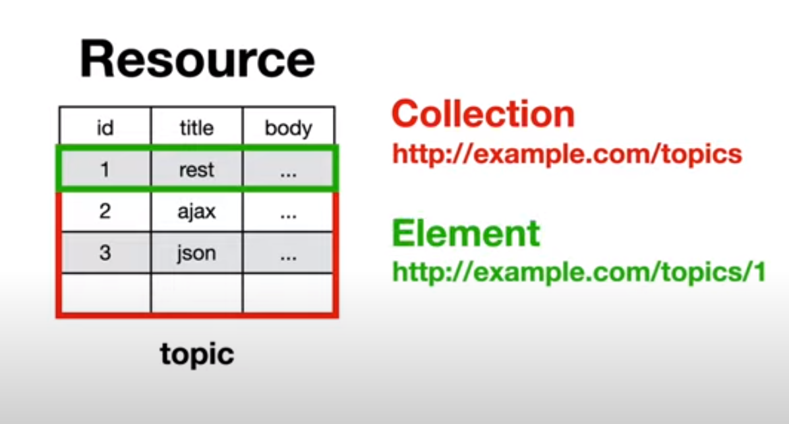
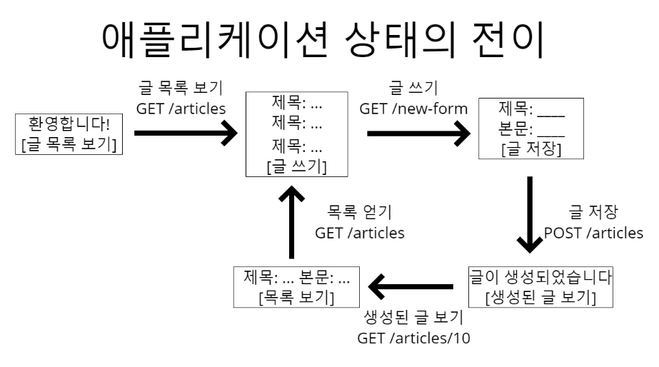

# REST API

## 목차
1. 개념
2. HTTP API vs. REST API
3. REST API 장/단점
4. 면접질문
5. 참고자료


## 1. 개념

### 등장배경

웹 브라우저/안드로이드/아이폰 애플리케이션 등으로 분산된 오늘날의 컨텐츠들

-> Hypermedia 콘텐츠들에 접근하여 통신에 대응해야할 필요성 증가<br>
-> 범용적이고 일관적인 사용성을 보장하는 서버디자인인 Software Architecture Style 개발

**`REST`**
: Representational State Transfer의 약자<br>
"분산 시스템"을 위한 HTTP기반 아키텍쳐

-> 즉, 웹 어플리케이션, 다양한 언어, 모바일 어플리케이션, 다른 서버(*다 HTTP 기반) 등 끼리 서로 통신할 수 있도록 통역 역할을 함


> `RESTful하다`
> : REST의 기본 원칙을 성실히 지킨 서비스 디자인이다.<br>
> [REST API를 보다 RESTful하게 만들기](https://pronist.dev/146)


`REST API` : REST 아키텍쳐 스타일에 부합하는 API. 독립적인 프로그램간의 통신 및 데이터 공유를 가능하게 한다.<br>

자원을 이름(자원의 표현)으로 구분하여 자원의 상태(정보)를 주고 받는 모든 것을 의미

-> 자원(resource)의 표현(representation)에 의한 상태 전달


### REST 구성요소


`자원(Resources) : URI`

<div align='center'>   
    
</div>

- 모든 자원에 고유한 ID가 존재하고, 이 자원은 Server에 존재

- `자원 = 객체`
    - 서버의 개별자원에 대한 고유한 식별자인 **URI를 통해 자원을 식별**해야 한다 
    - URI를 잘 네이밍할수록 API가 직관적이고 사용하기 쉽다 ex. /books, /customers(명사를 사용해서 자원을 표현)


<div align='center'>   
    
</div>


`행위(Verb) : HTTP Method`

- HTTP 프로토콜의 Method를 사용

- HTTP 프로토콜은 GET, POST, PUT, DELETE와 같은 메서드를 제공


`표현(Representation)`

- Client가 자원의 상태(정보)에 대한 조작을 요청하면 Server는 적절한 응답을 보낸다.

- REST에서 하나의 자원은 JSON, XML, TEXT 등 여러 형태의 Representation으로 나타내어 질 수 있다


<br />


## 2. HTTP API vs. REST API

HTTP API와 REST API는 사실 거의 같은 의미로 사용된다. but, 디테일하게 들어가면 차이 발생

### REST 아키텍처 스타일에 부합하는 API

1. `Client-Server 아키텍처` : 클라이언트와 서버가 최대한 분리되어 있기 때문에
2. `Stateless(무상태)` : 요청 자체가 요청을 처리하는 데 필요한 상태이고, 서버와 세션에 대한 내용을 저장 X
3. `Cache` : HTTP 레벨의 데이터 캐싱이 가능한 유일한 API 아키텍처 스타일
4. **`Uniform Interface(일관성있는 인터페이스)`** : 장비 or 애플리케이션 타입과 무관하게 목표 서버와 통신하도록 일관성있는 통신 방법을 허용
5. `Layered System(계층화된 시스템)`
6. `Code-On-Demand` : 서버가 공개 API를 구축하여 클라이언트에게 실행 가능한 코드를 제공할 수 있다 ex. 자바스크립트


**REST는 4번째 `일관성있는 인터페이스의 4가지 제약조건`을 만족해야 한다.**


> **Uniform Interface**
> API에서 클라이언트와 서버를 분리하기 위해서,  자원들은 각각의 독립적인 인터페이스를 가진다.
> 일관된 인터페이스를 구현하려면 아래의 4가지 제약조건이 필요
> - `url 자원식별`
> - `표현을 통한 자원조작` : HTTP 표준메서드 등을 통해 자원을 조회, 삭제 등 작업을 설명할 수 있는 정보가 담겨야 함
> - `Self-descriptive messages` : HTTP Header에 타입을 명시하고 각 메시지들은 MIME types에 맞춰 표현해야 함. 메시지는 스스로를 설명해야 한다 ex. .json을 반환한다면 application/json으로 명시

``` json
HTTP/1.1 200 OK
Content-Type: application/json-patch+json

[ { "op": "remove", "path": "/a/b/c" } ]
```

> - `HATEOAS(Hypermedia as the Engine of Application State)` : 하이퍼링크에 따라 다른 페이지를 보여줘야 하며, 데이터마다 어떤 URL에서 원했는지 명시해야 함

<div align='center'>   
    
</div>


``` json
HTTP/1.1 200 OK
Content-Type: application/json
Link: </articles/1>; rel="previous",
			</articles/3>; rel="next";

{
	"title": "The second article",
	"contents": "blah blah..."
}
```


<br />


## 3. 장/단점
 
 ### 장점

 1. 서비스 요청 결과에 대한 Caching이 가능

    -> 덕분에 서비스에 대한 응답시간을 줄이고, 서버 부하의 균형을 맞추기가 쉬워진다.

 2. 서버의 확장성이 높아진다

    -> Stateless 프로토콜을 사용하기에 클라이언트와 서버간에 계속적인 연결유지가 필요 X

 3. HTTP 프로토콜만을 사용하기에, 메시지 교환이 쉬워진다.

    ->  SOAP와 같은 별도의 메시징을 위한 기반 소프트웨어 필요 X


 ### 단점

 1. Light-Weight한 서비스 아키텍처이기에, 대규모의 엔터프라이즈 시스템에는 적용하지 어려운 점 존재

 2. 사용할 수 있는 메소드가 한정적 (4가지)


<br />


## 4. 면접질문


Q. Restful API에 대해 설명해주세요.

<details>A.
Restful API는 HTTP 통신을 Rest 설계 규칙을 잘 지켜서 개발한 API를 Restful한 API라고 합니다.

Rest 설계 규칙은 URI는 정보의 자원만 표현해야 하며, 자원의 상태와 행위는 HTTP Method에 명시하는걸 말합니다.
</details>

<br />


## 정리

### REST가 필요한 이유

- 애플리케이션 분리 및 통합

- 다양한 클라이언트의 등장

- 최근 서버 프로그램은 모바일 디바이스에서도 통신을 할 수 있어야 함. 기존의 프로토콜들 (XML, SOAP) 등 보다 사용하기 쉽고 속도가 더 빠른 REST가 사물인터넷 및 모바일 앱 개발에 사용하기 적합

- 멀티 플랫폼에 대한 자원을 위해 서비스 자원에 대한 아키텍처를 세우고 이용하는 방법을 모색한 결과, REST에 관심을 가지게 됨


### REST 개념 정리

- 오늘날 대부분 "REST API"는 사실 REST를 따르고 있지 않다.
- REST의 제약 조건 중 특히 self-descriptive와 HATEOAS를 잘 만족하지 못한다.
- REST : 긴 시간에 걸쳐(수십년) 진화하는 웹 애플리케이션을 위한 것

- REST를 따르겠다면 Self-decriptive와 HATEOAS를 만족시켜야한다.
    - Self-decriptiv는 custom media type, profile link relation으로 만족 가능
    - HATEOAS는 HTTP 헤더나 본문에 링크를 담아 만족 가능


- 최근에는 `GraphQL`이라는 다른 API 표준을 선택하는 방법도 존재


<br />


## 참고자료

- [REST API 총정리1](https://www.youtube.com/watch?v=Nxi8Ur89Akw&t=100s)
- [REST API 총정리2](https://velog.io/@kjh03160/%EA%B7%B8%EB%9F%B0-REST-API%EB%A1%9C-%EA%B4%9C%EC%B0%AE%EC%9D%80%EA%B0%80)

- [REST 아키텍쳐 정리](https://velog.io/@halonso14/%EB%8B%A4%EC%84%AF-%EB%B2%88%EC%A7%B8-%EC%9E%91%EC%8B%AC%EC%9D%BC%EC%9D%BC-API-%EC%95%84%ED%82%A4%ED%85%8D%EC%B2%98-%EC%8A%A4%ED%83%80%EC%9D%BC-4-REST)

- [HTTP API vs. REST API](https://www.inflearn.com/questions/126743/http-api-vs-rest-api)
- [REST 실습결과 정리](https://jy-beak.tistory.com/122)

- [REST API 장/단점](https://jjeongil.tistory.com/1138)

- [REST API 관련 면접질문](https://hanseom.tistory.com/78)

- [그런 REST API로 괜찮은가?](https://velog.io/@kjh03160/%EA%B7%B8%EB%9F%B0-REST-API%EB%A1%9C-%EA%B4%9C%EC%B0%AE%EC%9D%80%EA%B0%80)